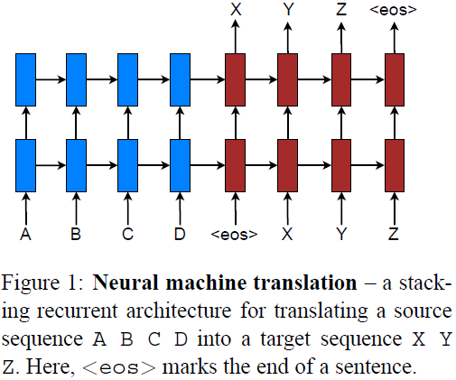
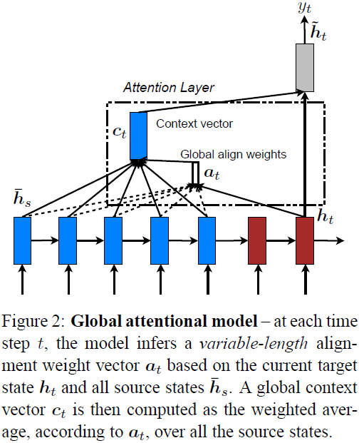
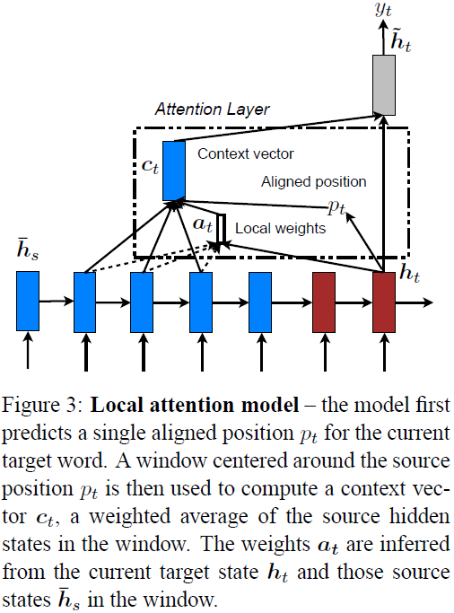
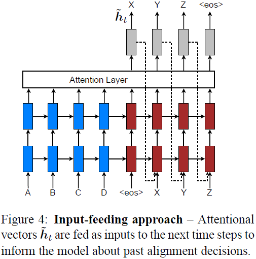
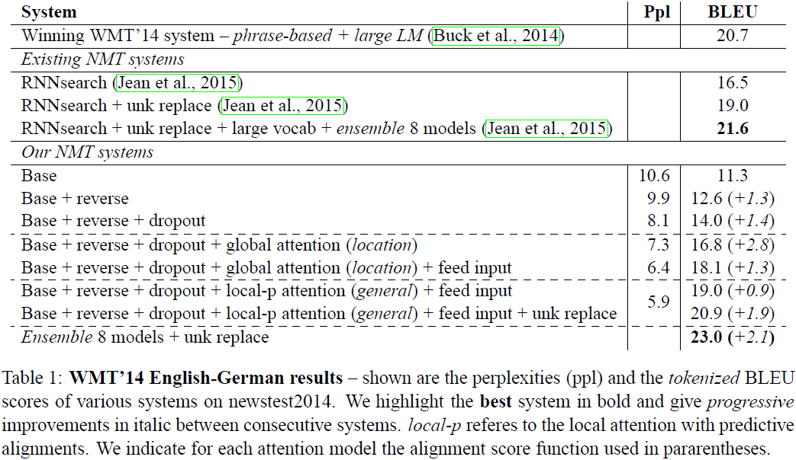
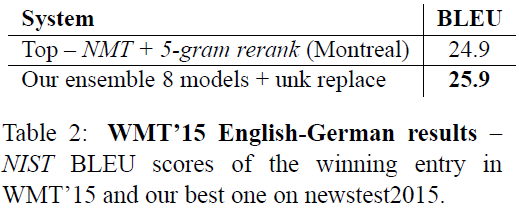
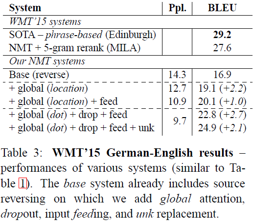
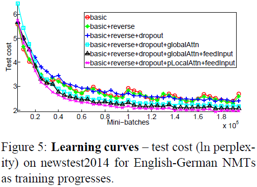
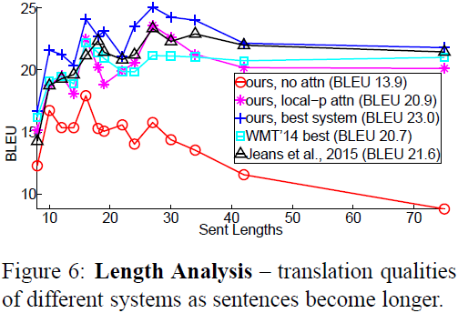
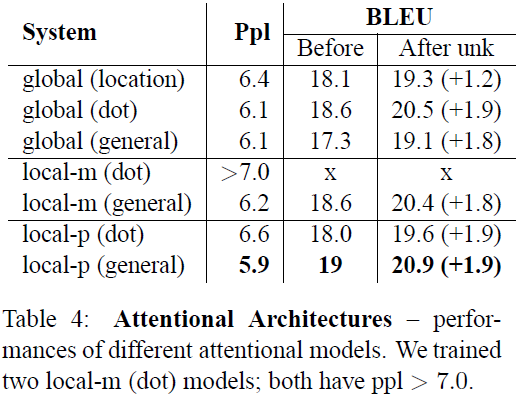

# Effective Approaches to Attention-based Neural Machine Translation

---

M.T. Luong, H. Pham, C. D. Manning, [Effective Approaches to Attention-based Neural Machine Translation][att_nmt], EMNLP (2015)

[att_nmt]: https://arxiv.org/abs/1508.04025v3 "Effective Approaches to Attention-based Neural Machine Translation"

---

## 摘要

全局注意力（a global approach）：（attends to all source words）

局部注意力（a local approach）：（only looks at a subset of source words at a time）

## 1 引言

\<eos\>：序列截止符（end-of-sentence symbol）

本文给出两种注意力模型：（1）全局注意力（a global approach in which all source words are attended）；（2）局部注意力（a local one whereby only a subset of source words are considered at a time）

## 2 神经网络机器翻译（neural machine translation）

神经网络机器翻译（neural machine translation，NMT）：神经网络直接对源序列$x_1, x_2, \cdots, x_n$翻译为目标序列$y_1, y_2, \cdots, y_m$的条件概率$p(y | x)$建模。（A neural machine translation system is a neural network that directly models the conditional probability $p(y | x)$ of translating a source sentence, $x_1, x_2, \cdots, x_n$, to a target sentence, $y_1, y_2, \cdots, y_m$）

NMT的基本形式为：

（1）编码器（encoder）：计算每个源语句的表示（a representation $s$ for each source sentence），$s$；

（2）译码器（decoder）：每次生成一个目标词（generates one target word at a time），其条件概率可分解为：

$$\log p(y | x) = \sum_{j = 1}^{m} \log p(y_{j} | y_{\lt j}, s) \tag{1}$$

通常译码器分解条件概率的建模采用递归神经网络（recurrent neural network，RNN），如RNN、LSTM（long short-term memory）、GRU（gated recurrent unit）。

单词$y_{j}$译码概率（probability of decoding each word）可参数化为：

$$p(y_{j} | y_{\lt j}, s) = \text{sofmax}(g(\mathbf{h}_{j})) \tag{2}$$

其中，$g$表示转换函数（transformation function），其输出向量长度为词库大小（a vocabulary-sized vector）；$\mathbf{h}_{j}$表示RNN的隐含单元（hidden unit）：

$$\mathbf{h}_{j} = f(\mathbf{h}_{j - 1}, s) \tag{3}$$

给定历史隐含状态（previous hidden state）$\mathbf{h}_{j - 1}$和$s$，通过$f$计算当前隐含状态（current hidden state）$\mathbf{h}_{j}$；$s$暗示源隐含状态集合（a set of source hidden states which are consulted throughout the entire course of the translation process）。

本文采用层叠LSTM结构（stacking LSTM architecture）（Fig. 1），损失函数（training objective）为：

$$J_{t} = \sum_{(x, y) \in \Bbb{D}} - \log p(y | x) \tag{4}$$

其中，$\Bbb{D}$为平行训练语料库（parallel training corpus）。

## 3 注意力机制模型（attention-based models）

注意力机制模型（attention-based models）：

* 全局（global）：关注所有位置的源（“attention” is placed on all source positions）（Fig. 2）

* 局部（local）：仅关注部分位置的源（“attention” is placed on only a few source positions）（Fig. 3）

二者共同点：在译码阶段$t$时刻（at each time step），二者均以层叠LSTM最高层（at the top layer of a stacking LSTM）隐含状态$\mathbf{h}_{t}$作为输入；其目的是推导上下文向量（a context vector）$\mathbf{c}_{t}$，上下文向量用于提取相关源端信息（captures relevant source-side information）以帮助当前目标词（current target word）$y_{t}$的预测。

给定目标隐含状态（target hidden state）$\mathbf{h}_{t}$和源端上下文向量（source-side context vector）$\mathbf{c}_{t}$，

（1）使用连接层（a concatenation layer）合并$\mathbf{h}_{t}$、$\mathbf{c}_{t}$的信息，生成注意力隐含状态（an attentional hidden state），

$$\tilde{\mathbf{h}}_{t} = \tanh(\mathbf{W}_c[\mathbf{c}_{t}; \mathbf{h}_{t}]) \tag{5}$$

（2）将注意力向量$\tilde{\mathbf{h}}_{t}$作为softmax层的输入，生成预测分布（predictive distribution），

$$p(y_{t} | y_{\lt t}, x) = \text{sofmax}(\mathbf{W}_s \tilde{\mathbf{h}}_{t}) \tag{6}$$

### 3.1 全局注意力（global attention）

计算上下文向量$\mathbf{c}_{t}$时，全局注意力机制关注编码器的全部隐含状态（the idea of a global attentional model is to consider all the hidden states of the encoder when deriving the context vector）。该模型中，通过比较当前目标隐含状态（current target hidden state）$\mathbf{h}_{t}$与各源隐含状态（each source hidden state）$\bar{\mathbf{h}}_s$，计算变长对齐向量（a variable-length alignment vector）$\mathbf{a}_{t}$，对齐向量的尺寸等于源端时长（the number of time steps on the source side）■■即源语句长度■。
$$\mathbf{a}_{t}(s) = \text{align}(\mathbf{h}_{t}, \bar{\mathbf{h}}_s) =
\frac{\exp (\text{score}(\mathbf{h}_{t}, \bar{\mathbf{h}}_s))}
{\sum_{s^{\prime}}\exp (\text{score}(\mathbf{h}_{t}, \bar{\mathbf{h}}_s^{\prime}))}
\tag{7}$$

其中，$\text{score}$表示基于内容的评分函数（a content-based function），本文给出3种形式：

$$\text{score}(\mathbf{h}_{t}, \bar{\mathbf{h}}_s) =
\begin{cases}
\mathbf{h}_{t}^{\text{T}} \bar{\mathbf{h}}_s & \text{dot} \\
\mathbf{h}_{t}^{\text{T}} \mathbf{W}_a \bar{\mathbf{h}}_s & \text{general} \\
\mathbf{v}_a^{\text{T}} \tanh(\mathbf{W}_a [\mathbf{h}_{t}; \bar{\mathbf{h}}_s]) & \text{concat} \\
\end{cases}$$

将对齐向量作为权值，则上下文向量$\mathbf{c}_{t}$为所有源隐含状态的加权平均（weighted average over all the source hidden states）。

■■$\mathbf{a}_{t}(s)$为对齐向量（权值向量），为源语句每个时刻隐含状态$\bar{\mathbf{h}}_s$分配一个权值，上下文向量$\mathbf{c}_{t}$为所有源隐含状态的加权平均。■

本文全局注意力模型特点：

（1）编码器和译码器仅使用最顶层LSTM的隐含状态；

（2）计算路径（computation path）：$\mathbf{h}_{t} \rightarrow \mathbf{a}_{t} \rightarrow \mathbf{c}_{t} \rightarrow \tilde{\mathbf{h}}_{t}$，然后预测（Eq. 5，Eq. 6，Fig. 2）；

（3）相比$\text{concat}$积（concat product），$\text{dot}$和$\text{general}$积表现更好。

全局注意力模型的缺陷在于：每生成一个目标词，都需要关注源端所有单词（attend to all words on the source side for each target word）。处理长语句（longer sequences）时该问题尤为突出。

### 3.2 局部注意力（local attention）

局部注意力机制（local attentional mechanism）：选择只关注每个目标单词的源位置的一小部分（chooses to focus only on a small subset of the source positions per target word）

本文局部注意力机制选择性关注上下文窗口，该机制可微（local attention mechanism selectively focuses on a small window of context and is differentiable）。在$t$时刻，局部注意力机制首先为每个目标词生成位置对齐$p_{t}$（generates an aligned position $p_{t}$ for each target word at time $t$），上下文向量$\mathbf{c}_{t}$为窗口$[p_{t} - D, p_{t} + D]$内源端隐含状态的加权平均（a weighted average over the set of source hidden states within the window），$D$凭经验给出。局部对齐向量（local alignment vector）$\mathbf{a}_{t}$长度固定（fixed-dimensional），即$\mathbf{a}_{t} \in \R^{2D + 1}$。

* 单调对齐（monotonic alignment，local-m）

假设源与目标序列近似单调对齐（source and target sequences are roughly monotonically aligned），即$p_{t} = t$

* 预测对齐（Predictive alignment，local-p）

$$p_{t} = S \cdot \text{sigmoid} \left( \mathbf{v}^{\mathrm{T}}_{p} \tanh(\mathbf{W}_{p} \mathbf{h}_{t}) \right) \tag{9}$$

其中，$\mathbf{W}_{p}$、$\mathbf{v}_{p}$为模型学习参数、$S$为源语句长度，可知$p_{t} \in [0, S]$。对齐向量权值（alignment weights）分配采用高斯分布（to favor alignment points near $p_{t}$, place a Gaussian distribution centered around $p_{t}$）：

$$\mathbf{a}_{t} = \text{align}(\mathbf{h}_{t}, \bar{\mathbf{h}}_{s})
\exp(- \frac{(s - p_{t})^{2}}{2 \sigma^{2}}) \tag{10}$$

标准差（standard deviation）凭经验设为（empirically set as）$\sigma = \frac{D}{2}$。**注意：$p_{t}$为实数（real number），$s$为整数（integer），其取值限制在以$p_{t}$为中心的窗口内。**

### 3.3 数据输入（input-feeding approach）

本文提出的全局、局部注意力机制中，注意力决策彼此独立（attentional decisions are made independently），属于次优解（suboptimal）。

## 4 实验（experiments）

### 4.1 训练细节（training details）

### 4.2 英文-德文结果（English-German results）

### 4.3 德文-英文结果（German-English results）

## 5 分析（Analysis）

### 5.1 学习曲线（learning curves）

### 5.2 长序列翻议（effects of translating long sentences）

### 5.3 注意力结构选择（choices of attentional architectures）

### 5.4 对齐质量（Alignment Quality）

### 5.5 翻译实例（sample translations）

## 6 结论

## 致谢
