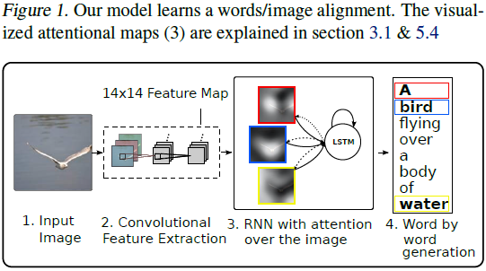
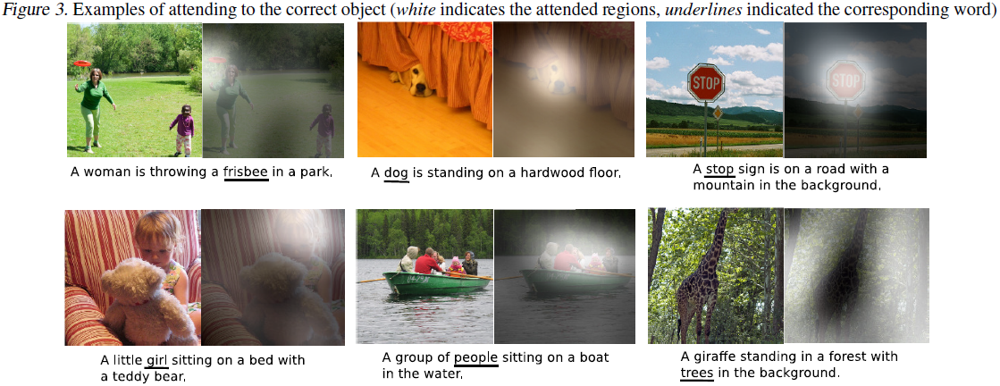
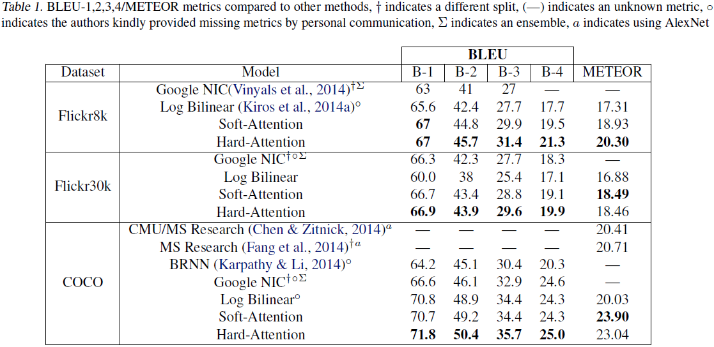

# Show, Attend and Tell Neural Image Caption Generation with Visual Attention (ICML 2015)

---

K. Ku, J.L. Ba, R. Kiros, K. Cho, A. Courville, R. Salakhutdinov, R.S. Zemel, Y. Bengio, [Show, Attend and Tell Neural Image Caption Generation with Visual Attention][show_att_tell], ICML 2015

[show_att_tell]: https://arxiv.org/abs/1502.03044 "Show, Attend and Tell Neural Image Caption Generation with Visual Attention"

---

## 摘要

基于注意力机制的图像内容描述模型（an attention based model that automatically learns to describe the content of images）

数据集：Flickr8k、Flickr30k、MS COCO

## 1 引言

has significantly improved the quality of caption generation using a combination of convolutional neural networks (convnets) to obtain vectorial representation of images and recurrent neural networks to decode those representations into natural language sentences

One of the most curious facets of the human visual system is the presence of attention. Rather than compress an entire image into a static representation, attention allows for salient features to dynamically come to the forefront as needed. This is especially important when there is a lot of clutter in an image.

Using representations (such as those from the top layer of a convnet) that distill information in image down to the most salient objects is one effective solution that has been widely adopted in previous work.

one potential drawback of losing information which could be useful for richer, more descriptive captions. Using more low-level representation can help preserve this information.

However working with these features necessitates a powerful mechanism to steer the model to information important to the task at hand.

“硬”注意力机制（a "hard" attention mechanism）和“软”注意力机制（a "soft" attention mechanism）

本文贡献：

（1）在同一框架下，给出两基于注意力的图像标题生成：“软”确知注意力机制可通过标准反向传播算法训练（a "soft" deterministic attention mechanism trainable by standard back-propagation methods）；一种“硬”随机注意机制可通过最大化近似变分下界训练（a "hard" stochastic attention mechanism trainable by maximizing an approximate variational lower bound）

（2）可视化请注意力焦点（visualizing "where" and "what" the attention focused on）

（3）在Flickr8k、Flickr30k、MS COCO数据集上，定量验证模型有效（quantitatively validate the usefulness of attention in caption generation）

## 2 相关工作

本文注意力框架不使用目标检测器，而是从头学习隐含对齐（latent alignments from scratch），以确保模型能够关注抽象概念而非目标（go beyond “objectness” and learn to attend to abstract concepts）

## 3 注意力机制图像标题生成（Image Caption Generation with Attention Mechanism）

### 3.1 模型细节（Model Details）

两种注意力机制采用同一框架

#### 3.1.1 编码器：卷积特征（encoder: convolutional features）

模型输入原始图像，输出生成的独热编码（1-of-$K$）词序列标题$y$，

$$y = \{ \mathbf{y}_{1}, \cdots, \mathbf{y}_{C} \}, \quad \mathbf{y}_{i} \in \R^{K}$$

其中，$K$为词库（vocabulary）大小、$C$为标题长度。

使用卷积神经网络（a convolutional neural network）提取一组特征向量（extract a set of feature vectors），本文称之为注释向量（annotation vectors）。提取器输出$L$个$D$维向量，每个向量对应图像中的一个区域的表示（The extractor produces $L$ vectors, each of which is a $D$-dimensional representation corresponding to a part of the image）。

$$a = \{ \mathbf{a}_{1}, \cdots, \mathbf{a}_{L} \}, \quad \mathbf{a}_{i} \in \R^{D}$$

*为获取特征向量与2维图像各区域间的关系（a correspondence between the feature vectors and portions of the 2-D image），本文从低层卷积层中提取特征（extract features from a lower convolutional layer）*。通过从所有特征向量中选择一个子集，解码器（decoder）能够关注图像的特定区域（selectively focus on certain parts of an image by selecting a subset of all the feature vectors）。

#### 3.1.2 解码器：LSTM（decoder: long short-term memory network）

本文用长短时记忆网络（long short-term memory network，LSTM）生成标题，根据上下文向量、隐含状态和已生成单词，每次生成一个单词（generating one word at every time step conditioned on a context vector, the previous hidden state and the previously generated words）。

$T_{s, t} : \R^{s} \rightarrow \R^{t}$表示包含可学习参数的仿射变换（affine transformation with parameters that are learned）

$$\begin{pmatrix} \mathbf{i}_{t} \\ \mathbf{f}_{t} \\ \mathbf{o}_{t} \\ \mathbf{g}_{t} \end{pmatrix} =
\begin{pmatrix} \sigma \\ \sigma \\ \sigma \\ \tanh \end{pmatrix}
T_{D + m + n, n}
\begin{pmatrix} \mathbf{E} \mathbf{y}_{t-1} \\ \mathbf{h}_{t-1} \\ \hat{\mathbf{z}}_{t} \end{pmatrix} \tag {1}$$

$$\mathbf{c}_{t} = \mathbf{f}_{t} \odot \mathbf{c}_{t-1} + \mathbf{i}_{t} \odot \mathbf{g}_{t} \tag {2}$$

$$\mathbf{h}_{t} = \mathbf{o}_{t} \odot \tanh(\mathbf{c}_{t}) \tag {3}$$

其中，$\mathbf{i}_{t}$、$\mathbf{f}_{t}$、$\mathbf{c}_{t}$、$\mathbf{o}_{t}$、$\mathbf{h}_{t}$分别表示LSTM的输入（input）、遗忘（forget）、记忆（memory）、输出（output）和隐含状态（hidden state）；$\hat{\mathbf{z}}_{t} \in \R^{D}$表示上下文向量（context vector），用于获取输入特定区域的视觉信息（capturing the visual information associated with a particular input location）；$\mathbf{E} \in \R^{m \times K}$表示词嵌入矩阵（embedding matrix）；$m$和$n$分别表示词嵌入（embedding）和LSTM的维度（dimensionality），$\sigma$表示逻辑激活（logistic sigmoid activation）；$\odot$表示按元素相乘（element-wise multiplication）。

上下文向量$\hat{\mathbf{z}}_{t}$为$t$时刻输入图像相关区域的动态表示（a dynamic representation of the relevant part of the image input）。本文定义一种根据注释向量$\mathbf{a}_{i}, \  i = 1, \dots, L$（对应从图像不同位置提取的特征（corresponding to the features extracted at different image locations））计算$\hat{\mathbf{z}}_{t}$的机制$\phi$。

该机制为图像的每个位置$i$生成一个数值为正的权值$\alpha_{i}$，该权值可解释为：（1）位置$i$为生成下一个单词应关注区域的概率（“硬”随机注意力机制）；或者（2）注释向量融合时，位置$i$的相对重要性。（For each location $i$, the mechanism generates a positive weight $\alpha_{i}$ which can be interpreted either as the probability that location $i$ is the right place to focus for producing the next word (the “hard” but stochastic attention mechanism), or as the relative importance to give to location $i$ in blending the $\alpha_{i}$’s together）。

每个注释向量$\mathbf{a}_{i}$的权值$\alpha_{i}$通过注意力模型（attention model）$f_{\text{att}}$计算，本文中注意力模型采用基于隐含状态$\mathbf{h}_{t-1}$的多层感知器（a multilayer perceptron (MLP) conditioned on the previous hidden state $\mathbf{h}_{t-1}$）。

*隐含状态随着RNN的输出变化而变化：网络下一步关注点取决于已生成的单词序列（the hidden state varies as the output RNN advances in its output sequence: “where” the network looks next depends on the sequence of words that has already been generated）。*

$$e_{t, i} = f_{\text{att}} (\mathbf{a}_{i}, \mathbf{h}_{t - 1}) \tag {4}$$

$$\alpha_{t, i} = \frac{\exp(e_{t, i})}{\sum_{k = 1}^{L} \exp(e_{t, k})} \tag {5}$$

$$\hat{\mathbf{z}}_{t} = \phi (\{\mathbf{a}_{i}\}, \{\alpha_{i}\}) \tag {6}$$

函数$\phi$的返回值为一个向量（a single vector）。

LSTM的初始记忆和隐含状态分别由两个MLP对注释向量的均值预测给出，（the initial memory state and hidden state of the LSTM are predicted by an average of the annotation vectors fed through two separate MLPs (init,c and init,h)）

$$\mathbf{c}_{0} = f_{\text{init, c}} (\frac{1}{L} \sum_{i}^{L} \mathbf{a}_{i})$$

$$\mathbf{h}_{0} = f_{\text{init, h}} (\frac{1}{L} \sum_{i}^{L} \mathbf{a}_{i})$$

给定LSTM状态、上下文向量和已生成单词，本文采用深度输出层计算输出单词的概率（a deep output layer to compute the output word probability given the LSTM state, the context vector and the previous word），

$$p(\mathbf{y}_{t} | \mathbf{a}, \mathbf{y}_{1}^{t - 1}) \propto
\exp \left(
    \mathbf{L}_{o} (\mathbf{E} \mathbf{y}_{t - 1} + \mathbf{L}_{h} \mathbf{h}_{t} + \mathbf{L}_{z} \hat{\mathbf{z}}_{t})
\right) \tag{7}$$

其中，$\mathbf{L}_{o} \in \R^{K \times m}$、$\mathbf{L}_{h} \in \R^{m \times n}$、$\mathbf{L}_{z} \in \R^{m \times D}$和$\mathbf{E}$均为可学习参数并采用随机初始化。

## 4 随机“硬”注意力和确知“软”注意力（Learning Stochastic "Hard" vs Deterministic "Soft" Attention）

注意力模型$f_{\text{att}}$：随机注意力（stochastic attention）和确知注意力（deterministic attention）

### 4.1 随机“硬”注意力（Stochastic "Hard" Attention）

位置变量（location variable）$s_{t}$表示：生成第$t$个单词时，模型应关注的区域（location variable $s_{t}$ as where the model decides to focus attention when generating the $t$-th word）。$s_{t, i}$为独热指示变量（indicator one-hot variable），当图像位置$i$（共$L$个位置）被用于提取视觉特征时，该值设为1（$s_{t, i}$ is an indicator one-hot variable which is set to 1 if the $i$-th location (out of $L$) is the one used to extract visual features）。将注意力位置作为服从参数为$\{ \alpha_{i} \}$的多项伯努利分布的中间隐含变量处理，并将$\hat{\mathbf{z}}_{t}$视为随机变量（treating the attention locations as intermediate latent variables, we can assign a multinoulli distribution parametrized by $\{ \alpha_{i} \}$, and view $\hat{\mathbf{z}}_{t}$ as a random variable），

$$p(s_{t, i} = 1 | s_{j < t}, \mathbf{a}) = \alpha_{t, i} \tag {8}$$

$$\hat{\mathbf{z}}_{t} = \sum_{i} s_{t, i} \mathbf{a}_{i} \tag {9}$$

损失函数（objective function）$L_{s}$定义为：给定图像特征$\mathbf{a}$，单词序列$\mathbf{y}$的边缘对数似然$\log p(\mathbf{y} | \mathbf{a})$变分下界（a variational lower bound on the marginal log-likelihood $\log p(\mathbf{y} | \mathbf{a})$ of observing the sequence of words $\mathbf{y}$ given image features $\mathbf{a}$）

$$\begin{aligned}
L_{s} & = \sum_{s} p(s | \mathbf{a}) \log p(\mathbf{y} | s, \mathbf{a}) \\
& \leq \log \sum_{s} p(s | \mathbf{a}) p(\mathbf{y} | s, \mathbf{a}) \\
& = \log p(\mathbf{y} | \mathbf{a})
\end{aligned} \tag {10}$$

则模型参数$W$可通过优化$L_{s}$得到：

$$\frac{\partial L_{s}}{\partial W} = \sum_{s} p(s | \mathbf{a}) \left[
    \frac{\partial \log p(\mathbf{y} | s, \mathbf{a})}{\partial W} +
    \log p(\mathbf{y} | s, \mathbf{a}) \frac{\partial \log p(s | \mathbf{a})}{\partial W}
\right] \tag {11}$$

■■

$$L_{s} = \sum_{s} p(s | \mathbf{a}) \log p(\mathbf{y} | s, \mathbf{a})$$

$\log$为凸函数，且

$$\sum_{s} p(s | \mathbf{a}) = 1, \quad 0 \leq p(s | \mathbf{a}) \leq 1$$

则由Jensen不等式可知：

$$\sum_{s} p(s | \mathbf{a}) \log p(\mathbf{y} | s, \mathbf{a}) \leq
\log \sum_{s} p(s | \mathbf{a}) p(\mathbf{y} | s, \mathbf{a}) =
\log p(\mathbf{y} | \mathbf{a})$$

$$\begin{aligned}
\frac{\partial L_{s}}{\partial W}
& = \sum_{s} \left[
    \frac{p(s | \mathbf{a}) \partial \log p(\mathbf{y} | s, \mathbf{a})}{\partial W} +
    \frac{\log p(\mathbf{y} | s, \mathbf{a}) \partial p(s | \mathbf{a})}{\partial W}
\right] \\
& = \sum_{s} \left[
    \frac{p(s | \mathbf{a}) \partial \log p(\mathbf{y} | s, \mathbf{a})}{\partial W} +
    \frac{\log p(\mathbf{y} | s, \mathbf{a}) \partial \exp( \log p(s | \mathbf{a}))}{\partial W}
\right] \\
& = \sum_{s} \left[
    \frac{p(s | \mathbf{a}) \partial \log p(\mathbf{y} | s, \mathbf{a})}{\partial W} +
    \frac{p(s | \mathbf{a}) \log p(\mathbf{y} | s, \mathbf{a}) \partial \log p(s | \mathbf{a})}{\partial W}
\right] \\
& = \sum_{s} p(s | \mathbf{a}) \left[
    \frac{\partial \log p(\mathbf{y} | s, \mathbf{a})}{\partial W} +
    \frac{\log p(\mathbf{y} | s, \mathbf{a}) \partial \log p(s | \mathbf{a})}{\partial W}
\right] \\
\end{aligned}$$

■

方程（11）蒙特卡罗采样近似

### 4.2 确知“软”注意力（Deterministic "Soft" Attention）

### 4.3 训练过程（Training Procedure）

## 5 实验

### 5.1 数据

### 5.2 评估过程（Evaluation Procedures）

### 5.3 定量分析（Quantitative Analysis）

### 5.4 （Qualitative Analysis: Learning to attend）

## 6 结论