# A Discriminative Feature Learning Approach for Deep Face Recognition

---

Y. Wen, K. Zhang, Z. Li, & Y. Qiao, [A Discriminative Feature Learning Approach for Deep Face Recognition][feature_learning], ECCV, 2016

[feature_learning]: http://www.dl.icdst.org/pdfs/files1/c8edf1770d6ac7f5415f8daef7fb9bce.pdf "A Discriminative Feature Learning Approach for Deep Face Recognition"

---

## 摘要

（1）中心损失（center loss）：学习各个类别的深度特征的中心，同时对类内深度特征空间的尺度加以惩罚（simultaneously learns a center for deep features of each class and penalizes the distances between the deep features and their corresponding class centers）
（2）中心损失可训练且易于优化
（3）归一化指数损失、中心损失联合监督（joint supervision of softmax loss and center loss），使得类间分布分散、类内分布紧密（inter-class dispersion and intra-class compactness）

## 1 引言

对于面部识别任务，提取的深度特征不仅可分（separable），还要可鉴别（discriminative）、泛化能力强（generalized enough）。
可鉴别意味着：减小类内变化并增大类间差异（compact intra-class variations and separable inter-class differences）

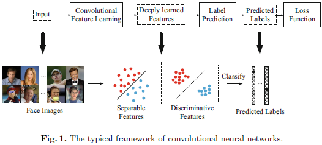

（1）中心损失函数能提高深度特征的判别能力。
（2）各类深度特征中心：在训练过程中，更新中心位置，使深层特征与相应类别中心的间距最小。
（3）归一化指数损失、中心损失联合监督，通过超参数平衡。
（4）归一化指数损失使不同类别的深层特性分离；中心损失使相同类别的深层特性靠近其类别中心。

## 2 相关工作

## 3 本文方法

### 3.1 简单示例

MNIST：2维深度特征

归一化指数（softmax）损失：

$$ \mathcal{L}_S
= - \sum_{i = 1}^{m} \log \frac
{e^{\mathbf{w}^{\mathrm{T}}_{y_i} \mathbf{x}_i + b_{y_i}}}
{\sum_{j = 1}^{n} e^{\mathbf{w}^{\mathrm{T}}_{j} \mathbf{x}_i + b_{j}}} $$

其中，$\mathbf{x}_i \in \mathbb{R}^d$表示样本$i$的深度特征，$y_i$表示样本$i$的类别，$d$表示特征的维度，$\mathbf{w}_{j} \in \mathbb{R}^d$表示输出全连接层权值矩阵$\mathbf{W} \in \mathbb{R}^{d \times n}$的第$j$列，$\mathbf{b} \in \mathbb{R}^{n}$表示偏置项。

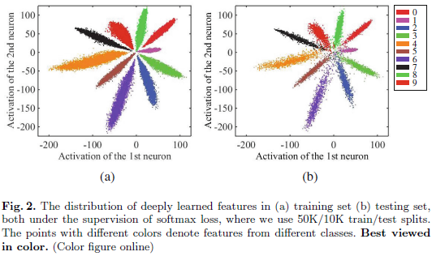

### 3.2 中心损失（center loss）

提升深度特征（deeply learned features）鉴别能力（discriminative power）的关键在于：保证不同类别特征可分的前提下，最小化类内差异。中心损失（center loss）定义为：

$$\mathcal{L}_C = \frac{1}{2} \sum_{i = 1}^{m} {\left\| \mathbf{x}_i - \mathbf{c}_{y_i} \right\|}_{2}^{2}$$

其中，$\mathbf{c}_{y_i} \in \mathbb{R}^d$表示类别$y_i$深度特征中心，该方程能够最小化类内差异。训练时，$\mathbf{c}_{y_i}$随深度特征的变化而变化，其学习率为$\alpha \in [0, 1]$。

$$\frac{\mathcal{L}_C}{\mathbf{x}_i} = \mathbf{x}_i - \mathbf{c}_{y_i}$$

$$\Delta \mathbf{c}_{j} = \frac{\sum_{i = 1}^{m} \delta(y_i = j)(\mathbf{c}_{j} - \mathbf{x}_i)}
{1 + \sum_{i = 1}^{m} \delta(y_i = j)}$$

其中，

$$\delta(x) = \begin{cases}
1, & x \ \text{is true} \\
0, & x \ \text{is false} \\
\end{cases}$$

归一化指数损失、中心损失联合监督损失函数（joint supervision of softmax loss and center loss）为：

$$ \begin{aligned}
\mathcal{L} = & \mathcal{L}_S + \lambda \mathcal{L}_C \\
= & - \sum_{i = 1}^{m} \log \frac{e^{\mathbf{w}^{\mathrm{T}}_{y_i} \mathbf{x}_i + b_{y_i}}}{\sum_{j = 1}^{n} e^{\mathbf{w}^{\mathrm{T}}_{j} \mathbf{x}_i + b_{j}}} +
\frac{\lambda}{2} \sum_{i = 1}^{m} \left\| \mathbf{x}_i - \mathbf{c}_{y_i} \right\|
\end{aligned}$$

超参数$\lambda$用于平衡归一化指数损失和中心损失。

*判别特征学习算法*

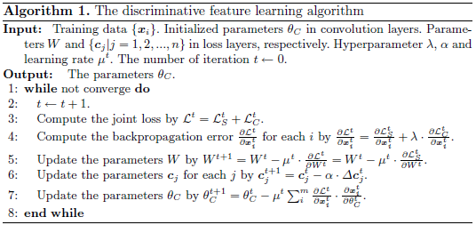

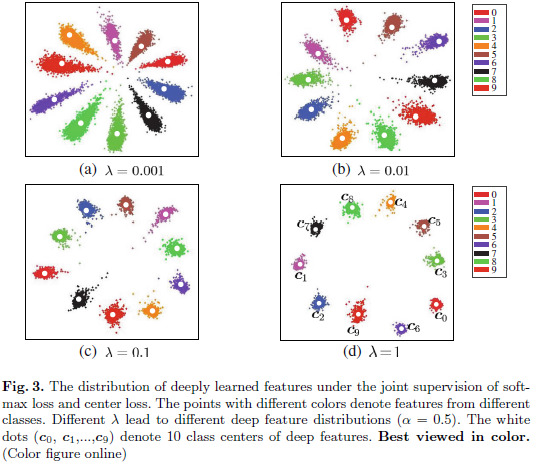

### 3.3 讨论

* 联合监督的必要性（the necessity of joint supervision）
归一化指数损失：增大类间距离；中心损失：减小类内距离（intra-class variations）

* 与反差损失、三元组损失比较（compared to contrastive loss and triplet loss）
反差损失、三元组损失在构造样本对、样本三元组时，存在数据膨胀问题（dramatic data expansion）；而联合监督损失无需额外构造数据；中心损失直接以类内紧致为学习目标。

## 4 实验

### 4.1 实施细节

* 预处理（preprocessing）
面部检测、5点关键点定位（landmarks）、5点仿射（similarity transformation）、样本正规化（normalized，$(p(x, y) - 127.5) / 255$）、RGB

* 训练数据（training data）
合并CASIA-WebFace、CACD2000、Celebrity+数据集，并剔除出现在测试集中的用户，共包含17,189位用户和70万张面部图像。
数据增强：水平翻转。

* CNN网络结构
caffe
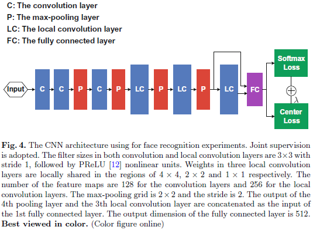
模型A：归一化指数损失；模型B：归一化指数损失、反差损失；模型C：归一化指数损失、中心损失。
批尺寸：256；Titan X：2 GPUs；
模型A、C：28K次迭代，14小时；模型B：42K次迭代，22小时。

* 测度
深度特征为全连接层输出、PCA、余弦相似度、最近邻（nearest neighbor）、门限比较（threshold comparison）

### 4.2 参数$\lambda$和$\alpha$

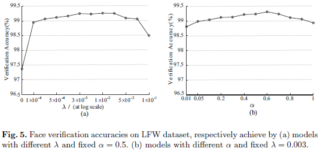

$\lambda$：控制类内变异（intra-class variations）
$\alpha$：类中心学习率（learning rate of center $\mathbf{c}$）

### 4.3 LFW、YTF

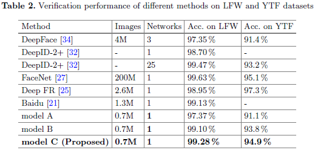

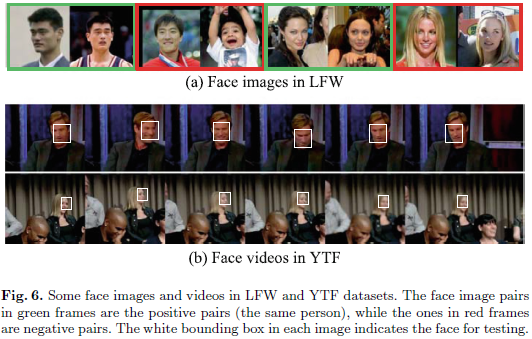

模型C，$\lambda = 0.003$、$\alpha = 0.5$

### 4.4 MegaFace

MegaFace：评估面部识别算法在大量干扰条件（million scale of distractors）下的表现。

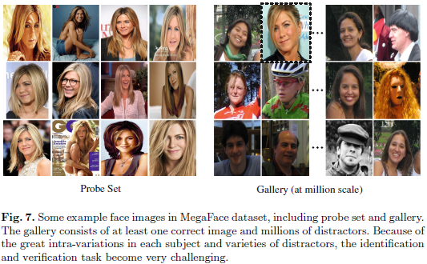

* 面部识别（face identification）
计算给定用户面部图像与库中面部图像间的相似度；用累积匹配特性（Cumulative Match Characteristics ，CMC）曲线（“Top-K”）衡量。
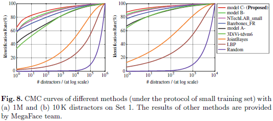
（横轴似乎反了）
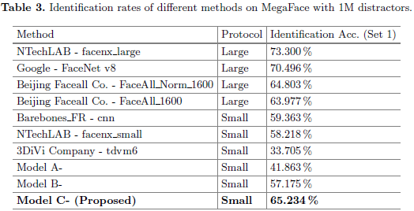
“Top-1”

* 面部认证（face verification）
验证给定的一对面部图像与是否为同一用户；计算真实接收速率（True Accept Rate，TAR）和虚假接收速率（False Accept Rate，FAR），绘制接收机的工作特性（Receiver Operating Characteristic，ROC）曲线。
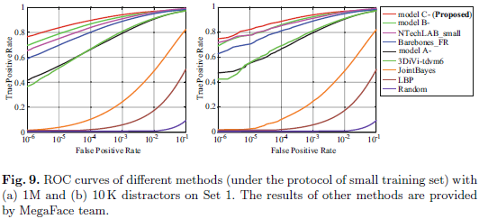
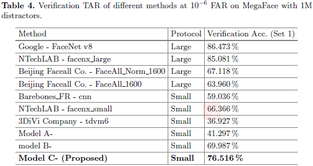
FAR = 1e-6

## 5 结论
