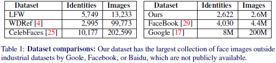
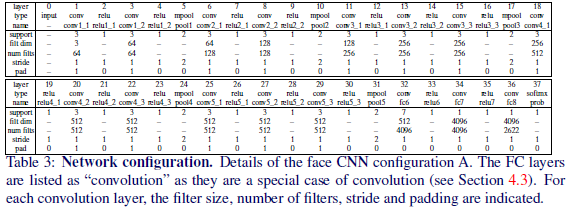
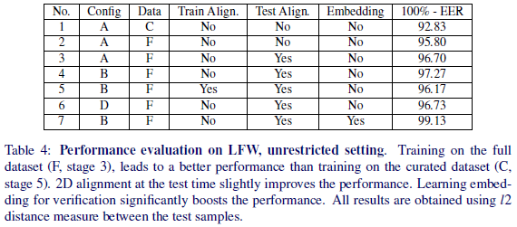
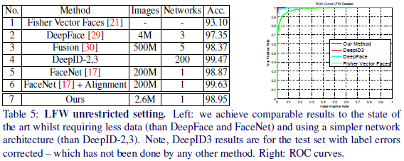
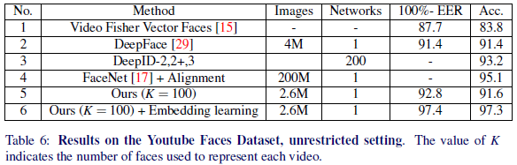

# Deep Face Recognition

---

O. M. Parkhi, A. Vedaldi, A. Zisserman, [Deep Face Recognition][deepface][C], British Machine Vision Conference, 2015

[deepface]: http://www.bmva.org/bmvc/2015/papers/paper041/paper041.pdf "Deep Face Recognition"

---

## 摘要

面部识别进展：（1）端到端学习（end to end learning）；（2）大规模训练集（very large scale training datasets）

本文内容：（1）260万张面部图像、2600+用户数据集创建；（2）深度网络训练和面部识别

## 1 引言

Google的FaceNet训练数据集比公开面部数据集大三个数量级（three orders of magnitude larger than）

本文提出：

（1）创建仅需有限人力标注的大规模面部数据集的过程；
（2）利用该训练集，考查用于面部识别及验证的CNN网络结构，包括面部对齐和度量学习。

## 2 相关工作

* DeepFace
孪生网络结构（siamese network architecture）、欧氏距离（Euclidean distance）、度量学习（metric learning）、3D面部对齐

* DeepID
CNN、贝叶斯学习框架（Bayesian learning framework）训练测度（metric）、分类&验证（classification and verification）多任务学习（multi-task learning）、2D面部对齐（2D affine alignment）

* FaceNet
三元组损失（“triplet-based” loss）
三元组：同一用户面部图像（congruous）$(a, b)$和其他用户面部图像$c$
目标：使$a$、$b$间距小于$a$、$c$间距（make $a$ closer to $b$ than $c$），$a$为中心脸（a “pivot” face）

## 3 数据集采集

* 步骤1：收集过滤候选用户列表，共2,622位明星
* 步骤2：为每个用户收集面部图像，每个用户2000张
* 步骤3：用Fisher面部描述符（Fisher Vector Faces descriptor）训练SVM（a one-vs-rest linear SVM），评价面部图像，每个用户保留1000张面部图像
* 步骤4：删除相似（near duplicate）图像
* 步骤5：人工过滤（manual filtering），最终面部图像982,803张，95%为正脸（frontal），5%为侧脸（profile）

## 4 网络结构和训练

### 4.1 学习面部分类器

$N$元分类问题（$N$-ways classification problem），$N = 2622$

深度网络（deep architectures）$\phi$
训练图像（training image）$l_t$，$t = 1, 2, \dots, T$
得分向量（score vector）$\mathbf{x}_t = \mathbf{W} \phi (l_t) + b \in \mathbb{R}^{N}$，全连接层输出，$N$个线性预测器（inear predictors），$\mathbf{W} \in \mathbb{R}^{N \times D}$，$b \in \mathbb{R}^{N}$
计算softmax（empirical softmax log-loss），比较得分向量$\mathbf{x}_t$与标签（ground-truth class identity）$c_t \in \{ 1, 2, \dots, N \}$：
$$E(\phi) = - \sum_{t} \log \left( \frac{e^{\left< \mathbf{e}_{c_{t}}, \mathbf{x}_t \right>}}{\sum_{q = 1, 2, \dots, N} e^{\left< \mathbf{e}_{q}, \mathbf{x}_t \right>}} \right)$$
$\mathbf{e}_{c}$表示类别$c$的独热编码（one-hot vector）

### 4.2 基于三元组损失学习面部嵌入向量

三元组损失（a triplet loss），源于度量学习（metric learning），用于学习可分、紧致、降维投影（learn a projection that is at the same time distinctive and compact, achieving dimensionality reduction at the same time）。

对CNN输出$\phi(l_t) \in \mathbb{R}^{D}$进行$l_2$标准化（$l^2$-normalised）并投影到$L$（$L \ll D$）维空间中，$\mathbf{x}_t = \frac{\mathbf{W}^{\prime} \phi (l_t)}{{\| \phi (l_t) \|}_2}$，$\mathbf{W}^{\prime} \in \mathbb{R}^{L \times D}$

固定CNN参数，仅训练投影$\mathbf{W}^{\prime}$，使三元组损失（empirical triplet loss）最小化：
$$E(\mathbf{W}^{\prime}) = - \sum_{(a, p, n) \in T}
\max \left\{ 0, \alpha - {\| \mathbf{x}_a - \mathbf{x}_n \|}_2^2 + {\| \mathbf{x}_a - \mathbf{x}_p \|}_2^2\right\},
\mathbf{x}_t = \mathbf{W}^{\prime} \frac{\phi (l_t)}{{\| \phi (l_t) \|}_2}$$

$\alpha \geq 0$为固定标量，表示学习余量（learning margin）、$T$为训练三元组集合（a collection of training triplets）。

### 4.3 结构

VGG网络A、B和D

输出全连接层维数为$N = 2622$（$N$元分类预测）或$L = 1024$（$L$维测度嵌入向量，$L$-dimensional metric embedding）

### 4.4 训练

## 5 数据集及评价

LFW、YTF

## 6 实验

* 实施细节

NVIDIA Titan Black GPUs：6GB显存，4核GPU

## 6.1 分量分析

* 数据策展

* 对齐

* 结构

* 三元组损失嵌入向量

### 6.2 比较

## 结论
