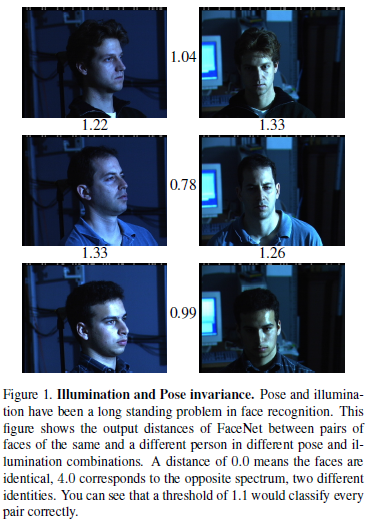
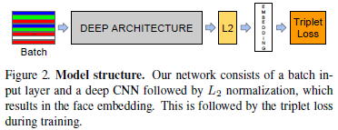
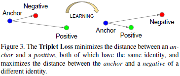
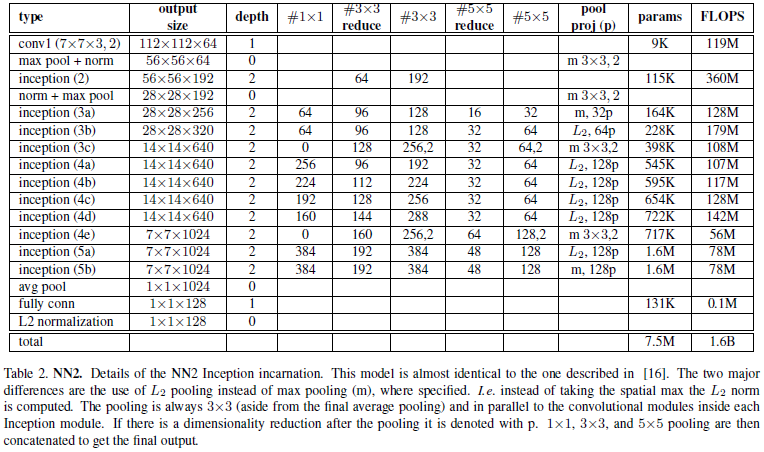
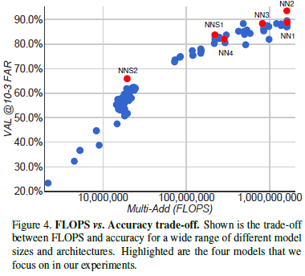
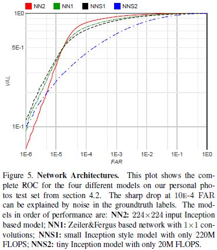
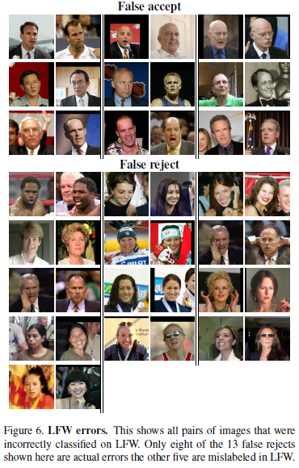

# FaceNet A Unified Embedding for Face Recognition and Clustering

"Schroff F, Kalenichenko D, Philbin J. [FaceNet: A unified embedding for face recognition and clustering][facenet][J]. 2015."

[facenet]: https://arxiv.org/abs/1503.03832 "FaceNet A Unified Embedding for Face Recognition and Clustering"

---
## 摘要

FaceNet：直接学习面部图像到紧致欧氏空间（compact Euclidean space）的映射，其距离用于度量面部的相似度。

## 1 引言

FaceNet利用基于三元组（triplet-based）最大余量近邻（large margin nearest neighbor，LMNN）的损失函数训练网络，其输出表示为128维紧致向量。

距离为$0$时，表示两张面部图像为同一个人；距离为$4$时，表示两张面部图像不是同一个人。门限$1.1$能够正确区分图中3组面部图像

## 2 相关工作

## 3 方法

本文给出一种将图像$x$映射到特征空间（a feature space）${\mathcal{R}}^d$的嵌入（embedding）$f(x)$，该嵌入能够减小同一用户所有面部图像之间平方距离（且与成像条件无关）；并增大任意不同用户面部图像之间的平方距离。

*三元组损失（triplet loss）*：在任意不同用户面部图像之间引入余量（enforce a margin）

### 3.1 三元组损失（Triplet Loss）

将图像$x$映射到$d$维欧氏空间（a $d$-dimensional Euclidean space）中的嵌入（embedding）记为$f(x) \in \mathcal{R}^{d}$。些外，将$f(x)$限制在$d$维超球面上，即${\|f(x)\|}_{2}=1$

锚点（anchor）：$x_{i}^{a}$，给定用户的面部图像
正样本（positive）：$x_{i}^{p}$，给定用户的其他面部图像
负样本（negative）：$x_{i}^{n}$，其他用户的面部图像

目标：使得给定用户的所有面部图像（锚点、正样本）间距小于该用户任意面部图像（锚点）与其他用户面部图像（负样本）间距。

$$\left\| f(x_{i}^{a}) - f(x_{i}^{p}) \right\|^{2}_{2} + \alpha \lt \left\| f(x_{i}^{a}) - f(x_{i}^{n}) \right\|^{2}_{2} \tag{1}$$

$$\forall \left( f(x_{i}^{a}), f(x_{i}^{p}), f(x_{i}^{n}) \right) \in \mathcal{T} \tag{2}$$

其中，$\alpha$为引入正负样本对间的余量（margin）；$\mathcal{T}$为训练集中所有可能的三元组集合，其基数为$N$。则$f(x)$通过最小化损失函数$\mathcal{L}$得到

$$\mathcal{L} = \sum_{i}^{N} {\left[ \left\| f(x_{i}^{a}) - f(x_{i}^{p}) \right\|^{2}_{2} - \left\| f(x_{i}^{a}) - f(x_{i}^{n}) \right\|^{2}_{2} + \alpha \right]}_{+} \tag{3}$$

最优化的关键在于选择硬三元组（hard triplets）。

### 3.2 三元组选择（Triplet Selection）

为确保快速收敛，选择违反方程（1）约束的三元组至关重要。给定$x_{i}^{a}$，可选择硬正样本（hard positive）$x_{i}^{p}$（$\arg \max_{x_{i}^{p}} \| f(x_{i}^{a}) - f(x_{i}^{p}) \|^{2}_{2}$），和硬负样本（hard negative）$x_{i}^{n}$（$\arg \min_{x_{i}^{n}} \| f(x_{i}^{a}) - f(x_{i}^{n}) \|^{2}_{2}$）

* 离线生成三元组（generate triplets offline）：每隔$n$步，使用最新网络检查点（checkpoint），计算数据子集上的argmin和argmax，生成三元组集合。

* 在线生成三元组（generate triplets online）：在一个迷你批量中选择硬正、负样本。

实验中，选择迷你批量中所有正样本和硬负样本组成三元组。同时，为防止训练开始时，$\mathcal{L}$陷入局部极小值（local minima），负样本选为半硬负样本（semi-hard negative）：

$$\left\| f(x_{i}^{a}) - f(x_{i}^{p}) \right\|^{2}_{2} \lt \left\| f(x_{i}^{a}) - f(x_{i}^{n}) \right\|^{2}_{2} \tag{4}$$

多数实验中，迷你批量尺寸为1800。

### 3.3 深度卷积网络（Deep Convolutional Networks）

余量$\alpha$设置为$0.2$，非线性激活函数为ReLU。

## 4 数据集与评价（Datasets and Evaluation）

数据集为LWF和Youtube Faces。

评价方法：

给定一对面部图像，用$L_2$平方距离阈值$D(x_i, x_j)$判别这对面部图像是否为同一用户。所有同一用户的面部图像对$(i, j)$记为$\mathcal{P}_{\text{same}}$，所有不同用户的面部图像对$(i, j)$记为$\mathcal{P}_{\text{diff}}$。

真阳性（true accepts）定义为：阈值为$d$时，正确分类为相同用户的面部图像对$(i, j)$，

$$\mathrm{TA}(d) = \{ (i, j) \in \mathcal{P}_{\text{same}}, \text{with} D(x_i, x_j) \leq d \} \tag{5}$$

假阳性（false accepts）定义为：阈值为$d$时，错误分类为相同用户的面部图像对$(i, j)$，

$$\mathrm{FA}(d) = \{ (i, j) \in \mathcal{P}_{\text{diff}}, \text{with} D(x_i, x_j) \leq d \} \tag{6}$$

召回率（validation rate）$\mathrm{VAL}(d)$：

$$\mathrm{VAL}(d) = \frac{|\mathrm{TA}(d)|}{|\mathcal{P}_{\text{same}}|}, \ \mathrm{FAR}(d) = \frac{|\mathrm{FA}(d)|}{|\mathcal{P}_{\text{diff}}|} \tag{7}$$

### 4.1 Hold-out Test Set

### 4.2 Personal Photos

### 4.3 Academic Datasets

## 5 实验（Experiments）

使用100-200M训练面部缩略图，其中包含大约8M个不同用户。

### 5.1 Computation Accuracy Trade-off

### 5.2 Effect of CNN Model

### 5.3 Sensitivity to Image Quality

### 5.4 Embedding Dimensionality

### 5.5 Amount of Training Data

### 5.6 Performance on LFW

### 5.7 Performance on Youtube Faces DB

### 5.8 Face Clustering

## 6 总结

## 7 附录：Harmonic Embedding
