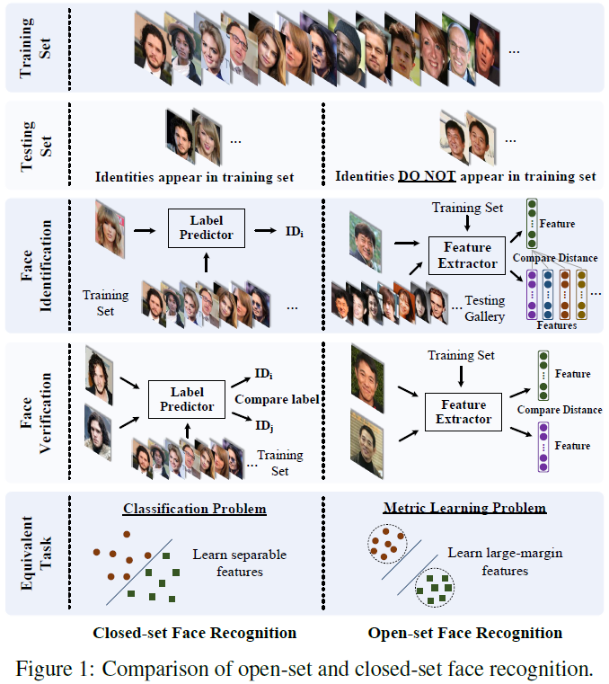
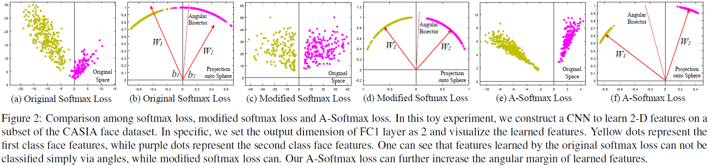
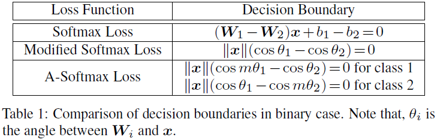
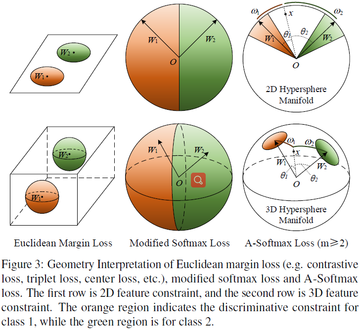
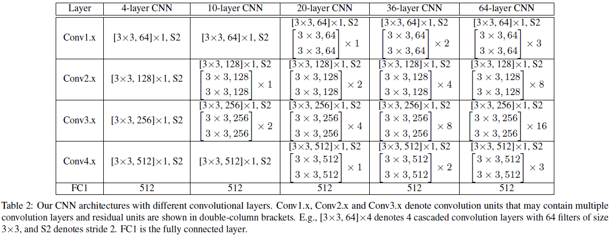
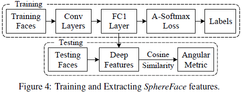
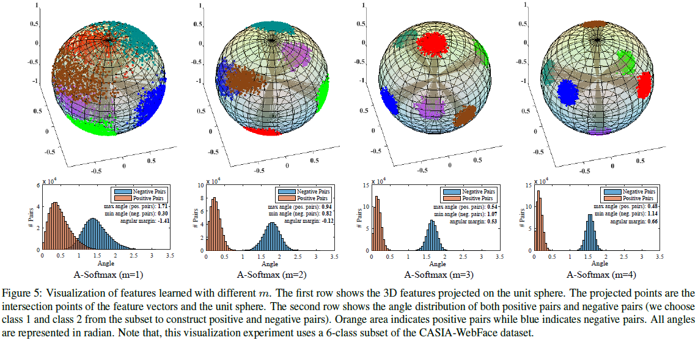
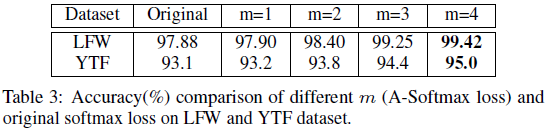
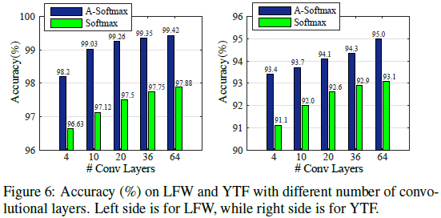
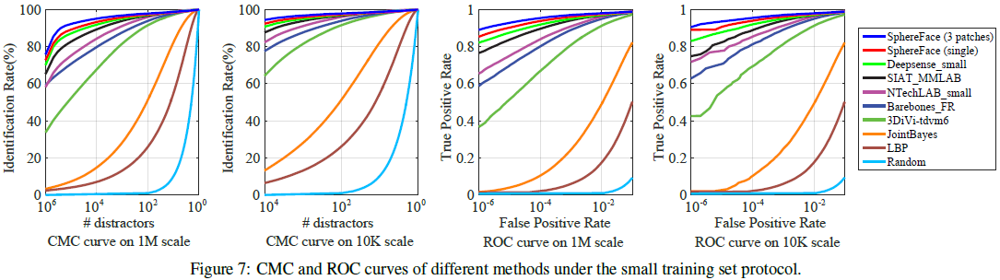

# SphereFace: Deep Hypersphere Embedding for Face Recognition

---

W. Liu, et al., [SphereFace: Deep Hypersphere Embedding for Face Recognition][sphere_face], CVPR (2017)

[sphere_face]: https://arxiv.org/pdf/1704.08063 "SphereFace: Deep Hypersphere Embedding for Face Recognition"

---

## 摘要

开集（open-set protocol）面部识别的特征要求：在某个测度空间（metric space）上，使得最大的类内距离（maximal intra-class distance）小于最小类间距离（minimal inter-class distance）。

角度归一化指数损失（angular softmax loss，A-Softmax）直接对超球面流形施加判别约束。

## 1 引言

面部识别（face recognition）分为面部身份识别（face identification）和面部验证（face verification），前者要求将面部图像分类到特定身份；后者是验证两张面部图像是否属于同一身份。

面部识别的测试协议（testing protocol）分为闭集（closed-set）和开集（open-set）设置：闭集面部识别为多分类问题，仅要求特征可分（separable）；而开集协议下，需要将面部图像映射到可辨特征空间中（map faces to a discriminative feature space）。

</img>

开集面部识别本质上是度量学习问题，其关键在于如何学习大余量可辨特征（discriminative large-margin features），使得最大的类内距离（maximal intra-class distance）在特定测度空间（metric space）上小于最小类间距离（minimal inter-class distance）。

面部识别的难点在于：面部图像类内差异大且类间相似度高（large intra-class variation and high inter-class similarity）

</img>

归一化指数损失（softmax loss）只能学习可分特征（seperatable features），其可辨性不足。中心损失（center loss）使类内紧凑；对比损失（contrastive loss）和三元组损失（triple loss）需要设计二元组、三元组挖掘。

*归一化指数损失学习的特征呈现角度分布，基于欧氏距离余量的损失与其并不兼容。（the
features learned by softmax loss have intrinsic angular distribution. In some sense, Euclidean margin based losses are incompatible with softmax loss.）*

* 角余量（angular margin）

归一化指数损失下，二分类（binary-class）问题的判决边界为：$(\mathbf{W}_1 - \mathbf{W}_2) \mathbf{x} + b_1 - b_2 = 0$，其中$\mathbf{x}$为特征向量（a feature vector）。引入约束条件（constrain）$\|\mathbf{W}_1\| = \|\mathbf{W}_2)\| = 1$、$b_1 = b_2 = 0$，判决边界改写为$\|\mathbf{x}\| (\cos \theta_1 - \cos \theta_2) = 0$，其中$\theta_i$为向量$\mathbf{W}_i$与$\mathbf{x}$的夹角。这种学习角度分布特征（angularly distributed features）的损失称为修正归一化指数损失（modified softmax loss）。

修正归一化指数损失可辨性依然不足，因此本文提出角度归一化指数函数（angular softmax，A-Softmax）：引入整数$m$（$m \geq 1$）定量控制决策边界（quantitatively control the decision boundary）。二分类情况下，决策边界为：

$$\|\mathbf{x}\| (\cos m \theta_1 - \cos \theta_2) = 0$$

$$\|\mathbf{x}\| (\cos \theta_1 - \cos m \theta_2) = 0$$

优化角度归一化指数损失（A-Softmax loss）能够同时增大类间余量，并压制类内角分布（simultaneously enlarging the inter-class margin and compressing the intra-class angular distribution）。角度归一化指数损失有清晰的几何解释，在其监督下（supervised by A-Softmax loss）习得的特征构造了等价于超球面流形上的测地线距离（a discriminative angular distance metric that is equivalent to geodesic distance on a hypersphere manifold）的判别角距离度量。将角度归一化指数损失应用于面部识别，提取的特征称为球面脸（SphereFace）

## 2 相关工作

* 度量学习（metric learning）

* 深度面部识别（deep face recognition）

## 3 深度超球面嵌入（Deep Hypersphere Embedding）

### 3.1 归一化指数损失

归一化指数损失（softmax loss）：

$$\mathcal{L} = \frac{1}{N} \sum_{i} \mathcal{L}_i =
\frac{1}{N} \sum_{i} - \log \frac{e^{f_{y_i}}}{\sum_j e^{f_j}} \tag{3}$$

其中，$N$为样本数、$f_j$为类别得分向量（class score vector）$\mathbf{f}$的第$j$个分量、$j \in [1, K]$、$K$为类别总数。

引入约束条件$\|\mathbf{W}_j\| = 1$、$b_j = 0$，修正归一化指数损失（modified softmax loss）为：

$$\mathcal{L}_\text{modified} =
\frac{1}{N} \sum_{i} - \log
\frac{e^{\|\mathbf{x}_i\| \cos \theta_{y_i, i}}}
{\sum_j e^{\|\mathbf{x}_i\| \cos \theta_{j, i}}} \tag{5}$$

### 3.2 归一化指数损失中引入角度余量（angular margin）

对于二分类问题，类别1的样本强制要求$\cos m \theta_1 \gt \cos \theta_2$；类别2的样本强制要求$\cos m \theta_2 \gt \cos \theta_1$，$m \geq 2$。此时角度余量为：

$$\frac{m - 1}{m + 1} \theta_2^1$$

其中，$\theta_2^1$为$\|\mathbf{W}_1\|$、$\|\mathbf{W}_2\|$间的夹角。

*推导*：

判决条件：$\theta_1 > \theta_2$、限制条件：$m \theta_1 > \theta_2$，因此角余量为$(m - 1) \theta_1$

case 1：$\theta_1 + \theta_2 = \theta_2^1$

角度归一化指数损失（A-Softmax loss）为：

$$\mathcal{L}_\text{ang} =
\frac{1}{N} \sum_{i} - \log
\frac{e^{\|\mathbf{x}_i\| \psi(\theta_{y_i, i})}}
{e^{\|\mathbf{x}_i\| \psi(\theta_{y_i, i})} +
\sum_{j \not=y_i} e^{\|\mathbf{x}_i\| \cos \theta_{j, i}}} \tag{7}$$

其中，$\psi(\theta_{y_i, i}) = (-1)^k \cos(m \theta_{y_i, i}) - 2k$为单调减函数、$\theta_{y_i, i} \in [\frac{k \pi}{m}, \frac{(k + 1) \pi}{m}]$、$k \in [0, m - 1]$

</img>

### 3.3 角度归一化指数损失（A-Softmax Loss）的超球面解释

角度归一化指数损失等价于超球流形上的可辨特征，欧式余量损失为欧式空间中的特征。

二分类问题中，$\theta_1$、$\theta_2$等价于其在单位超球面（unit hypersphere，$\{v_j, \forall j | \sum_j v_j^2 = 1, v \geq 0 \}$）上对应的弧长（arc length）$\omega_1$、$\omega_2$（最矩测地距离，shortest geodesic distance），则类别1样本的判决边界为$m \omega_1 = \omega_2$

</img>

### 3.4 角度归一化指数损失性质

* 性质1：角度归一化指数损失定义了难度可调的角度余量学习任务。$m$越大，角度余量越大，流形上的约束区域越小，相应的学习任务越难。

* 定义1：$m_{\min}$为满足可辨条件的最小值，即当$m > m_{\min}$时，在角度归一化指数损失监督下，类内最大角度特征距离小于类间最小角度特征距离。

* 性质2：二分类问题，$m_{\min} \geq 2 + \sqrt{3}$。

* 性质3：多分类问题，假设$\mathbf{W}_i, \forall i$均匀分布在欧氏空间中，则$m_{\min} \geq 3$。

通常可取$m = 4$。

### 3.5 讨论

角余量直接将可辨性与流形联系，其本质与面部图像同样位于流形之上的先验一致。

## 4 实验

### 4.1 实验设定

* 预处理

MTCNN面部对齐、截取，样本规范化（$(x - 127.5) / 128$）

* 网络结构

</img>

* 训练集

CASIA-WebFace（490万张面部图像，规模较小）

</img>

* 测试

FC1层输出作为深度特征，对原始面部图像及水平翻转后的图像做特征提取，将提取的特征连接后作为最终面部表示（representation）。评分（score）、度量（metric）为余弦距离（cosine distace），

### 4.2 结果分析

* 余量$m$的影响

</img>

</img>

* CNN结构的影响

</img>

### 4.3 LFW、YTF

</img>

### 4.4 MegaFace

</img>

</img>

## 5 结论

## 附录
