# Dimensionality Reduction by Learning an Invariant Mapping

---

R. Hadsell, S. Chopra, Y. Lecun, [Dimensionality Reduction by Learning an Invariant Mapping][invariant_mapping], CVPR (2006)

[invariant_mapping]: http://www.cs.toronto.edu/~hinton/csc2535/readings/hadsell-chopra-lecun-06-1.pdf "Dimensionality Reduction by Learning an Invariant Mapping"

---

## 摘要

降维（dimensionality reduction）：将高维数据点映射到低维流形上，使输入空间中相似的点在流形上相距较近（mapping a set of high dimensional input points onto a low dimensional manifold so that “similar” points in input space are mapped to nearby points on the manifold）。

已知方法的缺点：（1）与输入空间中的距离测度相关（most of them depend on a meaningful and computable distance metric in input space）；（2）当新样本与训练数据关系未知时，没有能够准确映射该样本的函数（do not compute a “function” that can accurately map new input samples whose relationship to the training data is unknown）。

本文提出通过学习不变映射进行降维（Dimensionality Reduction by Learning an Invariant Mapping，DrLIM），即学习一个能够将数据均匀映射到输出流形上的全局一致非线性函数（learning a globally coherent non-linear function that maps the data evenly to the output manifold），该学习仅与近邻关系有关而无需输入空间中任何距离度量（the learning relies solely on neighborhood relationships and does not require any distance measure in the input space）。

## 1 引言

局部线性嵌入（Locally Linear Embedding，LLE）：对类别相同的输入向量线性组合，无法处理与训练样本关系未知的数据。

样本外扩展（out-of-sample extensions）：假设存在能够生成邻域矩阵的可计算核函数（assume the existence of a computable kernel function that is used to generate the neighborhood matrix）条件下，给出新样本的一致性嵌入（consistent embedding）。

此外，在输出空间中，上述方法容易使样本聚集过密而导致解退化（degenerate solutions）；相反，这些方法需要找到能够被样本均匀覆盖的流形。

学习不变映射进行降维（Dimensionality Reduction by Learning an Invariant Mapping，DrLIM）通过学习全局一致非线性函数，数据映射到输出流形上：

* 仅需训练样本间的相邻关系（neighborhood relationships between training samples）；

* 对输入的非线性变换映射不变（invariant to complicated non-linear trnasformations of the inputs such as lighting changes and geometric distortions）；

* 无先验条件下，映射未知新样本（map new samples not seen during training, with no prior knowledge）；

* 输出空间上映射平滑、一致（mapping generated by the function is in some sense “smooth” and coherent in the output space）。

对比损失函数：通过学习映射函数$G_{\mathbf{W}}$的参数$\mathbf{W}$，使原始高维空间中的近邻样本在低维流形上内聚、非近邻样本远离。低维流形上距离度量为欧氏距离（euclidean distance）：

$$D_\mathbf{W} (\mathbf{x}_1, \mathbf{x}_2) = {\| G_\mathbf{W}(\mathbf{x}_1) - G_\mathbf{W}(\mathbf{x}_2) \|}_2$$

给定近邻关系集合（a set of neighborhood relationships），$D_\mathbf{W} (\mathbf{x}_1, \mathbf{x}_2)$能够逼近样本在输入空间上的语义相似性（semantic similarity”of the inputs in input space）。

### 1.1 相关工作（Previous Work）

线性嵌入（a linear embedding）：主成分分析（Principal Component Analysis，PCA）、多维缩放（Multi-Dimensional Scaling，MDS）

非线性谱方法（non-linear spectral methods）：ISOMAP、局部线性嵌入（Local Linear Embedding，LLE）、拉普拉斯特征图（Laplacian Eigenmaps）。上述方法步骤为：（1）确定每个样本的近邻样本列表；（2）构造元组矩阵（gram matrix）；第三，元组矩阵特征值（eigenvalue）求解。

核主成分分析（Kernel PCA）

## 2 学习低维映射（Learning the Low Dimensional Mapping）

问题描述：给定输入空间中样本间相邻关系（neighborhood relationships between samples），寻找将高维空间输入模式映射到时低维输出的函数（a function that maps high dimensional input patterns to lower dimensional outputs）。

输入向量集合：$\mathcal{I} = \{\mathbf{x}_1, \cdots, \mathbf{x}_P\}$，$\mathbf{x}_i \in \frak{R}^D, \forall i = 1, 2, \cdots, P$；

参数方程：$G_{\mathbf{W}} : \frak{R}^D \rightarrow \frak{R}^d, d \ll D$，满足：

（1）输出空间上的距离测度逼近输入空间中的近邻关系（neighborhood relationships）

（2）对输入样本的复杂变换具有不变性

（3）对近邻关系未知的样本公平（faithful even for samples whose neighborhood relationships are unknown）

### 2.1 对比损失函数（The Contrastive Loss Function）

高维训练向量集合：$\mathcal{I} = \{\mathbf{x}_i\}$；对于$\mathcal{I}$中的每条样本$\mathbf{x}_i$，$\mathcal{S}_{\mathbf{x}_i}$表示与$\mathbf{x}_i$相似的样本集合；$y = 0$表示$\mathbf{x}_1$与$\mathbf{x}_2$相似；$y = 1$表示$\mathbf{x}_1$与$\mathbf{x}_2$不相似；$D_\mathbf{W} (\mathbf{x}_1, \mathbf{x}_2)$表示$G_{\mathbf{W}}$输出间的欧氏距离：

$$D_\mathbf{W} (\mathbf{x}_1, \mathbf{x}_2) = {\| G_\mathbf{W}(\mathbf{x}_1) - G_\mathbf{W}(\mathbf{x}_2) \|}_2$$

则对比损失函数定义为：

$$\mathcal{L}(\mathbf{W}) = \sum_{i = 1}^{P} \mathcal{L} \left(\mathbf{W}, (y, \mathbf{x}_1, \mathbf{x}_2)^{i} \right)$$

$$\mathcal{L} \left(\mathbf{W}, (y, \mathbf{x}_1, \mathbf{x}_2)^{i} \right) = (1 - y) \mathcal{L}_S (D_\mathbf{W}^{i}) + y \mathcal{L}_D (D_\mathbf{W}^{i})$$

其中，$(y, \mathbf{x}_1, \mathbf{x}_2)^{i}$为第$i$对标记样本；$\mathcal{L}_S$为相似样本间部分损失函数（partial loss function for a pair of similar points）；$\mathcal{L}_D$为非相似样本间部分损失函数（partial loss function for a pair of dissimilar points）；$P$为样本对总数。

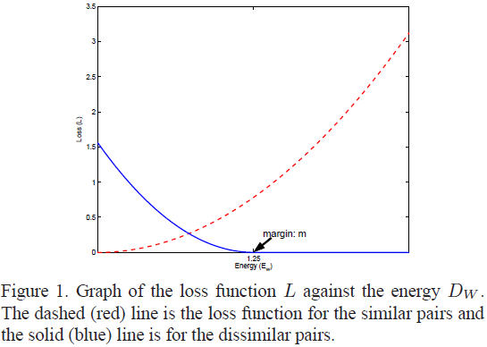

$$\mathcal{L}(\mathbf{W}, y, \mathbf{x}_1, \mathbf{x}_2) = (1 - y) \frac{1}{2} (D_\mathbf{W})^2 + y \frac{1}{2} \left\{\max(0, m - D_\mathbf{W})\right\}^2$$

其中，$m > 0$表示余量，定义了$G_\mathbf{W}(\mathbf{x})$的半径，仅当非相似样本对间距离小于该半径时，$\mathcal{L}_D$才发挥作用。

### 2.2 弹簧模型（Spring Model Analogy）

弹簧模型：

$$F = -KX$$

其中，$F$为力、$K$为弹簧常数（spring constant）、$X$为弹簧到其静止长度的位移（thedisplacement of the spring from its rest length）。

（1）拉力弹簧（attract-only）：弹簧的静止长度为零，任意正位移$X$都使弹簧两个端点间产生拉力；

（2）斥力弹簧（$m$-repulse-only）：弹簧的静止长度为$m$，当$X$小于$m$时，弹簧两个端点相互排斥。

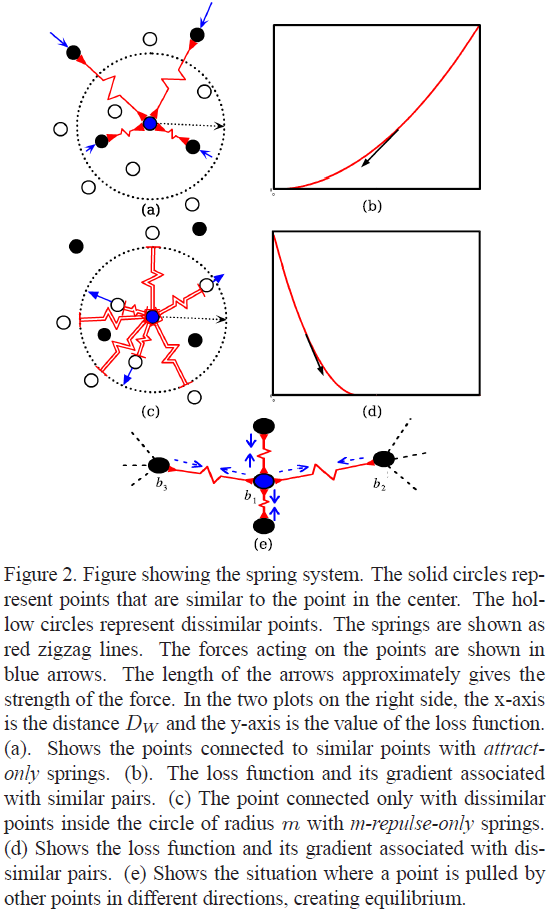

* 相似损失$\mathcal{L}_S \left(\mathbf{W}, \mathbf{x}_1, \mathbf{x}_2 \right)$：将相似样本对比作拉力弹簧的两个端点，

$$\mathcal{L}_S \left(\mathbf{W}, \mathbf{x}_1, \mathbf{x}_2 \right) = \frac{1}{2} (D_\mathbf{W})^{2}$$

相似损失$\mathcal{L}_S$梯度：

$$\frac{\partial \mathcal{L}_S}{\partial \mathbf{W}} = D_\mathbf{W} \frac{\partial D_\mathbf{W}}{\partial \mathbf{W}}$$

非相似损失$\mathcal{L}_D \left(\mathbf{W}, \mathbf{x}_1, \mathbf{x}_2 \right)$：将非相似样本对比作斥力弹簧的两个端点，

$$\mathcal{L}_D \left(\mathbf{W}, \mathbf{x}_1, \mathbf{x}_2 \right) = \frac{1}{2} \left\{\max(0, m - D_\mathbf{W})\right\}^2$$

* 非相似损失$\mathcal{L}_D$梯度：

$$\frac{\partial \mathcal{L}_D}{\partial \mathbf{W}} =
\begin{cases}
0, & D_\mathbf{W} > m \\
-(m - D_\mathbf{W}) \frac{\partial D_\mathbf{W}}{\partial \mathbf{W}}, & D_\mathbf{W} < m \\
\end{cases}$$

### 2.3 算法（The Algorithm）

（1）对训练集中任意样本$\mathbf{x}_i$，生成其相似样本集$\mathcal{S}_{\mathbf{x}_i} = \{\mathbf{x}_j\}_{j = 1}^{p}$和非相似样本集并标注：

$$y_{ij} = \begin{cases}
0, & \mathbf{x}_j \in \mathcal{S}_{\mathbf{x}_i} \\
1, & \text{otherwise} \\
\end{cases}$$

（2）训练

训练集中每对样本，若$y_{ij} = 0$，则更新$\mathbf{W}$使$D_\mathbf{W} = {\| G_\mathbf{W}(\mathbf{x}_1) - G_\mathbf{W}(\mathbf{x}_2) \|}_2$减小；反之若$y_{ij} = 1$，则更新$\mathbf{W}$，使$D_\mathbf{W} = {\| G_\mathbf{W}(\mathbf{x}_1) - G_\mathbf{W}(\mathbf{x}_2) \|}_2$增加。

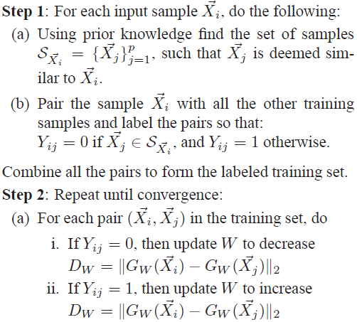

## 3 实验

### 3.1 训练结构（Training Architecture）

学习过程采用[孪生网络结构（siamese architecture）](https://blog.csdn.net/zhaoyin214/article/details/93902567)：

输入：$\mathbf{x}_1$、$\mathbf{x}_2$、$y$

孪生分枝：权值共享，分别计算$G_\mathbf{W}(\mathbf{x}_1)$、$G_\mathbf{W}(\mathbf{x}_2)$

损失模块：输入为标签、孪生分枝输出，计算$D_\mathbf{W} (G_\mathbf{W}(\mathbf{x}_1), G_\mathbf{W}(\mathbf{x}_2))$、$\mathcal{L}_S$、$\mathcal{L}_D$。

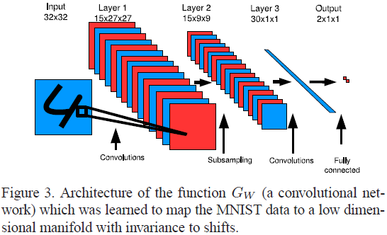

### 3.2 MNIST样本映射

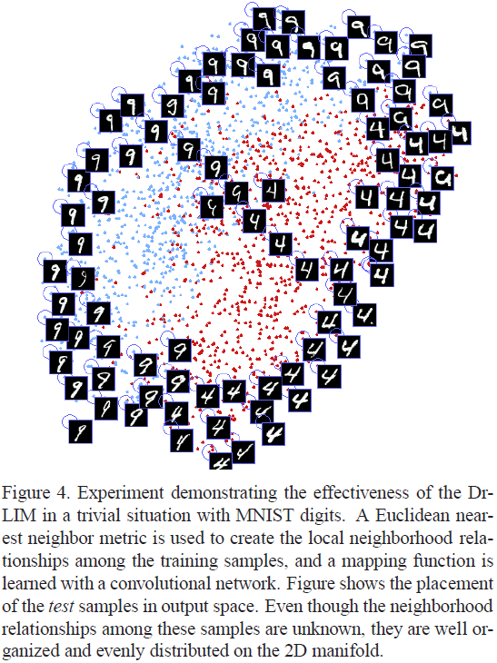

### 3.3 MNIST样本平移映射不变性

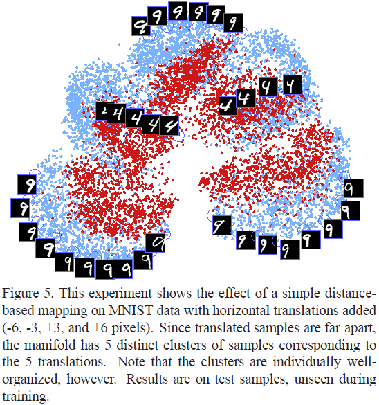

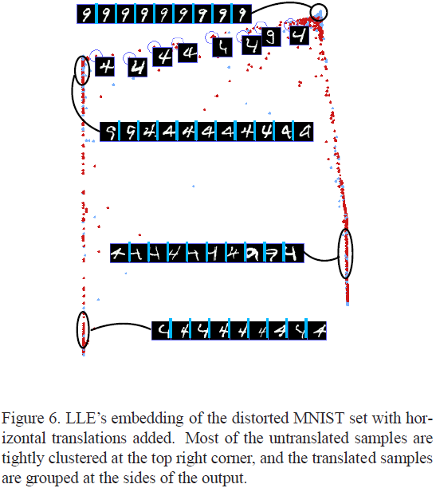

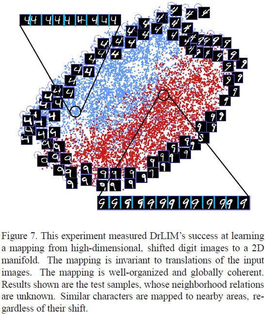

### 3.4 时域和光照映射不变性

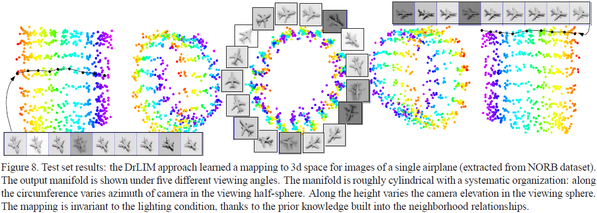

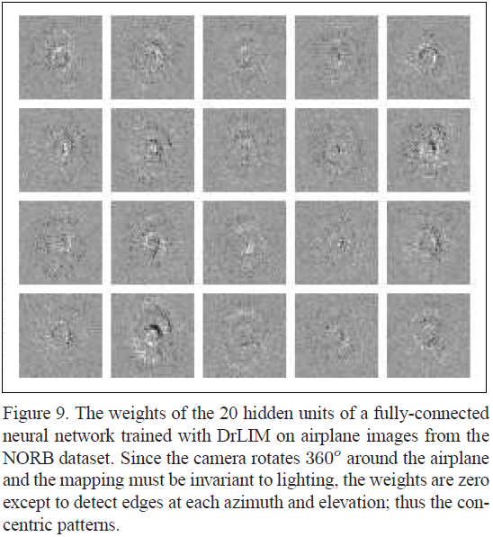

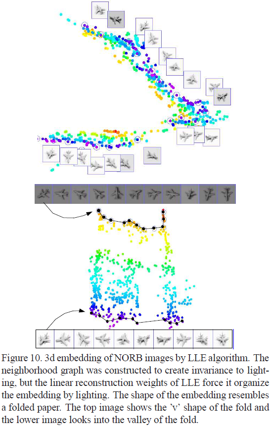

## 4 讨论
