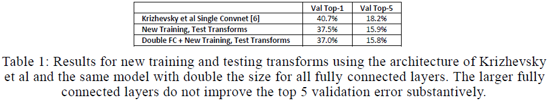
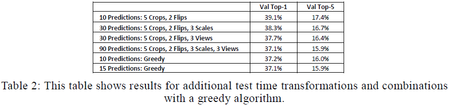
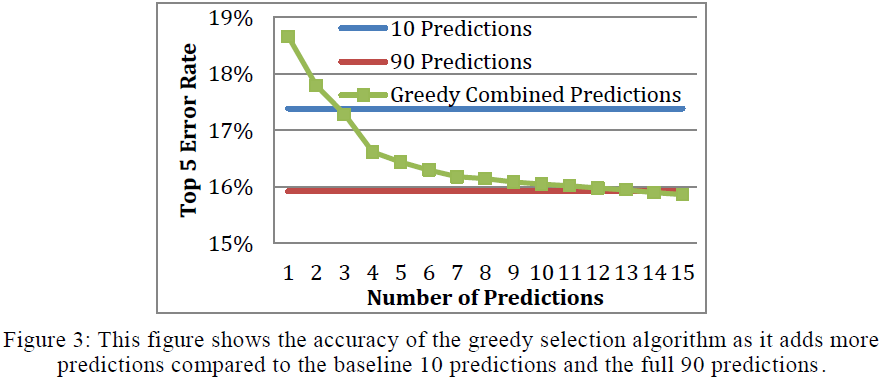
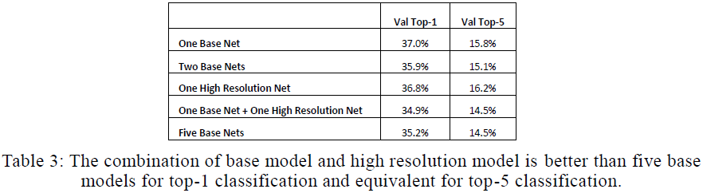
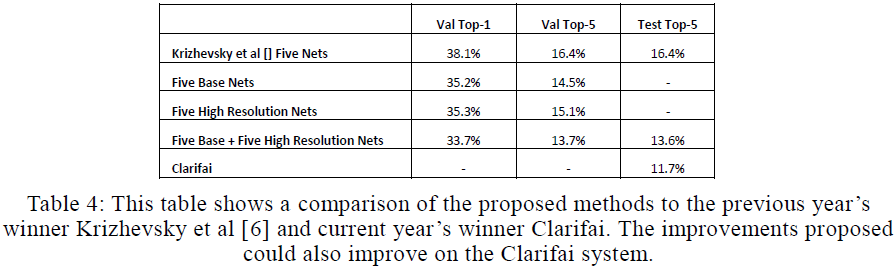

# Some Improvements on Deep Convolutional Neural Network Based Image Classification

---

A.G. Howard [Some Improvements on Deep Convolutional Neural Network Based Image Classification](https://arxiv.org/abs/1312.5402) (2013)

---

## 摘要

## 1 引言

验证误差平台（validation error plateaus）

## 2 训练数据变换（additional data transformations for training）

AlexNet分类（imagenet classification system）采用三种数据增强方式：

（1）随机裁剪（randomly located crop），从$256 \times 256$图像中随机裁剪出$224 \times 224$区域，获取平移不变性（capture some translation invariance）；

（2）随机水平翻转（horizontal flip）图像，获取镜像不变性（capture the reflection invariance）

（3）随机光照（add randomly generated lighting），获取光照不变性和次要色彩不变性（capture invariance to the change in lighting and minor color variation）

### 2.1 随机裁剪（extending image crops into extra pixels）

AlexNet随机裁剪：首先将图像的最大维度缩放至$256$像素，然后将图像另一边裁剪至$256$像素，大约损失$30%$的像素信息。

本文将图像沿短边按比例缩放至$256 \times N$（$N \times 256$）像素，然后随机裁剪出$224 \times 224$区域作为训练图像。

### 2.2 色彩修改（additional color manipulations）

随机修改对比度（contrast）、亮度（brightness）和色彩（color）：随机确定三种操作的次序、均匀抽取$[0.5, 1.5]$间的随机数作为处理强度（choose a number between 0.5 and 1.5 for the amount of enhancement），然后再加入随机光照。

## 3 测试数据变换（additional data transformations for testing）

预测时，AlexNet对输入图像进行中心（1）、边角（4）裁剪并水平翻转（2），然后将$10$张图像分别输入网络进行预测，并对结果取均值。本文将平移（5）、水平翻转（2）、缩放（3）、视角（3）组合，共有90种不同变换，采用贪心算法（greedy algorithm）选择$10$种进行预测。

### 3.1 多尺度预测（predictions at multiple scales）

通常图像的有用信息包含在不同的尺度上（image contains useful predictive elements at different scales），本文在三个尺度上进行预测：$256$、$228$、$284$，其中放大图像(（scaling an image up）、缩小图像（scaling an image down）时采用双三次插值（bicubic interpolation）；不使用抗锯齿滤波器（anti aliasing filter）。

### 3.2 多视角预测（predictions at multiple views）

给定输入图像尺寸$256 \times N$（$N \times 256$），本文分别截取左中右（上中下）区域，并将其裁剪、翻转、缩放。

### 3.2 减少预测数（reducing the number of predicitons）

贪心算法：从最佳预测（best prediction）开始，逐步新增预测，直至性能不再提升。

▇最佳预测是什么鬼？▇

## 4 高分辨率模型（higher resolution models）

分辨率增大时，可能需要重新训练模型，此时可使用已有模型作为初始权值。

### 4.1 模型细节（model details）

## 5 结果

