# Look at Boundary: A Boundary-Aware Face Alignment Algorithm

---

W. Wu, C. Qian, S. Yang, et al. [Look at Boundary: A Boundary-Aware Face Alignment Algorithm][lab], CVPR (2018)

[lab]: https://arxiv.org/abs/1805.10483 "Look at Boundary: A Boundary-Aware Face Alignment Algorithm"

---

## 摘要

边界面部对齐算法（boundary-aware face alignment）：将边界线作为面部几何结构（utilising boundary lines as the geometric structure of a human face），帮助面部关键点定位（facial landmark localisation）。

WFLW数据集：面部姿态、表情、光照、装容、遮挡、模糊。

## 1 引言

边界面部对齐算法（boundary-aware face alignment）包含两个步骤：

（1）估计面部边界热力图（estimate facial boundary heatmaps）

（2）根据边界热力图回归关键点（regress landmarks with the help of boundary heatmaps）

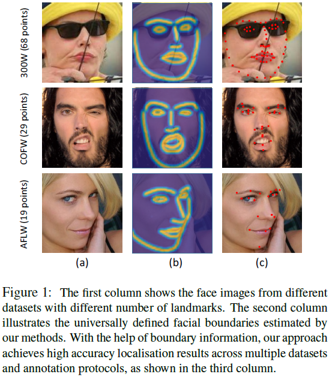

WFLW（Wider Facial Landmarks in-the-wild）数据集：包含$10000$张图像、姿态变化、表情、遮挡，每张图像包含$98$个关键点和$6$个属性。

## 2 相关工作

*坐标回归模型（coordinate regression models）*：直接学习输入图像到关键点坐标向量的映射。

*热力图回归模型（heatmap regression models）*：分别为每个关键点生成似然热力图（likelihood heatmaps）。

## 3 边界面部对齐算法（boundary-aware face alignment）

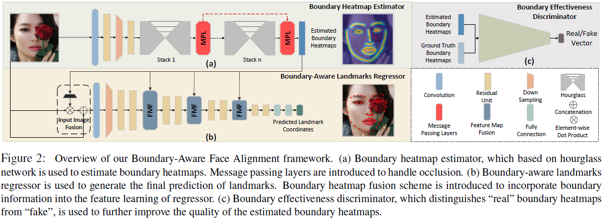

### 3.1 边界关键点回归（boundary-aware landmarks regressor）

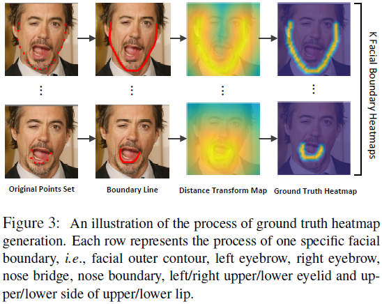

$I$：输入面部图像（face image）；

$L$个关键点（landmarks）标签（ground truth annotation）集合$S = \{ s_{l} \}_{l = 1}^{L}$；

$K$个子集$S_i \in S$表示$K$个边界（boundaries）；

对$S_i$插值计算密边界线（a dense boundary line）；

二值边界图（a binary boundary map）$B_i$，尺寸与$I$相同；

真实边界热力图（ground-truth boundary heatmap）$M_{i}$：

$$M_{i}(x, y) = \begin{cases}
\exp \left( - \frac{D_{i} (x, y)^{2}}{2 \sigma_{2}} \right), \quad & \text{if } D_{i} (x, y) < 3 \sigma \\
0, \quad & \text{otherwise} \\
\end{cases}$$

基础网络：ResNet18

*输入图像融合（input image fusion）*：将边界热力图$M$与输入图像$I$融合，融合输入$H$为

$$H = I \oplus (M_{1} \otimes I) \oplus \cdots \oplus (M_{T} \otimes I) \tag{2}$$

【$H = I \oplus (M_{1} \otimes I) \oplus \cdots \oplus (M_{K} \otimes I)$】

其中，$\otimes$表示按元素做点积运算（element-wise dot product operation）、$\oplus$表示沿通道维度相连（channel-wise concatenation）【$\text{concat}([c_{1,1}, c_{1,2}, \cdots, c_{1,m}], [c_{2,1}, c_{2,2}, \cdots, c_{2,n}]) \rightarrow [c_{1,1}, c_{1,2}, \cdots, c_{1,m}, c_{2,1}, c_{2,2}, \cdots, c_{2,n}]$】

*特征图融合（feature map fusion）*：将边界热力图$M$与特征图（feature map）$F$融合，融合特征图$H$为

$$H = F \oplus \left(F \otimes T (M \oplus F) \right) \tag{3}$$

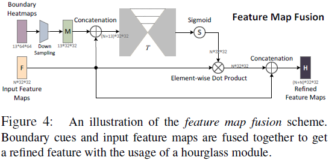

### 3.2 边界热力图回归（boundary heatmap estimator）

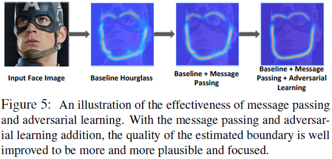

*层内消息传递（intra-level message passing）*：在各堆的末端，将各边界热力图的信息相互传递（at the end of each stack to pass information between different boundary heatmaps）；因此，可见边界的信息能够传到不可见边界处（information can be passed from visible boundaries to occluded ones）。

*层间消息传递（inter-level message passing）*：

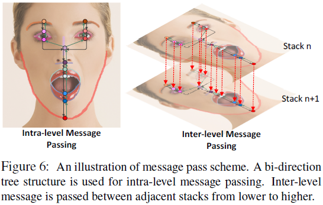

### 3.3 边界辨别（boundary effectiveness discriminator）

### 3.4 跨数集面部对齐（Cross-Dataset Face Alignment）

## 4 实验

### 4.1. （comparison with existing approaches）

#### 4.1.1 300W数据集评估（evaluation on 300W）

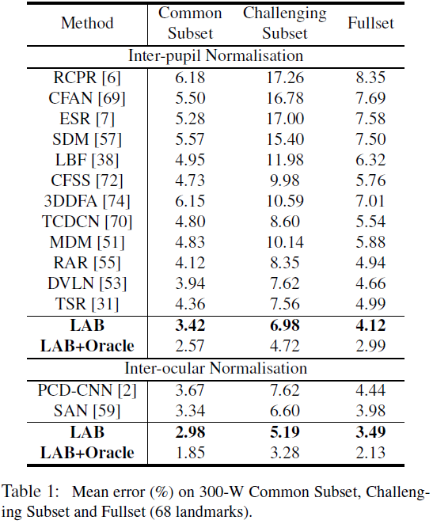

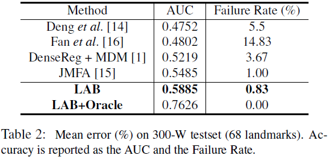

#### 4.1.2 WFLW数据集评估（evaluation on WFLW）

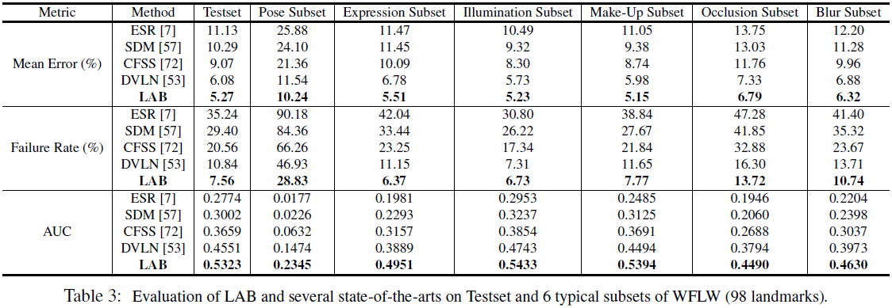

#### 4.1.3 跨数集评估（cross-dataset evaluation on COFW and AFLW）

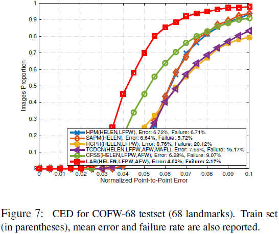

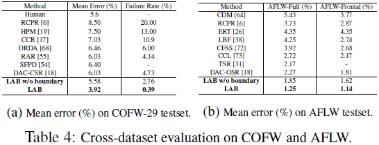

### 4.2. （ablation study）

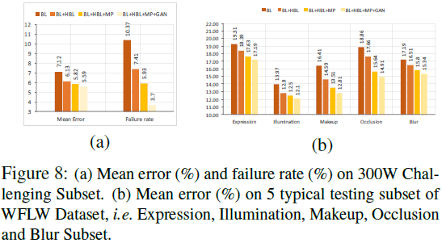

* 边界信息（boundary information）

* 边界信息融合（boundary information fusion）

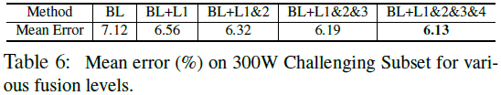

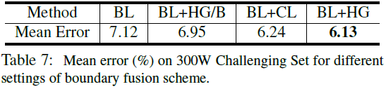

* 消息传输（message passing）

* 对抗学习（adversarial learning）

* 边界估计与关键点回归（relationship between boundary estimator and landmarks regressor）

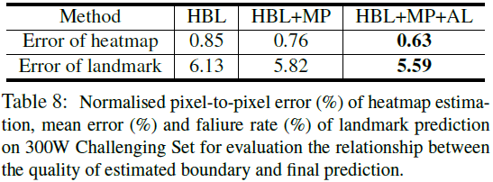

## 5 结论
