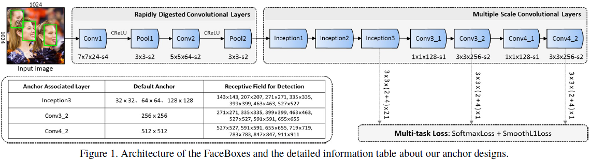
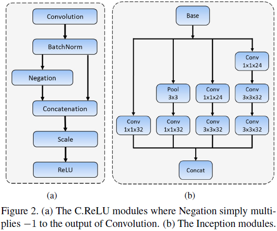
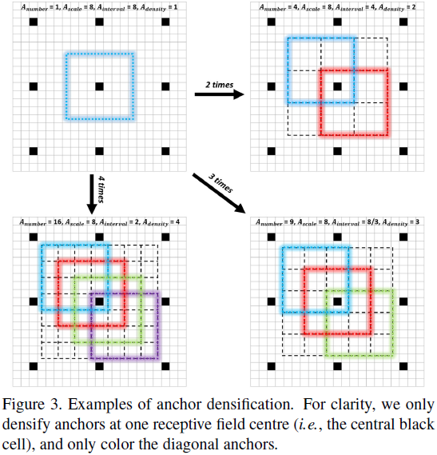
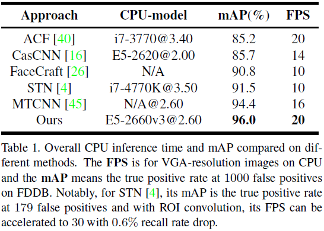
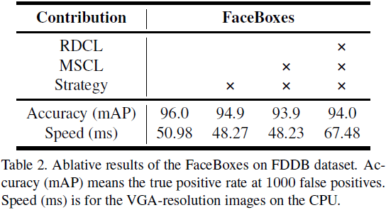
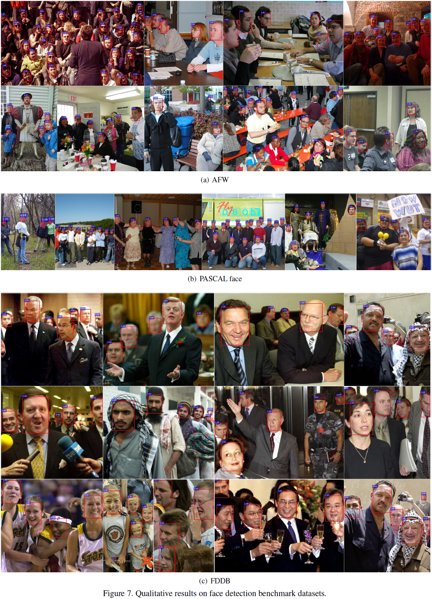
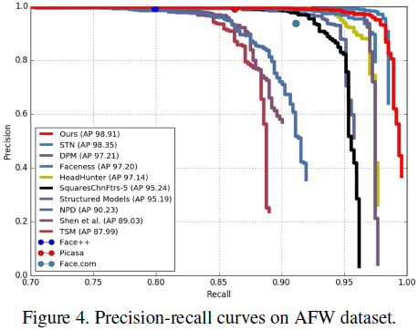
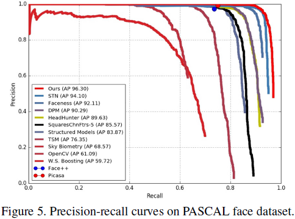
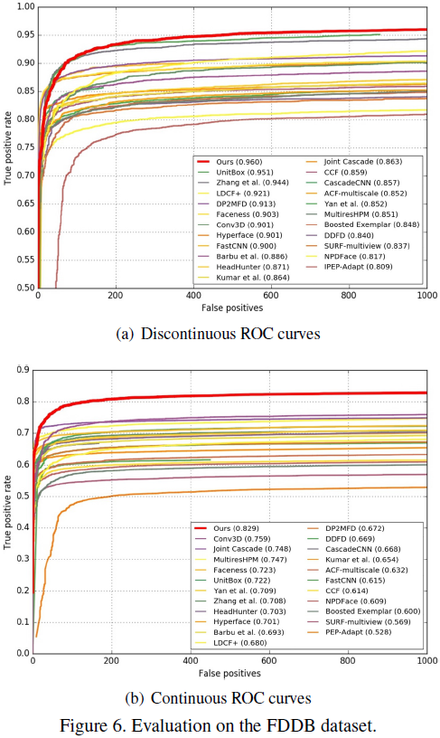

# FaceBoxes: A CPU Real-time Face Detector with High Accuracy

---

S.F. Zhang, X.Y. Zhu, Z. Lei, et al, [FaceBoxes: A CPU Real-time Face Detector with High Accuracy][face_boxes], IJCB (2017)

[face_boxes]: https://arxiv.org/abs/1708.05234 "FaceBoxes: A CPU Real-time Face Detector with High Accuracy"

---

## 摘要

FaceBoxes：

* CPU实时处理（real-time speed on the CPU）

* 高准确率（superior performance on both speed and accuracy）

* 轻量且性能强大的网络结构（a lightweight yet powerful network structure），包括高速抽取卷积层（Rapidly Digested Convolutional Layers，RDCL）和多尺度卷积层（Multiple Scale Convolutional Layers，MSCL）

* RDCL使FaceBoxes能够在CPU上实时处理

* MSCL用于丰富感知域（enriching the receptive fields）并通过在多个卷积层上锚点离散化处理不同尺度的面部

* 锚点稠密化（anchor densification strategy）使图像上不同类型的锚点密度相同（样本平衡），以提升小尺寸面部的召回率（improves the recall rate of small faces）

* 检测速度与面部数量无关

## 1 引言

FaceBoxes是一种全卷积网络（fully convolutional neural network），能够进行端到端训练（be trained end-to-end）。

FaceBoxes采用轻量化（lightweight）网络结构（Fig. 1），由高速抽取卷积层（Rapidly Digested Convolutional Layers，RDCL）和多尺度卷积层（Multiple Scale Convolutional Layers，MSCL）组成。

RDCL（Rapidly Digested Convolutional Layers，高速抽取卷积层）：使FaceBoxes能够在CPU上实时处理

MSCL（Multiple Scale Convolutional Layers，多尺度卷积层）：丰富感知域（enriching the receptive fields），通过在多个卷积层上锚点离散化处理不同尺度的面部

锚点稠密化（anchor densification strategy）：使输入图像上不同类型锚点的密度相同，以提升小尺寸面部的召回率。

在VGA分辨率（VGA-resolution）下，FaceBoxes检测器在单核CPU（a single CPU core）上的运行速度为20FPS，在GPU上的运行速度为125FPS，且检测速度与面部数量无关。

本文贡献：RDCL、MSCL、锚点稠密化

## 2 相关工作

### 2.1 人工特征表示（Hand-craft based methods）

### 2.2 卷积神经网络特征表示（CNN based methods）

## 3 FaceBoxes

RDCL、MSCL、锚点稠密化

### 3.1 高速抽取卷积层（Rapidly Digested Convolutional Layers）

高速抽取卷积层（Rapidly Digested Convolutional Layers，RDCL）：使用合适尺寸的卷积核快速缩小输入空间尺寸并减少输出通道数（fast shrink the input spatial size by suitable kernel size with reducing the number of output channels）。

* 缩小输入空间尺寸（shrinking the spatial size of input）

增加卷积层与池化层的步长，快速缩小输入空间尺寸。Conv1、Pool1、Conv2、Pool2步长分别为4、2、2、2。

* 核尺寸（choosing suitable kernel size）

满足有效性及高效率（keep efficient as well as effective），Conv1、Conv2、Pool1的核尺寸分别为$7 \times 7$、$5 \times 5$、$3 \times 3$

* 减少输出通道数（reducing the number of output channels）

低层卷积滤波器输出成对、相位相反（filters in the lower layers form pairs, i.e., filters with opposite phase）。CReLU（Concatenated Rectified Linear Units）激活（Fig. 2-a）将输出取反后与原输出并联，使输出通道数翻倍（double the number of output channels by simply concatenating negated outputs before applying ReLU）。

$$\text{CReLU} (x) = [\max(x, 0), \max(-x, 0)] = \text{ReLU} ([x, -x])$$

### 3.2 多尺度卷积层（Multiple Scale Convolutional Layers）

应用区域候选网络（region proposal network，RPN）检测面部存在的问题：

（1）锚点仅分配给最后一层卷积层的输出特征图

（2）锚点的输入特征图感知域尺寸单一

* 网络深度多尺度（multi-scale design along the dimension of network depth）

以Inception_3、Conv3_2、Conv4_2输出组成多尺度特征图（multi-scale feature maps），特征图尺寸逐层减小

* 网络宽度多尺度（multi-scale design along the dimension of network width）

锚点层输入特征图对应多尺寸感知域。Inception模块（Fig. 2-b）由卷积核尺寸不同的多个卷积分枝组成，因此能够沿网络宽度维度丰富感知域。

▇
FaceBoxes网络结构

* RDCL

--- | 输出 | 卷积核 | 填充 | 步长
--- | ---: | ---: | ---: | ---:
输入 | 1024 x 1024 x 3 | - | - | -
conv1 | 256 x 256 x 24 | 7 x 7 x 24 | 3 | 4
crelu | 256 x 256 x 48 | - | - | -
max_pool1 | 128 x 128 x 48 | 3 x 3 | 1 | 2
conv2 | 64 x 64 x 64 | 5 x 5 x 64 | 2 | 2
crelu | 64 x 64 x 128 | - | - | -
max_pool1 | 32 x 32 x 128 | 3 x 3 | 1 | 2

* MSCL

--- | 输出 | 卷积核 | 填充 | 步长
--- | ---: | ---: | ---: | ---:
输入 | 32 x 32 x 128 | - | - | -
incept1 | 32 x 32 x (32 x 4) | - | - | -
incept2 | 32 x 32 x (32 x 4) | - | - | -
incept3 | 32 x 32 x (32 x 4) | - | - | -
conv3_1 | 32 x 32 x 128 | 1 x 1 x 128 | 0 | 1
conv3_2 | 16 x 16 x 256 | 3 x 3 x 256 | 1 | 2
conv4_1 | 16 x 16 x 128 | 1 x 1 x 128 | 0 | 1
conv4_2 | 8 x 8 x 256 | 3 x 3 x 256 | 1 | 2

* Anchor Box （loc + conf）

--- | 输入 | 输出 | 卷积核 | 填充 | 步长 | 平铺间隔（像素步长）
--- | ---: | ---: | ---: | ---: | ---: | ---:
loc + conf | incept3 | 32 x 32 x 126 | 3 x 3 x ((4 + 2) x 21) | 1 | 1 | 32
loc + conf | conv3_2 | 16 x 16 x 6 | 3 x 3 x ((4 + 2) x 1) | 1 | 1 | 64
loc + conf | conv3_2 | 8 x 8 x 6 | 3 x 3 x ((4 + 2) x 1) | 1 | 1 | 128

▇

### 3.3 锚点稠密化（anchor densification strategy）

默认锚点长宽比（aspect ratio）为$1 : 1$，incept3的锚点尺度（scale of anchor）为32、64、128像素（pixel）、conv3_2和conv4_2的锚点尺度分别为256和512像素。

图像上锚点的平铺间隔等于对应锚点层的像素单位步长（the tiling interval of anchor on the image is equal to the stride size of the corresponding anchor-associated layer）。例：conv3_2的步长为64像素、锚点尺寸为$256 \times 256$，表示该输入图像上每64个像素都有一个$256 \times 256$的锚点与之对应。锚点平铺密度$A_{\text{density}}定义为$：

$$A_{\text{density}} = \frac{A_{\text{scale}}}{A_{\text{interval}}} \tag{1}$$

其中，$A_{\text{scale}}$表示锚点尺度（scale of anchor）、$A_{\text{interval}}$表示锚点平铺间隔（tiling interval of anchor）。默认锚点的平铺间隔分别为32、32、32、64和128，由方程(1)可知，其对应的锚点平铺密度分别为1、2、4、4和4，因此引发不同尺度锚点的平铺密度不平衡问题（tiling density imbalance problem）。与大尺度锚点（$128 \times 128$、$256 \times 256$、$512 \times 512$）相比，小尺度锚点（$32 \times 32$、$64 \times 64$）过于稀疏。

▇

--- | 尺度（人工指定） | 平铺间隔（步长） | 平铺密度
--- | ---: | ---: | ---:
incept3 (1) | $32 \times 32$ | 32 | 1
incept3 (2) | $64 \times 64$ | 32 | 2
incept3 (3) | $128 \times 128$ | 32 | 4
conv3_2 | $256 \times 256$ | 64 | 4
conv4_2 | $512 \times 512$ | 128 | 4

▇

本文采用锚点稠密化策略（anchor densification strategy）处理不平衡问题（Fig. 3）：锚点$n$倍稠密化（densify one type of anchors $n$ times），围绕感知域中心均匀平铺$A_{\text{number}} = n^2$个锚点（uniformly tile $A_{\text{number}} = n^2$ around the center of one receptive field instead of only tiling one at the center of this receptive field to predict）。

### 3.4 训练

* 训练数据集（training dataset）

WIDER FACE：训练集中包含12880张图像。

* 数据增强（data augmentation）

    + 色彩失真（color distortion）：光度测定失真（photo-metric distortions）；
    + 随机裁剪（random cropping）：从原始图像中随机裁剪5块方形区域（square patches），其中一块为原始图像最大的方形区域，其余尺寸随机取原始图像短边的$[0.3, 1]$。然后随机选取其中之一作为输入图像；
    + 尺度变换（scale transformation）：将随机裁剪后的图像区域缩放为$1024 \times 1024$；
    + 水平翻转（horizontal flipping）：将缩放后图像以概率$0.5$随机翻转；
    + 过滤面部框（face-box filter）：如果面部框的中心位于随机裁剪后的图像区域中，则保留重叠的部分；然后将其中高度或宽度小于20像素的面部框滤除。

* 匹配策略（matching strategy）

首先将真实面部框匹配给IoU最大锚点；然后为每个锚点分配一个IoU大于门限的真实面部框。

* 损失函数（loss function）

分类：二分类交叉熵损失（2-class softmax loss for classification）；回归：平滑$L_1$损失（the smooth L1 loss for regression）。

* 决策边界负样本挖掘（hard negative mining）

匹配后的锚点大多数为负样本，引起正负样本数据不平衡问题。对锚点按损失排序，选择排名靠前的锚点，使正负样本比例为$1 : 3$。

* 其它（other implementation details）

参数初始化：xavier；SGD：动量（momentum）0.9、权值衰减（weight decay）0.0005、批尺寸32；最大迭代次数120k，前80k次迭代学习率（learning rate）为$10^{-3}$、随后20k次迭代学习率为$10^{-4}$、最后20k次迭代学习率为$10^{-5}$。

## 4 实验

### 4.1 运行时效率（runtime efficiency）

### 4.2 模型分析（model analysis）

* （anchor densification strategy is crucial）

* （MSCL is better）

* （RDCL is efficient and accuracy-preserving）

### 4.3 评估（evaluation on benchmark）

* AFW数据集

* PASCAL面部数据集

* FDDB数据集

## 5 结论

## 致谢
