# NIMA Neural Image Assessment

---

H. Talebi, P. Milanfar, [NIMA: Neural Image Assessment][nima], TIP (2018)

[nima]: https://ieeexplore.ieee.org/document/8352823 "NIMA: Neural Image Assessment"

---

## 摘要

使用卷积神经网纲预测人类评分的分布（predict the distribution of human opinion scores using a convolutional neural network）

图像评分可靠、与人类的认知高度相关，并能辅助图像质量优化、增强（not only score images reliably and with high correlation to human perception, but also to assist with adaptation and optimization of photo editing/enhancement algorithms in a photographic pipeline）

无需参考图像（without need of a “golden” reference image）

## 1 引言

技术质量评价（technical quality assessment）：衡量图像低层次衰退（measuring low-level degradations），如噪声、模糊、压缩伪影等

审美评价（aesthetic assessment）：量化（quantify）图像中与情感和审美（emotions and beauty）相关的语义层面特征（semantic level characteristics）。

图像质量评价（image quality assessment）分为全参考（full-reference）和无参考（no-reference）：有参考图像时，评价指标可采用PSNR、SSIM；无参考方法利用失真统计模型预测图像质量（blind (no-reference) approaches rely on a statistical model of distortions）。

### A 相关工作

### B 本文贡献

相比图像高、低评分分类（classifying images to low/high score）和平均分回归（regressing to the mean score），本文预测评分的直方图分布（the distribution of ratings are predicted as a histogram），预测结果与人类评分高度相关。

### C AVA数据集（A Large-Scale Database for Aesthetic Visual Analysis）

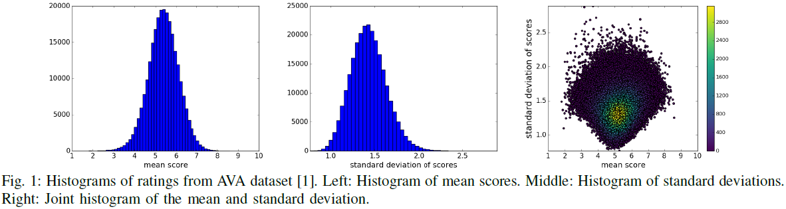

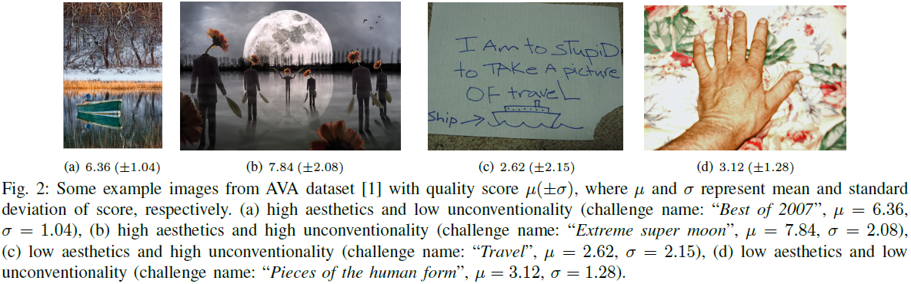

### D TID2013数据集（Tampere Image Database 2013）

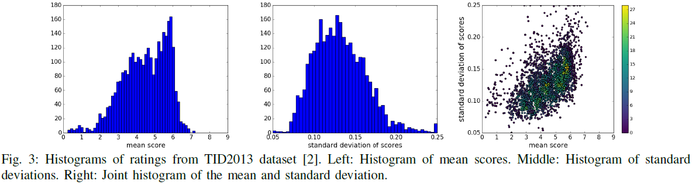

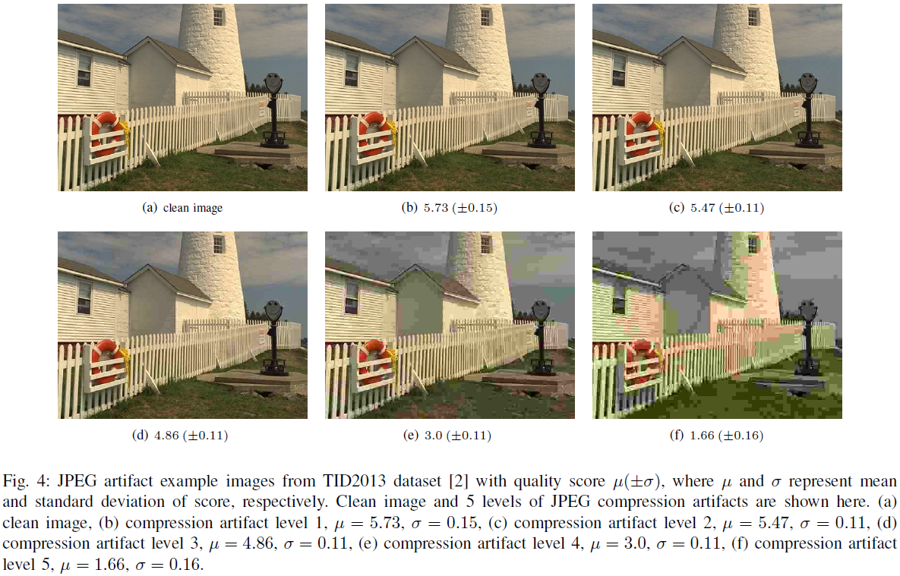

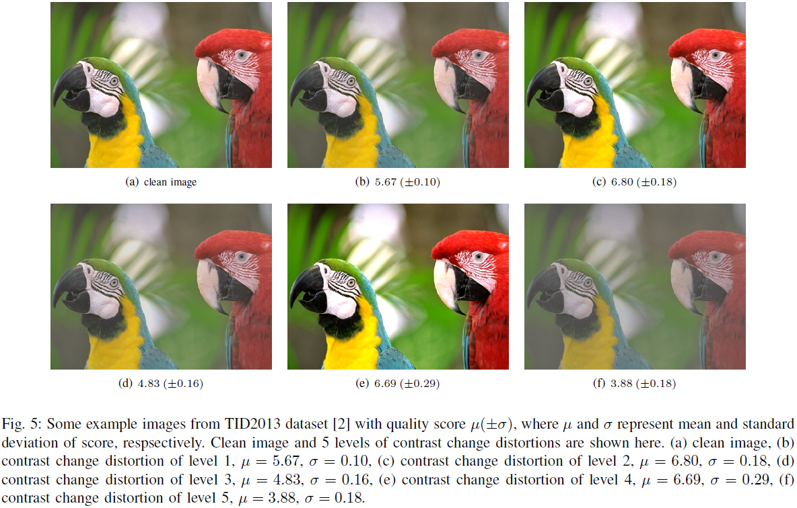

## 2 方法

本文提出的质量、美学预测器以图像分类器为基础网络（the quality and aesthetic predictor stands on image classifier architectures），如VGG16、Inception-v2、MobileNet。

将CNN基础网络（baseline）的输出层替换为10个神经元（10 neurons）的全连接层（a fully-connected layer）并采用softmax激活。

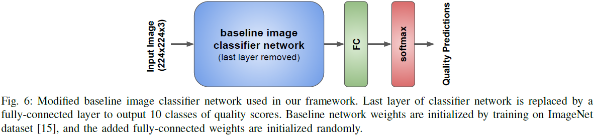

训练阶段：将输入图像缩放至$256 \times 256$（rescaled to $256 \times 256$）、随机裁剪$224 \times 224$区域并随机水平翻转（horizontal flipping）。

本文目标是预测给定图像的评分分布（the distribution of ratings）$\hat{\mathbf{p}}$。人类对给定图像评分的真实分布（ground truth distribution）可表示为经验概率质量函数（an empirical probability mass function）

$$\mathbf{p} = \left[ p_{s_1}, \cdots, p_{s_N} \right], \sum_{i = 1}^{N} p_{s_i} = 1, \ s_1 \leq s_i \leq s_N$$

其中$s_i$表示第$i$个分值，$N$表示分值总数。则平均质量分值（mean quality score）为
$$\mu = \sum_{i = 1}^{N} s_i \times p_{s_i}$$

分值标准差为

$$\sigma = \sqrt{ \sum_{i = 1}^{N} (s_i - \mu)^{2} \times p_{s_i}}$$

AVA数据集中，$N = 10$、$s_1 = 1$、$s_{10} = 10$；TID数据集中，$N = 10$、$s_1 = 0$、$s_{10} = 9$。

### A 损失函数（loss function）

softmax交叉熵损失（softmax cross-entropy loss），$\sum_{i = 1}^{N} p_{s_i} \log \hat{p_{s_i}}$，能够最大化真实类别的预测概率。但在有序类别问题（ordered-classes）中，交叉熵损失无法反映各分值间的关系（cross-entropy loss lacks the inter-class relationships between score buckets）。对于有序类别问题，分类框架的表现要优于回归模型（for ordered classes, classification frameworks can outperform regression models）。

推土距离损失（Earth Mover's Distance loss，EMD loss）：根据类间距离惩罚错误分类（penalize mis-classifications according to class distances）。

对于图像质量评分（image quality ratings），类别间固有顺序（inherently ordered）满足$s_1 \leq \cdots \leq s_N$，类别间$r$-范数距离（$r$-norm distance）定义为$\| s_i - s_j \|_{r}$，$1 \leq i, j \leq N$。EMD定义为将一个分布的质量搬移至另一分布的最小代价（the minimum cost to move the mass of one distribution to another）。

给定真实概率质量函数（ground truth probability mass function）$\mathbf{p}$和预测概率质量函数（estimated probability mass function）$\hat{\mathbf{p}}$，$N$个有序类别的$r$-范数标准化推土距离损失（normalized EMD loss）表示为

$$\text{EMD} (\mathbf{p}, \hat{\mathbf{p}}) = \left( \frac{1}{N} \sum_{k = 1}^{N} \left| \text{CDF}_{\mathbf{p}}(k) - \text{CDF}_{\hat{\mathbf{p}}}(k) \right| \right)^{\frac{1}{r}} \tag {1}$$

其中，累积分布函数（the cumulative function）$\text{CDF}_{\mathbf{p}} (k)$表示为$\sum_{i = 1}^{k} p_{s_i}$。方程（1）解的闭形式（closed-form solution）要求两个分布的质量相等，$\sum_{i = 1}^{N} p_{s_i} = \sum_{i = 1}^{N} \hat{p}_{s_i}$。

在NIMA框架中，$r$的取值为$2$，即惩罚两个分布CDF的欧氏距离（penalize the Euclidean distance between the CDFs）。

## 3 实验

数据集：AVA、TID2013，其中$20\%$数据用于测试。

基础CNN网络加载ImageNet数据集预训练权值，输出全连接层权值随机初始化。

权值和偏置的动量（weight and bias momentums）设置为$0.9$，基础网络的输出丢弃率为$75%$（a dropout rate of 0.75 is applied on the last layer of the baseline network）。

基础CNN网络各层和NIMA输出层（last fully-connected layer）的学习率（learning rate）分别设置为$3 \times 10^{-7}$、$3 \times 10^{-6}$。

优化算法采用随机梯度下降（stochastic gradient descent）。

每训练10轮（epoch），学习率指数衰减一次，衰减因子为$0.95$（after every 10 epochs of training, an exponential decay with decay factor 0.95 is applied to all learning rates）。

### A 性能比较

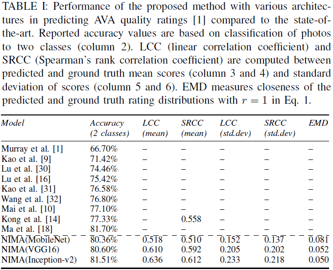

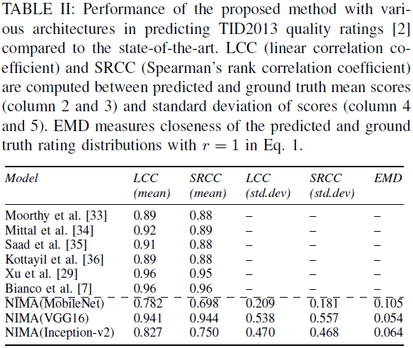

### B 照片评级（photo ranking）

除了图像内容（image content），色调（tone）、对比度（contrast）和构图（composition）等因素也对图像美感至关重要（important aesthetic qualities）。

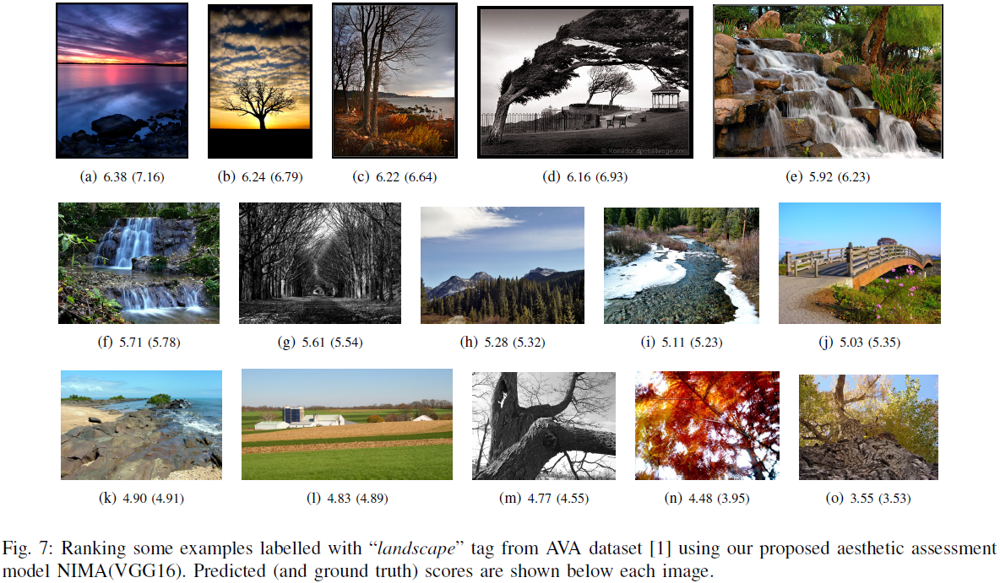

除了图像语义（image semantics），取景（framing）和调色（color palette）也是图像的关键品质（key qualities）。

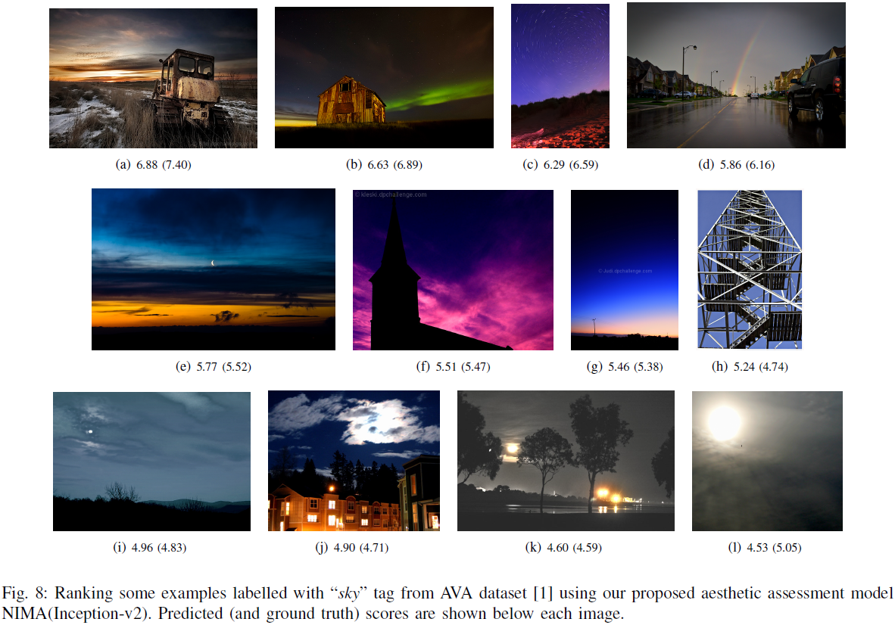

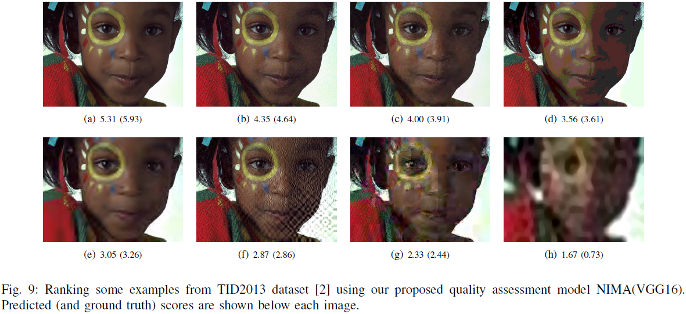

### C 图像增强（image enhancement）

质量和审美评分（quality and aesthetic scores）可用于感性微调（perceptually tune）图像增强操作符，即以最大化NIMA评分作为先验可以提升图像增强感性质量（increase the likelihood of enhancing perceptual quality of an image）。

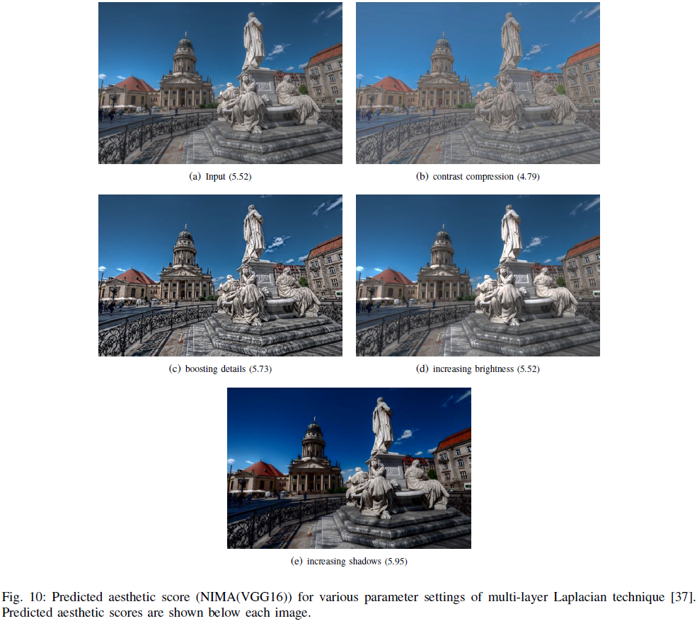

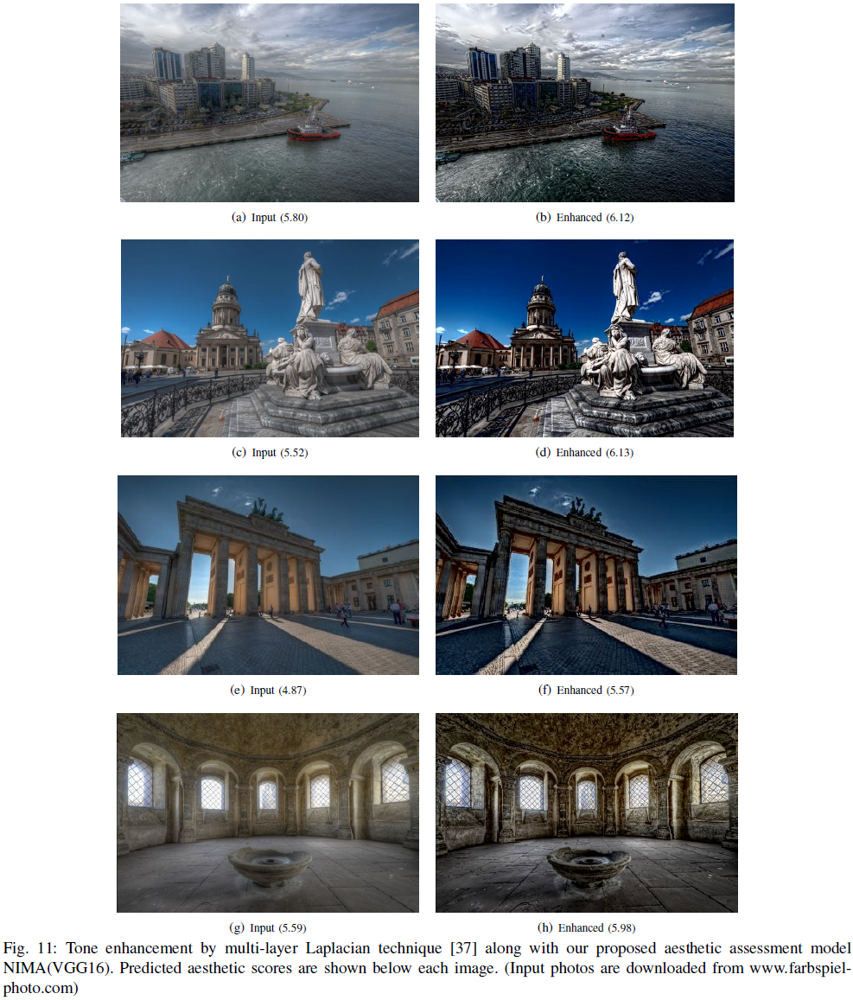

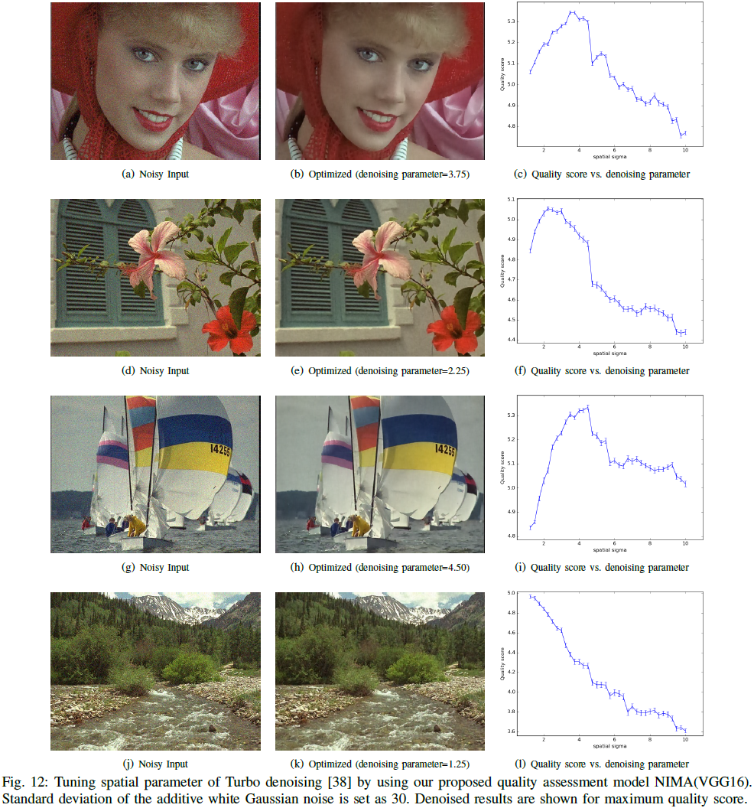

质量评估模型（quality assessment model）注重纹理（respect textures），能避免细节过度平滑（oversmoothing of details）

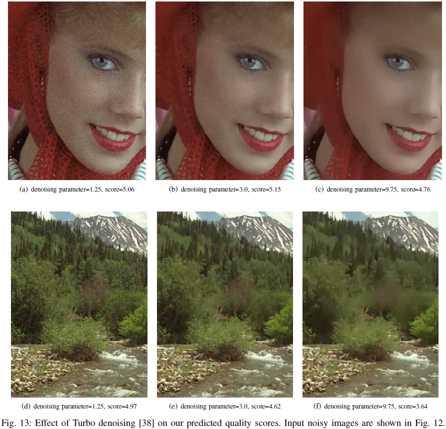

### D 计算量（computational costs）

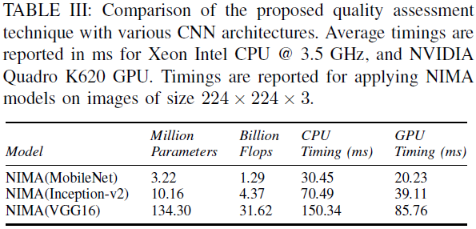

## 5 结论

