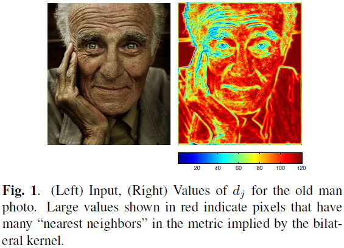
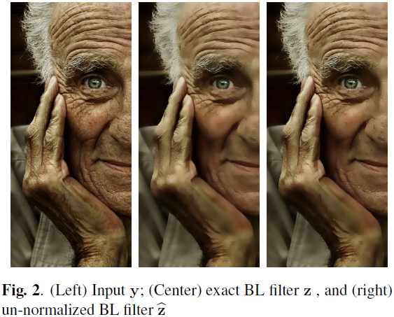
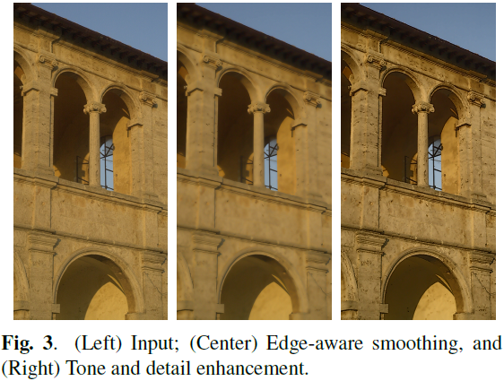
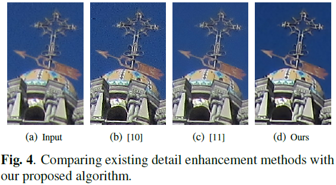
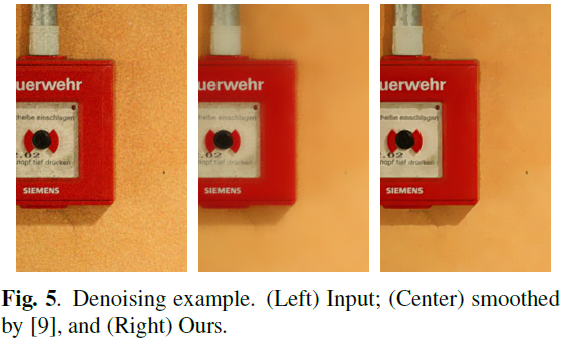

# A New Class of Image Filters without Normalization

---

P. Milanfar, H. Talebi, [A New Class of Image Filters without Normalization][norm_free], ICIP (2016)

[norm_free]: https://ieeexplore.ieee.org/document/7532969 "A New Class of Image Filters without Normalization"

---

## 摘要

## 1 引言

1. 双边（Bilateral，BL）

$$k_{ij} = \exp (\frac{- \| \mathbf{x}_{i} - \mathbf{x}_{j} \|^{2}}{h_x}) \exp (\frac{- ( y_{i} - y_{j} )^{2}}{h_y}) \tag {1}$$

相似性度量（similarity metric）：向量$(\mathbf{x}_{i}, y_{i})$和$(\mathbf{x}_{j}, y_{j})$的加权欧氏距离（weighted Euclidean distance between the concatenated vectors）

2. 非局部均值（Nonlocal Means，NLM）

NLM核（NLM kernel）为双边核（bilateral kernel）的一般形式，其距离（patch-wise）（point-wise）：

$$k_{ij} = \exp (\frac{- \| \mathbf{x}_{i} - \mathbf{x}_{j} \|^{2}}{h_x}) \exp (\frac{- \| \mathbf{y}_{i} - \mathbf{y}_{j} \|^{2}}{h_y}) \tag {2}$$

$$\mathbf{W} = \mathbf{D}^{-1}\mathbf{K} \tag {4}$$

$$\hat{\mathbf{W}} = \mathbf{I} + \alpha (\mathbf{K} - \mathbf{D}) \tag {5}$$

## 2 非归一化滤波器（the Normalization-Free Filter）$\hat{\mathbf{W}}$

标准滤波器改写为：

$$\mathbf{W} = \mathbf{I} + \mathbf{D}^{-1}(\mathbf{K} - \mathbf{D}) \tag {6}$$

$$\mathbf{D}^{-1} \approx \alpha \mathbf{I}$$

$$\mathbf{D}^{-1} \mathbf{K} \approx \mathbf{I} +
\mathbf{D}_{0}^{-1} (\mathbf{K} - \mathbf{D}) -
\mathbf{D}_{0}^{-2} (\mathbf{D} - \mathbf{D}_{0}) (\mathbf{K} - \mathbf{D})
\tag {7}$$

令$\mathbf{D}_{0}^{-1} = \alpha \mathbf{I}$，可得方程（5）。

### 2.1 最佳$\alpha$的选取

矩阵F-范数（Frobenius norm）

$$\min_{\alpha} \left \| \mathbf{W} - \hat{\mathbf{W}} (\alpha) \right\|^{2} \tag {9}$$

$$\hat{\alpha} =
\frac{
        \text{tr}(\mathbf{K} \mathbf{D}^{-1} \mathbf{K}) -
        2 \text{tr} (\mathbf{K}) +
        \text{tr} (\mathbf{D})
    }
    {
        \text{tr}(\mathbf{K}^{2}) -
        2 \text{tr} (\mathbf{K} \mathbf{D}) +
        \text{tr}(\mathbf{D}^{2})
    }
\tag {10}$$

$$\hat{\alpha} \approx
\frac{
        \text{tr} (\mathbf{D})
    }
    {
        \text{tr}(\mathbf{D}^{2})
    } =
\frac{s_{1}}{s_{2}}
\tag {11}$$

其中，

$$s_{1} = \sum_{i = 1}^{n} d_{i}, \quad s_{2} = \sum_{i = 1}^{n} d_{i}^{2}$$

$\frac{1}{n} \leq \frac{s_{1}}{s_{2}} \leq \frac{1}{\bar{d}}$

$$\hat{\alpha} \approx \frac{1}{\bar{d}} \tag {13}$$

$\bar{d} = \text{mean} (d_{j})$

## 3 $\hat{\mathbf{W}}$的性质

$$\hat{\mathbf{w}}_{i}^{\text{T}} - \mathbf{\delta}_{i} = \alpha d_{i} (\mathbf{w}_{i}^{\text{T}} - \mathbf{\delta}_{i}) \tag {15}$$

$$\hat{\mathbf{W}} - \mathbf{I} = \mathbf{R} (\mathbf{W} - \mathbf{I}) \tag {16}$$

$\mathbf{R} = \alpha \mathbf{D}$

## 4 应用

## 5 结论