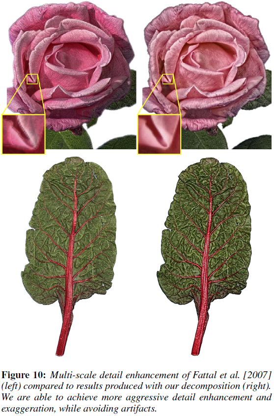
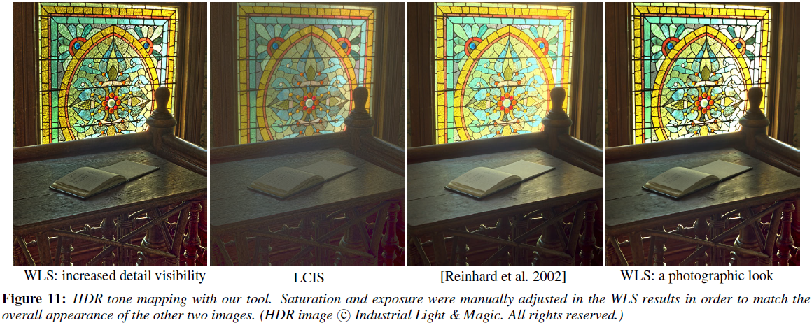

# Edge-Preserving Decompositions for Multi-Scale Tone and Detail Manipulation

---

Z. Farbman, R. Fattal, D. Lischinski, R Szeliski, [Edge-Preserving Decompositions for Multi-Scale Tone and Detail Manipulation][wls_epd], ACM TOG (2008)

[wls_epd]: https://dl.acm.org/citation.cfm?id=1360666 "Edge-Preserving Decompositions for Multi-Scale Tone and Detail Manipulation"

---

## 摘要

计算摄影技术通常将图像分层处理：分段平滑基础层、大尺度亮度变化层、小尺度细节残差层（computational photography techniques decompose an image into a piecewise smooth base layer, containing large scale variations in intensity, and a residual detail layer capturing the smaller scale details in the image）。因此，对提取细节空间尺度的控制至关重要，同时在处理多尺度细节时需避免产生视觉伪影（it is important to control the spatial scale of the extracted details, and it is often desirable to manipulate details at multiple scales, while avoiding visual artifacts）。

基于双边滤波器（bilateral filter）的细节分解技术（base-detail decomposition techniques）难以在任意尺度上提取细节（extract detail at arbitrary scales）。

本文提出一种基于加权最小二乘（WLS）框架的保边平滑算子，该算子适于图像粗尺度渐近平滑及多尺度细节提取（an alternative edge-preserving smoothing operator, based on the weighted least squares (WLS) optimization frame-work, which is particularly well suited for progressive coarsening of images and for multi-scale detail extraction）。

## 1 引言

计算摄影学（computational photography）通常将图像分解为基础平滑层和细节层（decompose an image into a piecewise smooth base layer and a detail layer）。

多尺度图像处理需要对图像进行多尺度分解，如拉普拉斯金字塔（Laplacian pyramid）；多尺度分解也常用于色调映射（tone mapping）。然而，用线性滤波器（linear filters）构造的金字塔会在图像边缘附近产生光晕（halo artifacts near edges）。

双边滤波器（bilateral filter，BLF）：适于去噪（noise removal）和提取小尺度细节（extraction of detail at a fine spatial scale），但不适于提取任意尺度细节（less appropriate for extraction of detail at arbitrary scales）。

## 2 背景

在计算摄影中，通常将图像分解成一个分段平滑基础层和一个（多个）细节层（In computational photography, images are often decomposed into a piecewise smooth base layer and one or more detail layers）：

1. 基础层用于提取大尺度亮度变化，一般通过保边平滑算子实现（the base layer captures the larger scale variations in intensity, and is typically computed by applying an edge-preserving smoothing operator to the image (sometimes applied to the logarithm of the luminance or to the lightness channel of the CIELAB color space)）。

2. 细节层为原始图像与基础层间的差值（或商）（the detail layer is then defined as the difference (or the quotient) between the original image and the base layer）。

3. 对各层分别处理，然后合并即为最终输出（each of the resultant layers may be manipulated separately in various ways, depending on the application, and possibly recombined to yield the final result）。

例如，调整HDR图像动态范围（reduce the dynamic range of an HDR image）：对基础层非线性压缩映射，然后与细节层合并（the base layer is typically subjected to a non-linear compressive mapping, and then recombined with the (possibly attenuated or boosted) detail layers）；图像风格化与抽象化（image and video stylization and abstraction）：抛弃细节，只对基础层处理（details are discarded, while the base layer is further processed to achieve a stylized look），抛弃不同空间尺度上的细节能使所关注区域的细节获得视觉上的加强，并且使背景更抽象（discarding details at different spatial scales makes it possible to retain more detail inside intended regions of interest, while achieving more abstraction in the background）。

提取基础层是对图像进行粗化（computing the base layer is an image coarsening process）。对粗化图像进行边缘模糊或锐化都会导致细节层出现毛刺（both blurring and sharpening of edges in the coarsened image cause ringing in the detail layer），并在最终输出上为光晕和梯度反转（halos and gradient reversals）（Fig. 2）。因此，线性滤波和硬分割都不适于图像多尺度分解（neither linear filtering nor hard segmentation is well-suited for computing base-detail decompositions）。

双边滤波器（bilateral filter，BLF）：非线性滤波器（non-linear filter），输出图像每个像素都是其邻域各像素的加权平均（a weighted mean of its neighbors），权值随空间距离和数值差异的增加而减小（the weights decreasing both with spatial distance and with difference in value）。

$$\text{BLF} (g)_{p} = \frac{1}{k_{p}} \sum_{q} \text{G}_{\sigma_{s}} (\|p - q\|) \text{G}_{\sigma_{r}} (\|g_{p} - g_{q}\|) \tag {1}$$

$$k_{p} = \sum_{q} \text{G}_{\sigma_{s}} (\|p - q\|) \text{G}_{\sigma_{r}} (\|g_{p} - g_{q}\|) \tag {2}$$

基中，$\mathbf{g}$为输入图像；$p$和$q$表示像素的空间位置（spatial locations of pixels）；核函数（kernel function）$\text{G}_{\sigma_{s}}$、$\text{G}_{\sigma_{r}}$通常为高斯核（Gaussian），$\sigma_{s}$决定空间支撑（spatial support）、$\sigma_{r}$决定值域支撑（range support）调节边缘敏感度（sensitivity to edges）。

双边滤波器性能定性分析：

1. 给定像素$p$，其原始像素值为$g_{p}$（a particular pixel $p$, whose unfiltered value is $g_{p}$）。随$\sigma_{s}$的增大，更多的邻域像素$q$参与像素$p$的平滑，其中与$g_{p}$相近的$g_{q}$贡献最大，导致平滑后$p$点像素值与$g_{p}$差值很小（as $\sigma_{s}$ is increased, more and more distant pixels $q$, whose value $g_{q}$ is close to $g_{p}$ are being averaged together, and as a result the filtered value does not stray too far from $g_{p}$）。当$\sigma_{s} \rightarrow \infin$时，双边滤波器等同于值域滤波器（in the limit ($\sigma_{s} \rightarrow \infin$), the bilateral filter becomes a range filter）。因此，为实现大尺度平滑，不仅需要增大$\sigma_{s}$，$\sigma_{r}$也需要相应增加（more aggressive smoothing cannot be achieved only by increasing $\sigma_{s}$, and the range support $\sigma_{r}$ must be increased as well）。

2. 增大$\sigma_{r}$会降低双边滤波器的保边性能，导致部分边缘模糊（increasing $\sigma_{r}$ reduces the ability of the bilateral filter to preserve edges, and some of them become blurred）。当$\sigma_{r} \rightarrow \infin$时，双边滤波器等同于高斯滤波器（in the limit ($\sigma_{r} \rightarrow \infin$) the bilateral filter becomes a linear Gaussian filter）。

因此，双边滤波器需在保边性能与平滑性能间折中（BLF trades off its edge-preservation abilities with its smoothing abilities）。

## 3 加权保边平滑（Edge-Preserving Smoothing via WLS）

本文提出一种基于加权最小二乘法优化框架的保边平滑（edge-preserving smoothing approach based on the WLS optimization framework），然后构造多尺度保边分解（multi-scale edge-preserving decompositions）。

保边平滑可视为两个相反目标间的妥协（a compromise between two possibly contradictory goals）。给定输入图像$\mathbf{g}$，计算输出图像$\mathbf{u}$，使其尽可能逼近$\mathbf{g}$，同时使$\mathbf{g}$梯度平缓区域尽可能平滑（Given an input image $\mathbf{g}$, we seek a new image $\mathbf{u}$, which, on the one hand, is as close as possible to $\mathbf{g}$, and, at the same time, is as smooth as possible everywhere, except across significant gradients in $\mathbf{g}$）。该问题可表示为损失函数的最小值（minimum）：

$$\sum_{p} \left( (u_{p} - g_{p})^{2} + \lambda \left(
    a_{x, p}(g) \left( \frac{\partial u}{\partial x} \right)_{p}^{2} +
    a_{y, p}(g) \left( \frac{\partial u}{\partial y} \right)_{p}^{2} \right)
\right) \tag {3}$$

其中，下标$p$表示像素的空间位置（the spatial location of a pixel）。数据项（data term）$(u_{p} - g_{p})^{2}$用于最小化$\mathbf{u}$和$\mathbf{g}$间距离，正则项（regularization term）通过最小化$\mathbf{u}$的偏导数实现平滑（strive to achieve smoothness by minimizing the partial derivatives of $\mathbf{u}$）。$a_{x}$、$a_{y}$为与$\mathbf{g}$相关的平滑权值（smoothness weights）；$\lambda$用于平衡数据项和正则项，$\lambda$越大，$\mathbf{u}$越平滑（results in progressively smoother images $\mathbf{u}$）。

二次型（quadratic form）方程（3）的矩阵形式为：

$$(\mathbf{u} - \mathbf{g})^{\text{T}} (\mathbf{u} - \mathbf{g}) +
\lambda \left(
    \mathbf{u}^{\text{T}} \mathbf{D}_{x}^{\text{T}} \mathbf{A}_{x} \mathbf{D}_{x} \mathbf{u} +
    \mathbf{u}^{\text{T}} \mathbf{D}_{y}^{\text{T}} \mathbf{A}_{y} \mathbf{D}_{y} \mathbf{u}
\right) \tag {4}$$

对角矩阵（diagonal matrices）$\mathbf{A}_{x}$、$\mathbf{A}_{y}$包含平滑权值$a_{x} (\mathbf{g})$、$a_{y} (\mathbf{g})$；矩阵$\mathbf{D}_{x}$、$\mathbf{D}_{y}$为离散差分算子（discrete differentiation operator）。

方程（4）的最优解为线性方程组（5）的解（the solution of the linear system）：

$$(\mathbf{I} + \lambda \mathbf{L}_{g}) \mathbf{u} = \mathbf{g} \tag {5}$$

其中，$\mathbf{L}_{g} = \mathbf{D}_{x}^{\text{T}} \mathbf{A}_{x} \mathbf{D}_{x} + \mathbf{D}_{y}^{\text{T}} \mathbf{A}_{y} \mathbf{D}_{y}$。

$\mathbf{D}_{x}$、$\mathbf{D}_{y}$为前向差分算子（forward difference operators），$\mathbf{D}_{x}^{\text{T}}$、$\mathbf{D}_{y}^{\text{T}}$为后向差分算子（backward difference operators），即$\mathbf{L}_{g}$为五点空间非齐次拉普拉斯矩阵（a five-point spatially inhomogeneous Laplacian matrix）。

$$a_{x, p}(g) =
\left(
    \left| \frac{\partial l}{\partial x} (p) \right|^{\alpha} + \epsilon
\right)^{-1}, \quad
a_{y, p}(g) =
\left(
    \left| \frac{\partial l}{\partial y} (p) \right|^{\alpha} + \epsilon
\right)^{-1}
\tag {6}$$

其中，$l$为$\mathbf{g}$的对数亮度通道（log-luminance channel）；指数（exponent）$\alpha$通常取值为$1.2 \sim 2.0$，决定$\mathbf{g}$梯度的灵敏度；$\epsilon$通常取值为$1e-4$。

$$\mathbf{u} = F_{\lambda} (\mathbf{g}) = (\mathbf{I} + \lambda \mathbf{L}_{g})^{-1} \mathbf{g} \tag {7}$$

**$F_{\lambda}$的频响特性（frequency response）**：考虑$\mathbf{g}$近似常量时，$a_{x} \approx a_{y} \approx a$，

$$F_{\lambda} (\mathbf{g}) \approx (\mathbf{I} + \lambda a \mathbf{L})^{-1} \mathbf{g} \tag {8}$$

其中，$\mathbf{L} = \mathbf{D}_{x}^{\text{T}} \mathbf{D}_{x} + \mathbf{D}_{y}^{\text{T}} \mathbf{D}_{y}$为齐次拉普拉斯矩阵（ordinary (homogeneous) Laplacian matrix），则$F_{\lambda}$的频响特性（frequency response）为

$$\mathcal{F}_{\lambda} (\omega) = \frac{1}{1 + a \lambda \omega^{2}}$$

则在频域上缩放$c$倍（scaling by a factor of $c$ in the frequency domain）等价于$\lambda$乘以$c^{2}$。

$$\mathcal{F}_{\lambda} (\omega) = \frac{1}{1 + a c^{2} \lambda \omega^{2}} = \mathcal{F}_{c^{2} \lambda} (\omega)$$

### 3.1 多尺度保边分解（Multi-scale edge-preserving decompositions）

多尺度保边分解（multi-scale edge-preserving decomposition），代表拉普拉斯金字塔（Laplacian pyramid）：将图像分解为平滑图像及一组逐层获取小尺度细节差值图像（the decomposition consists of a coarse, piecewise smooth, version of the image, along with a sequence of difference images, capturing detail at progressively finer scales）。

给定输入图像$\mathbf{g}$，构造$k + 1$层分解（a $(k + 1)$-level decomposition）：$\mathbf{u}^{1}, \cdots, \mathbf{u}^{k}$表示对$\mathbf{g}$逐层粗化（progressively coarser versions of $\mathbf{g}$），将最粗层$\mathbf{u}^{k}$作为基础层$\mathbf{b}$（the coarsest of these versions, $\mathbf{u}^{k}$ will serve as the base layer $b$），$k$个细节层（detail layers）定义为：

$$\mathbf{d}^{i} = \mathbf{u}^{i - 1} - \mathbf{u}^{i}, \quad i = \{1, \cdots, k\}, \mathbf{u}^{0} = \mathbf{g} \tag {11}$$

原始图像（original image）$\mathbf{g}$的重构（recovered from this decomposition）：

$$\mathbf{g} = \mathbf{b} + \sum_{i = 1}^{k} \mathbf{d}^{i} \tag {12}$$

注意：*$\mathbf{u}^{i}$是保边平滑图像，而非一般意义上的带限（not band-limited in the usual sense）图像，因此不能对$\mathbf{u}^{i}$做任何下采样（downsampling）处理*。加权最小二乘多尺度分解是原始图像的超完备描述（an over-complete description）。

本文采用两种方式计算逐层粗化序列（progressive coarsening sequence）$\mathbf{u}^{1}, \cdots, \mathbf{u}^{k}$

1. 求解线性方程组（linear systerm）（5）$k$次，逐层增加参数$\lambda$的数值（each time increasing the value of the parameter $\lambda$），如Fig. 4（左）

$$\mathbf{u}^{i + 1} = F_{c^{i} \lambda} (\mathbf{g}) \tag {13}$$

该方法（$\alpha \in [1.2, 1.4]$）适于HDR压缩（HDR compression）和多尺度细节增强（multiscale detail enhancement）

2. 迭代计算

$$\mathbf{u}^{i + 1} = F_{c^{i} \lambda} (\mathbf{u}^{i}) \tag {14}$$

## 4 比较

## 5 与其它算子的关系（Connections with Other Operators）

## 6 应用

高动态范围（high dynamic range，HDR）色调映射（tone mapping）、细节增强（detail enhancement）、图像抽象（image abstraction）

### 6.1 多尺度色调调整（Multi-scale tone manipulation）

控制参数：

| | 曝光（exposure） | 增强因子（boosting factors）
--- | :---: | :---:
基础层（base layer） | $\eta$ | $\delta_{0}$
中等尺度细节层（medium detail layer） | - | $\delta_{1}$
小尺度细节层（fine detail layer） | - | $\delta_{2}$

调整后图像$\hat{\mathbf{g}}$在像素$p$处的值为：

$$\hat{\mathbf{g}}_{p} = \mu + S(\delta_{0}, \eta \mathbf{b}_{p} - \mu) + S(\delta_{1}, \mathbf{d}_{p}^{1}) + S(\delta_{2}, \mathbf{d}_{p}^{2}) \tag {16}$$

其中，$\mu$为亮度范围均值（the mean of the lightness range）、$S$为逻辑曲线（sigmoid curve），

$$S(a, x) = \frac{1}{1 + \exp(-ax)}$$

逻辑曲线用于防止细节层增强时产生的硬截断（The goal of this sigmoid is to avoid the hard clipping that would otherwise occur when the detail layers are significantly boosted）。

$S(\delta_{0}, \eta \mathbf{b}_{p} - \mu)$控制基础层的曝光度（exposure）和对比度（contrast）；其余项控制中等尺度和小尺度细节层的增强（remaining terms control the boosting of the medium and fine scale details），结果如Fig. 1、8、9所示。

多尺度分解参数：

| | $\alpha$ | $\lambda$
--- | --- | ---
小尺度滤波（fine scale filtering） | $1.2$ | $0.1$
中尺度滤波（medium scale filtering） | $1.4$ | $0.4$

实验表明：*三层金字塔分解最为有效*。

### 6.2 夸饰细节（Detail exaggeration）

### 6.3 HDR色调映射（HDR tone mapping）

### 6.4 图像抽象画（Progressive image abstraction）

## 7 结论

