# Fast Multilayer Laplacian Enhancement

---

H. Talebi, P. Milanfar, [Fast Multilayer Laplacian Enhancement][multi_laplace], TCI (2016)

[multi_laplace]: https://ieeexplore.ieee.org/document/7563313/ "Fast Multilayer Laplacian Enhancement"

---

## 摘要

## 1 引言

### A 相关工作

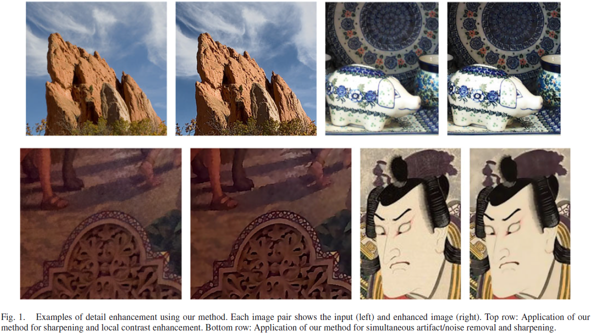

线性非锐化蒙板（linear unsharp masking，UM）

双边滤波器（bilateral filter）

### B 贡献

1. （a novel filtering approach using normalization-free filters）

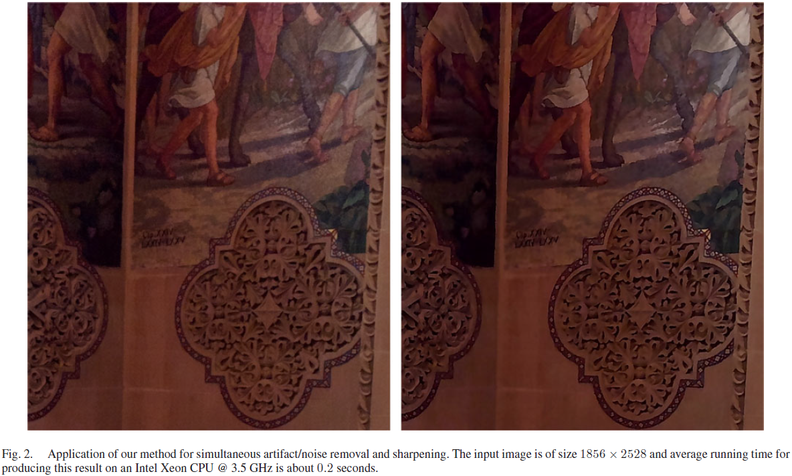

2. （detail manipulation in the presence of mild image distortions）

3. （substantial complexity reduction of nonlinear multi-scale decomposition）

## 2 方案（Proposed Scheme）

### A 非线性边值滤波器（Nonlinear Edge-Aware Filters）

1. 双边（Bilateral，BL）

$$k_{ij} = \exp (\frac{- \| \mathbf{x}_{i} - \mathbf{x}_{j} \|^{2}}{h_x}) \exp (\frac{- ( y_{i} - y_{j} )^{2}}{h_y}) \tag {1}$$

相似性度量（similarity metric）：向量$(\mathbf{x}_{i}, y_{i})$和$(\mathbf{x}_{j}, y_{j})$的加权欧氏距离（weighted Euclidean distance between the concatenated vectors）

2. 非局部均值（Nonlocal Means，NLM）

NLM核（NLM kernel）为双边核（bilateral kernel）的一般形式，其距离（patch-wise）（point-wise）：

$$k_{ij} = \exp (\frac{- \| \mathbf{x}_{i} - \mathbf{x}_{j} \|^{2}}{h_x}) \exp (\frac{- \| \mathbf{y}_{i} - \mathbf{y}_{j} \|^{2}}{h_y}) \tag {2}$$

### B 动机（Motivation）

滤波图像$\mathbf{z}$可表示为$k$个细节层和$1$个平滑层的线性组合（a linear combination of $k$ detail layers and one smooth layer）

$$\mathbf{z} = \beta_{1} \mathbf{y}_{\text{smooth}} +
\beta_{2} \mathbf{y}_{\text{detail}_{1}} + \cdots +
\beta_{k + 1} \mathbf{y}_{\text{detail}_{k}} \tag {8}$$

$$\mathbf{z} = \beta_{1} \mathbf{W}^{k} \mathbf{y} +
\beta_{2} (\mathbf{I} - \mathbf{W}) \mathbf{W}^{k - 1} \mathbf{y} + \cdots +
\beta_{k} (\mathbf{I} - \mathbf{W}) \mathbf{W} \mathbf{y} +
\beta_{k + 1} (\mathbf{I} - \mathbf{W}) \mathbf{y} \tag {9}$$

其中，$\mathbf{W}^{k} \mathbf{y}$表示滤波器$\mathbf{W}$经$k$次扩散迭代（diffusion iterations）后的平滑层（smooth layer），其余各项由$k - 1$个带通（band-pass）和一个高通（high-pass）滤波器组成，它们将输入图像分解为不同层次的细节（detail layers）。

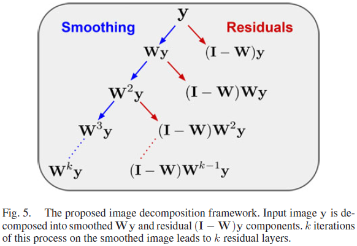

方程(9)中多尺度滤波器对应滤波器特征值的多项式映射（the multi-scale filtering in (9) corresponds to a polynomial mapping of the filter eigenvalues）。

$n \times n$尺寸的滤波器，$\mathbf{W}$，扩散过程涉及矩阵乘法（the expensive matrix multiplication of the diffusion process），$\mathbf{W}^{k}$，其计算复杂度为$\mathcal{O} (k n^{3})$

本文将$\mathbf{W}^{k}$的计算用相似权值

$$\mathbf{D}^{-1} \approx \alpha \mathbf{I} \tag {12}$$

（Taylor series）

$$\mathbf{D}^{-1} \mathbf{K} \approx \mathbf{I} +
\mathbf{D}_{0}^{-1} (\mathbf{K} - \mathbf{D}) -
\mathbf{D}_{0}^{-2} (\mathbf{D} - \mathbf{D}_{0}) (\mathbf{K} - \mathbf{D}) \tag {13}$$

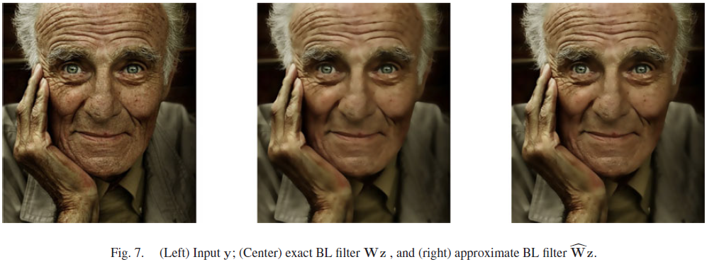

### C 无归一化滤波器（The Normalization-Free Filter）

F-范数（Frobenius norm）

$$\| \mathbf{X} \|_{F} = \sqrt{\sum_{i, j} |x_{i, j}|^{2}} = \sqrt{\text{tr} (\mathbf{X}^{\text{H}} \mathbf{X})}$$

### D （Proposed Filtering Scheme）

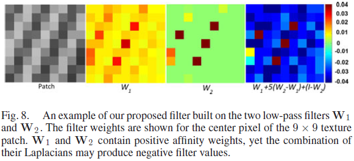

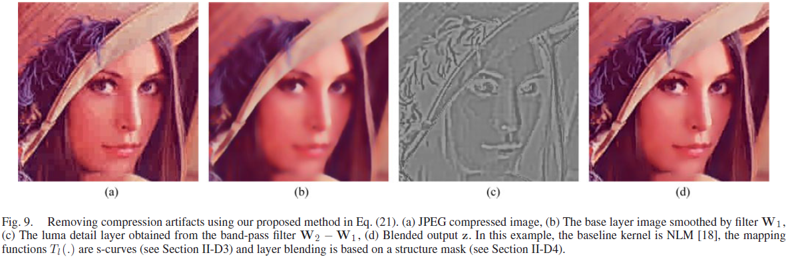

4. 结构蒙板（Structure Mask）

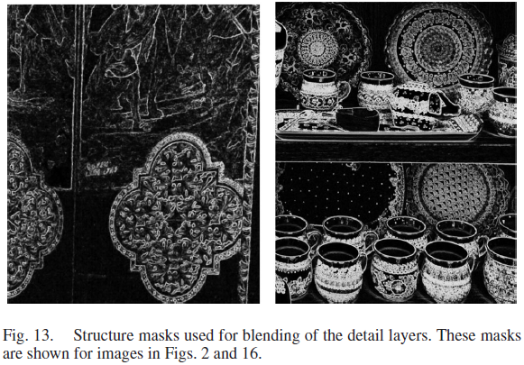

## 3 实验

细节平滑（detail smoothing）

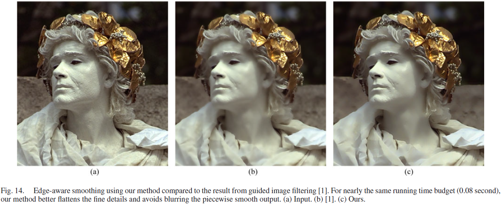

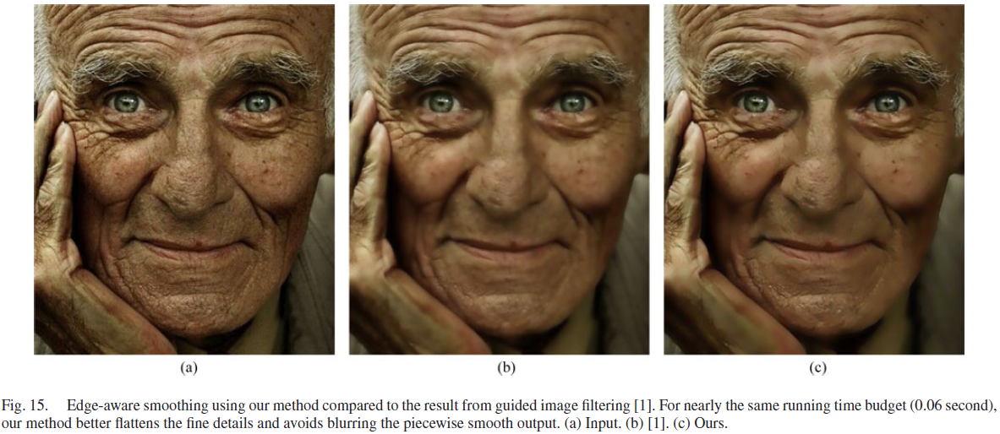

锐化模糊（sharpening mildly blurred images）

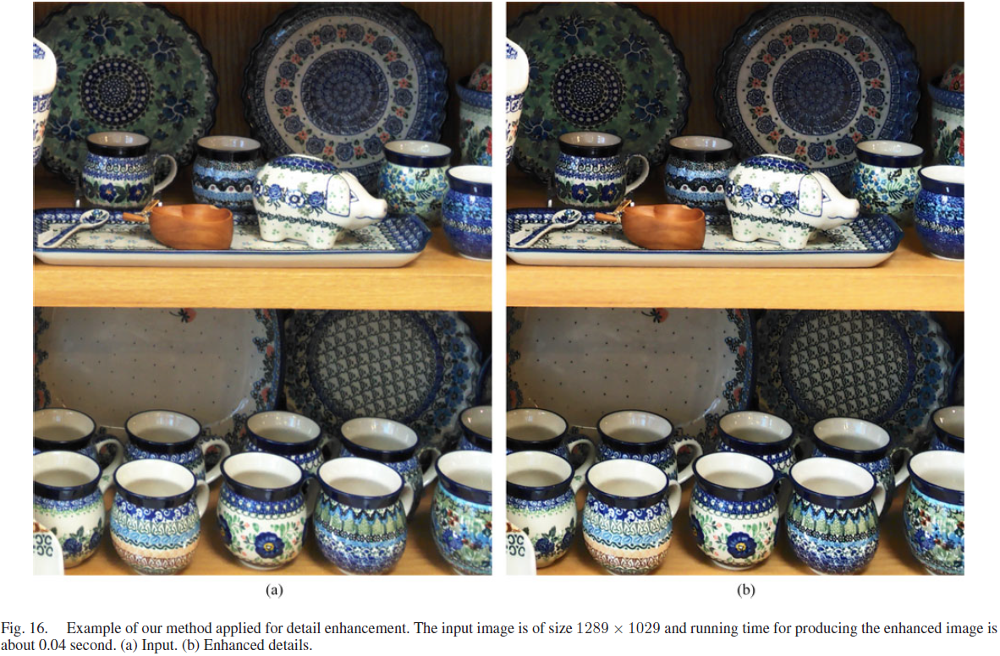

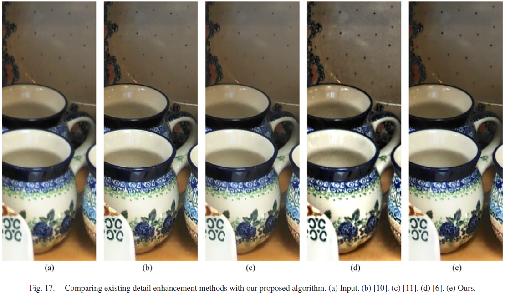

有噪图像细节增强（detail enhancement in noisy/artifacted images）

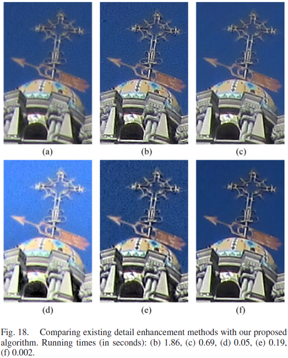

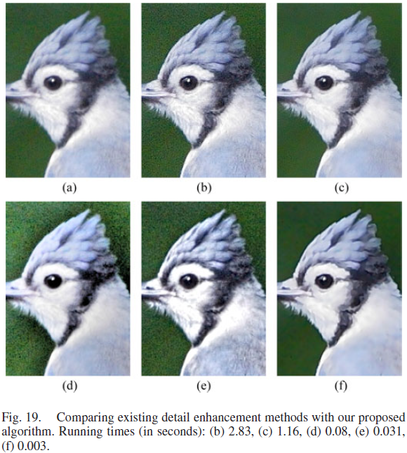

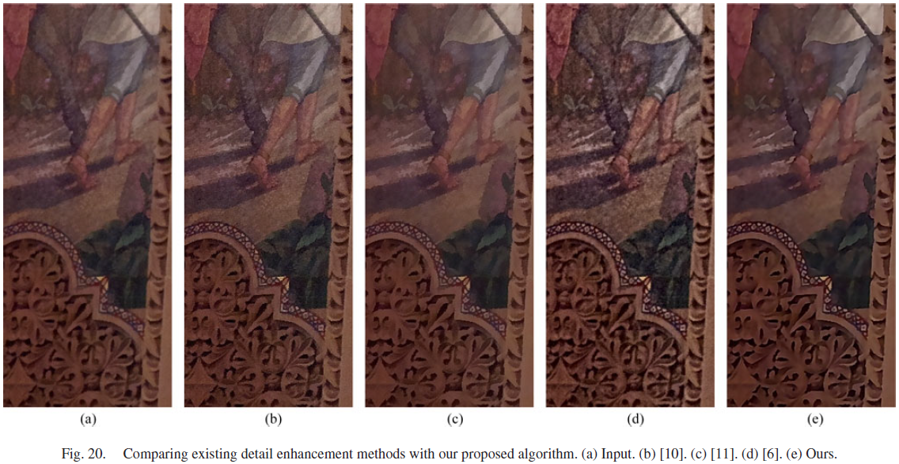

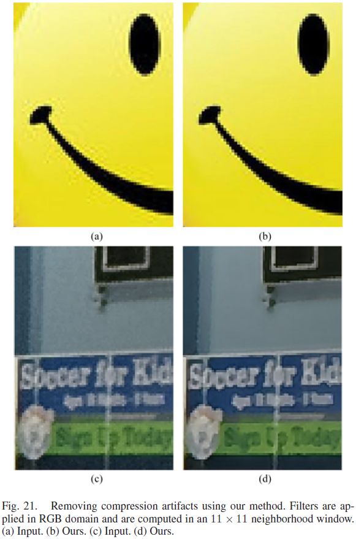

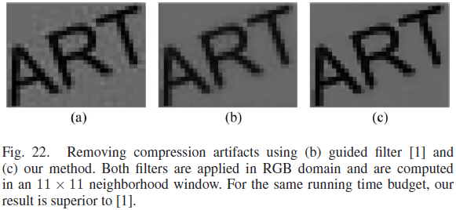
