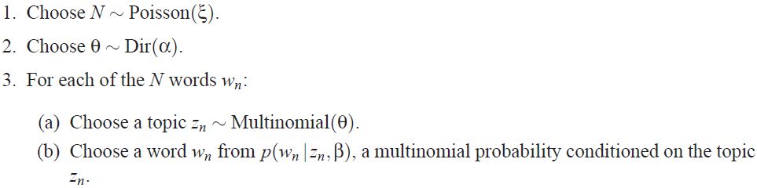

# Latent Dirichlet Allocation

---

D.M. Blei, A.Y. Ng, M.I. Jordan, [Latent Dirichlet Allocation][lda], Machine Learning Research Archive (2003)

[lda]: http://www.jmlr.org/papers/volume3/blei03a/blei03a.pdf "Latent Dirichlet Allocation"

---

## 摘要

## 1 引言

tf-idf

隐含语义索引（latent semantic indexing，LSI）

概率隐含语义索引（probabilistic LSI，pLSI）

## 2 符号和术语（notation and terminology）

* 词（word）：离散数据的基本单位（basic unit of discrete data），词汇表中的索引（$\{1, \cdots, V\}$）项（an item from a vocabulary indexed by $\{1, \cdots, V\}$）；本文用单位基向量表示词（represent words using unit-basis vectors that have a single component equal to one and all other components equal to zero），用上标（superscript）表示元素（components），词汇表中第$v$个词用长度为$V$的向量$w$（a $V$-vector $w$）表示：

$$w^{v}= 1 \ \text{and} \ w^{u}= 1 \ \text{for} \ u \not = v$$

* 文档（document）：$N$个词构成的序列，记为$\mathbf{w} = (w_1, w_2, \cdots, w_N)$，其中$w_n$为序列中的第$n$个词

* 语料库（corpus）：$M$篇文档的集合（collection），记为$D = \{ \mathbf{w}_1, \mathbf{w}_2, \cdots, \mathbf{w}_M \}$

## 3 隐含狄利克雷分配（latent Dirichlet allocation）

隐含狄利克雷分配（latent Dirichlet allocation，LDA）是语料库的概率生成模型（a generative probabilistic model of a corpus），其基本思想为：将文档表示为隐含主题（latent topics）的随机混合（documents are represented as random mixtures over latent topics），每个主题都由词分布表示（each topic is characterized by a distribution over words）

语料库$D$中文档$\mathbf{w}$的生成过程（LDA assumes the following generative process for each document $\mathbf{w}$ in a corpus $D$）：

1. 选择$N \sim \text{Poisson}(\xi)$

2. 选择$\theta \sim \text{Dir}(\alpha)$

3. 对于第个词$w_{n}$：

    (a) 选择主题$z_n \sim \text{Multinomial}(\theta)$

    (b) 从主题$z_{n}$的条件多项分布（a multinomial probability conditioned on the topic $z_{n}$）$p \left( w_{n} | z_{n}, \beta \right)$中抽取词$w_{n}$

假设：

（1）狄利克雷分布（Dirichlet distribution）的维度$k$（即主题变量（topic variable）$z$的维度）固定；

（2）词概率（word probabilities）
