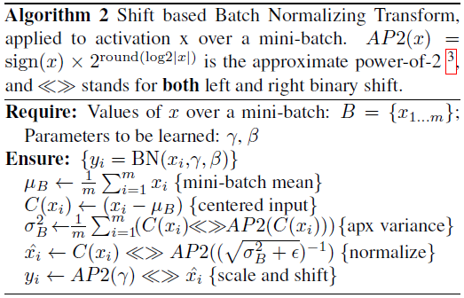
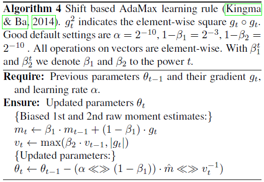
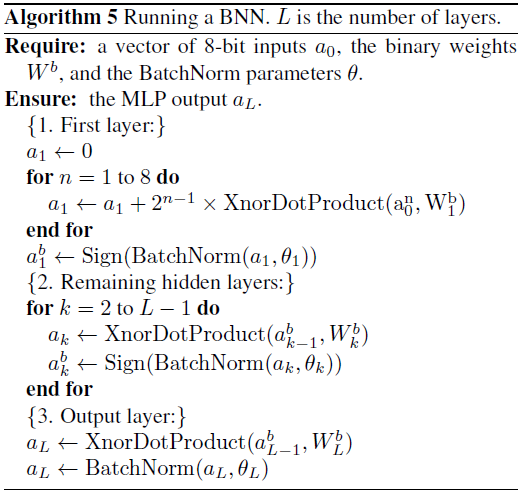
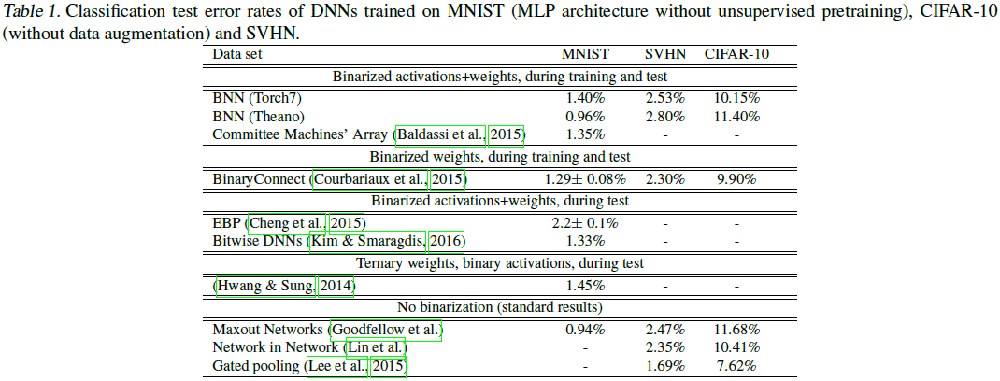
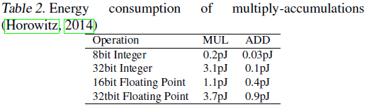
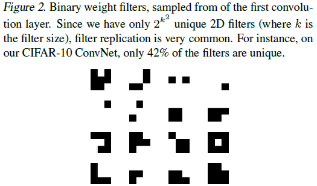
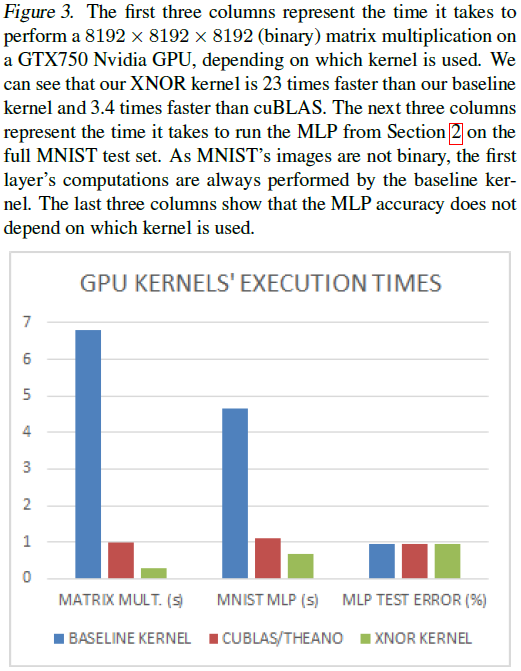

# Binarized Neural Networks: Training Deep Neural Networks with Weights and Activations Constrained to +1 or -1

---

M. Courbariaux, et al., [Binarized Neural Networks: Training Deep Neural Networks with Weights and Activations Constrained to +1 or -1][bin_net], (2016).

[bin_net]: https://arxiv.org/abs/1602.02830 "Binarized Neural Networks: Training Deep Neural Networks with Weights and Activations Constrained to +1 or -1"

---

## 摘要

二值化神经网络（Binarized Neural Networks，BNNs）：推理（run-time）阶段，权值（weights）和激活（activations）均为二进制数值；训练阶段：使用二进制权值和激活计算参数梯度

训练BNNs的方法

网络前馈过程（forward pass）中，BNNs减小内存占用及访问（access），且多数运算为位操作（bit-wise operations），能够有效降低功耗（power-efficiency）

## 引言

二值化神经网络（Binarized Neural Networks，BNNs）：推理（run-time）阶段，权值（weights）和激活（activations）均为二进制数值；训练阶段：使用二进制权值和激活计算参数梯度

## 1 二值化神经网络

### 1.1 确定、随机二值化（Deterministic vs Stochastic Binarization）

训练BNN时，将权值和激活限定为$\pm 1$

二值化函数（binarization functions）：

（1）确定（deterministic）二值化函数：

$$x^b = \mathrm{Sign}(x) = \begin{cases}
+1 & \text{if} \ x \geq 0 \\
-1 & \text{otherwise}
\end{cases} \tag{1}$$

（2）随机（stochastic）二值化函数：

$$x^b = \begin{cases}
+1 & \text{with probability} \ p = \sigma(x) \\
-1 & \text{with probability} \ 1 - p
\end{cases} \tag{2}$$

其中，$\sigma$为“硬逻辑”（hard sigmoid）函数：

$$\sigma(x) = \mathrm{clip}(\frac{x + 1}{2}, 0, 1) = \max(0, \min(1, \frac{x + 1}{2}))$$

随机二值化函数性能优于确定二值化函数，但需要硬件生成随机序列，因此难以应用。

### 1.2 梯度计算与累加（Gradient Computation and Accumulation）

权值的梯度是实数值（real-valued），通过实值变量累加计算。

随机梯度下降（Stochasic Gradient Descent，SGD）采用有噪的小步长探索参数空间，各权值的随机梯度贡献累加平滑能够消除噪声。

计算参数的梯度时，向权重和激活项中添加噪声相当于了一种正则化，有助于提高模型的泛化能力。

本文训练BNNs的方法可以视为Dropout的变体，Dropout是随机将激活置零，本文是对权值和激活二值化。

### 1.3 离散化梯度传播（Propagating Gradients Through Discretization）

符号函数量化（sign function quantization）

$$q = \mathrm{Sign}(r)$$

假设梯度$\frac{\partial C}{\partial q}$的估计量$g_q$已知，则梯度$\frac{\partial C}{\partial r}$的估计量（straight-through estimator）为

$$g_r = g_q 1_{|r| \leq 1} \tag{4}$$

上式保留了梯度信息，但当$r$过大时，丢弃（cancel）梯度。

* 算法1：训练BNN

$C$：迷你批次（minibatch）的损失函数
$\lambda$：学习速率衰减系数
$L$：网络层数
$\circ$：元素乘法（element-wise multiplication）。

Binarize()：指定权值和激活的二值化方法（确定、随机）；
Clip()：指定如何截断权值；
BatchNorm()：指定如何对激活批量标准化；
BackBatchNorm()：标准化层处，指定梯度如何反向传播；
Update()：梯度已知时，如何更新参数（ADAM、AdaMax）。

导数$1_{|r| \leq 1}$可视为通过“硬正切”（hard tanh）传播梯度，表示为分段线性激活函数（piece-wise linear activation function）：

$$\mathrm{Htanh}(x) = \mathrm{Clip}(x, -1, 1) = \max(-1, \min(1, x)) \tag{5}$$

隐层单元通过 *非线性符号函数（sign function non-linearity）得到二值激活（binary activations）*，其权值计算分为两步：

（1）将实数权值限定在$-1$和$+1$之间：当权值更新使$w^r$超出$[-1, +1]$，将$w^r$投影到$-1$或$+1$上，即训练时截断（clip）权值。

（2）使用权值$w^r$时，将其二值化$w^b = \mathrm{Sign}(w^r)$

### 1.4 移位批标准化（Shift based Batch Normalization）

* 算法2：移位批标准化（shift-based batch normalization，SBN）

$AP2(x) = \mathrm{Sign}(x) \times 2^{\mathrm{round}(\log_2 |x|)}$：2的幂函数的近似；
$\ll \gg$：移位运算（both left and right binary shift）

【作者给出的公式书写有误】

*推导：*

$x = \mathrm{Sign}(x) 2^{\log_2(|x|)} \approx
\mathrm{Sign}(x) \times 2^{\mathrm{round}(\log_2 |x|)}$

（1）BatchNorm：

均值：$\mu_B = \frac{1}{m} \sum_{i = 1}^{m} x_i$
方差：$\sigma_B^2 = \frac{1}{m} \sum_{i = 1}^{m} (x_i - \mu_B)^2$
标准化：$\hat{x}_i = \frac{x_i - \mu_B}{\sigma_B}$
缩放平移（scale and shift）：$y_i = \gamma \hat{x}_i + \beta$

（2）Shift-based BatchNorm：

$C(x_i) = x_i - \mu_B$，$\sigma_B^2 = \frac{1}{m} \sum_{i = 1}^{m} C^2(x_i)$

用移位运算近似平方运算（$C^2(x_i)$）：

$\begin{aligned}
C^2(x_i) = & C(x_i) \times \mathrm{Sign}(C(x_i)) 2^{\log_2 |C(x_i)|} \\
\approx & C(x_i) \times \mathrm{Sign}(C(x_i)) 2^{\mathrm{round}(\log_2 |C(x_i)|)} \\
= & |C(x_i)| 2^{\mathrm{round}(\log_2 |C(x_i)|)} \\
= & |C(x_i)| \ll \gg \mathrm{round}(\log_2 |C(x_i)|) \\
\end{aligned}$

近似方差：

$\sigma_B^2 \approx \frac{1}{m} \sum_{i = 1}^{m} C(x_i)| \ll \gg \mathrm{round}(\log_2 |C(x_i)|)$

用移位运算近似除运算（$C2(x_i) / \sigma_B$）：

$\begin{aligned}
\frac{C(x_i)}{\sigma_B} = & \frac{C(x_i)}{\mathrm{Sign}(\sigma_B) 2^{\log_2 |\sigma_B|}} \\
\approx & \frac{C(x_i)}{\mathrm{Sign}(\sigma_B) 2^{\mathrm{round}(\log_2 |\sigma_B|)}} \\
= & \frac{C(x_i)}{2^{\mathrm{round}(\log_2 \sigma_B)}} \\
= & C(x_i) \ll \gg \mathrm{round}(\log_2 \sigma_B)) \\
\end{aligned}$

标准化：

$\hat{x}_i \approx C(x_i) \ll \gg \mathrm{round}(\log_2 \sigma_B))$

缩放平移：

$y_i = \mathrm{Sign}(\gamma) \hat{x}_i \ll \gg \mathrm{round}(\log_2 |\gamma|) + \beta$

### 1.5 移位AdaMax（Shift based AdaMax）

* 算法4：移位AdaMax优化器（shift-based AdaMax）

$g_t^2$：按元素取平方，$g_t \circ g_t$
默认设置：$\alpha = 2^{-10}$、$1 - \beta_1 = 2^{-3}$、$1 - \beta_2 = 2^{-10}$
所有向量运算均指按元素运算。
$\beta_1^t$、$\beta_2^t$：$\beta_1$、$\beta_2$的$t$次方（$\beta_1$ and $\beta_2$ to the power $t$）

### 1.6 第一层

相邻两层，前一层的输出是后一层的输入，因此除第一层外，所有层的输入都是二进制的。

连续数值（continuous-valued inputs）输入可以用定点数（fixed point numbers）处理（fixed point numbers），8位（8-bit）定点输入可表示为：

$$s = x \cdot w^b$$

$$s = \sum_{i = 1}^8 2^{n - 1} (x^n \cdot w^b)$$

其中，$x$为由1024个8-bit输入组成的向量，$x_1^8$表示第1个输入的最高位（most significant bit of the first input），$w^b$为由1024个1-bit权值组成的向量，$s$为加权和。

* 算法5：BNN预测

## 2 基准测试（Benchmark Results）

### 2.1 多层感知器、MNIST、Theano（Multi-Layer Perception (MLP) on MNIST (Theano)）

### 2.2 多层感知器、MNIST、Torch7（MLP on MNIST (Torch7)）

### 2.3 卷积网络、CIFAR-10、Theano（ConvNet on CIFAR-10 (Theano)）

### 2.4 卷积网络、CIFAR-10、Torch7（ConvNet on CIFAR-10 (Torch7)）

### 2.5 卷积网络、SVHN（ConvNet on SVHN）

## 3 前向过程低功耗（Very Power Efficient in Forward Pass）

### 3.1 内存占用及访问（Memory Size and Accesses）

### 3.2 同或（XNOR-Count）

1-bit XNOR-count operations

### 3.3 重复滤波器（Exploiting Filter Repetitions）

二值卷积核的数量取决于卷积核的尺寸（the number of unique filters is bounded by the filter size）。

## 4 运算速度提升7倍（Seven Times Faster on GPU at Run-Time）

## 5 讨论及相关工作（Discussion and Related Work）

## 结论
