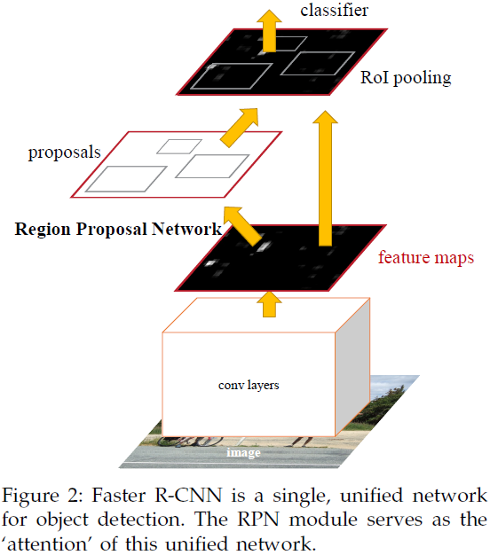

# Faster R-CNN: Towards Real-Time Object Detection with Region Proposal Networks

---

S.Q. Ren, K.M. He, R. Girshick, J. Sun, [Faster R-CNN: Towards Real-Time Object Detection with Region Proposal Networks][faster_rcnn], NIPS (2015)

[faster_rcnn]: https://arxiv.org/abs/1506.01497 "Faster R-CNN: Towards Real-Time Object Detection with Region Proposal Networks"

---

## 摘要

## 1 引言

## 2 相关工作

## 3 Faster R-CNN

### 3.1 区域候选网络（region proposal networks）

#### 3.1.1 锚点（anchors）

* 锚点平移不变性（translation-invariant anchors）

* 以多尺度锚点作为回归参照（multi-scale anchors as regression references）

#### 3.1.2 损失函数（loss function）

$$\mathcal{L} \left( \{p_{i}\}, \{t_{i}\} \right) =
\frac{1}{N_{\text{cls}}} \sum_{i} \mathcal{L}_{\text{cls}} \left( p_{i}, p_{i}^{\ast} \right) +
\lambda \frac{1}{N_{\text{reg}}} \sum_{i} p_{i}^{\ast} \mathcal{L}_{\text{reg}} \left( t_{i}, t_{i}^{\ast} \right) \tag{1}$$

其中，

$i$表示一个批次数据中锚点的索引；

$p_{i}$为锚点$i$为目标的预测概率；

$p_{i}^{\ast}$为锚点$i$的真实标签（ground-truth label，$1$-锚点为正样本、$0$-锚点为负样本）；

$t_{i}$表示预测边界框（bounding box）的$4$维坐标向量；

$t_{i}^{\ast}$表示正样本真实边界框（bounding box）的$4$维坐标向量；

分类损失$\mathcal{L}_{\text{cls}}$表示二分类对数损失（log loss over two classes，是否为目标）；

回归损失$\mathcal{L}_{\text{reg}} = R \left( t_{i}, t_{i}^{\ast} \right)$，$R$表示鲁棒损失函数（robust loss function，smooth $L_{1}$，平滑$L_{1}$函数）；

$p_{i}^{\ast} \mathcal{L}_{\text{reg}}$表示回归损失仅对正样本锚点有效，对负样本锚点无效（the regression loss is activated only for positive anchors ($p_{i}^{\ast} = 1$) and is disabled otherwise ($p_{i}^{\ast} = 0$)）。

$\text{cls}$、$\text{reg}$各层的输出分别由$\{ p_{i} \}$、$\{ t_{i} \}$组成。

方程$(1)$中，$N_{\text{cls}}$、$N_{\text{reg}}$为标准化参数、$N_{\text{cls}}$为批次尺寸（$N_{\text{cls}} \approx 256$）、$N_{\text{reg}}$为锚点位置（anchor locations）数（$N_{\text{reg}} \approx 2400$）、$\lambda$为平衡损失参数（$\lambda = 10$），此时分类损失和回归损失权重相同。实验结果对$\lambda$的取值不敏感，方程$(1)$的标准化项可以取消。

边界框回归（bounding box regression）：将锚点框回归到近邻边界框（be thought of as bounding-box regression from an anchor box to a nearby ground-truth box）

$$\begin{aligned}
& t_{x} = \frac{x - x_{a}}{w_{a}}, & \quad & t_{y} = \frac{y - y_{a}}{h_{a}}, \\
& t_{w} = \log \left( \frac{w}{w_{a}} \right), & \quad & t_{h} = \log \left( \frac{h}{h_{a}} \right), \\
& t_{x}^{\ast} = \frac{x^{\ast} - x_{a}}{w_{a}}, & \quad & t_{y}^{\ast} = \frac{y^{\ast} - y_{a}}{h_{a}}, \\
& t_{w}^{\ast} = \log \left( \frac{w^{\ast}}{w_{a}} \right), & \quad & t_{h}^{\ast} = \log \left( \frac{h^{\ast}}{h_{a}} \right), \\
\end{aligned}$$

其中，$x$、$y$、$w$、$h$分别表示边界框的中心坐标、长度、宽度；$x$、$x_{a}$、$x^{\ast}$分别表示预测框（predicted box）、锚点框（anchor box）、真实框（ground-truth box）。

#### 3.1.3 RPN训练（training RPNs）

### 3.2 RPN、Fast R-CNN特征共享（sharing features for RPN and Fast R-CNN）

### 3.3 实现（implementation details）

## 4 实验

### 4.1 PASCAL VOC

### 4.2 MS COCO

### 4.3 MS COCO to PASCAL VOC

## 5 结论
