# SSD: Single Shot MultiBox Detector

---

W. Liu, et al., [SSD: Single Shot MultiBox Detector][ssd], ECCV (2016).

[ssd]: https://arxiv.org/abs/1512.02325 "SSD: Single Shot MultiBox Detector"

---

## 摘要

SSD（single shot detector）：将边界框（bounding boxes）的输出空间离散化为一组锚点框

锚点框（anchors boxe，default boxes，default bounding boxes）：位于各特征图（feature map）的所有位置上，代表不同长宽比、不同尺度的边界框

推理阶段：在每个锚点框上，SSD网络对所有类别评分（score），并对锚点框形状进行调整以配匹目标形状。

SSD网络对多个分辨率不同的特征图进行预测，并将结果合并，以处理不同尺寸的目标。

SSD网络取消了生成候选区域（proposal generation）和特征重采样（pixel or feature resampling）两个阶段，将全部计算整合到单一网络中。

## 1 引言

主流目标检测：假设边界框（hypothesize bounding boxes）、特征重采样（resample pixels or features for each box）、分类器（high-quality classifier）。

SSD网络改进：

（1）取消了生成边界框候选区（bounding box proposals）和特征重采样（pixel or feature resampling）两个阶段；
（2）使用小尺寸卷积核滤波器预测目标类别（object categories）、边界框位置偏移（offsets in bounding box locations）；
（3）使用独立预测器（滤波器）预测不同纵横比的目标；
（4）将预测滤波器作用于特征提取网络后端隐含层的输出特征图（multiple feature maps from the later stages of a network），以实现多尺度检测（perform detection at multiple scales）。

本文贡献：

（1）SSD网络检测速度均优于YOLO、Faster R-CNN，准确率远优于YOLO、与Faster R-CNN持平；
（2）SSD网络的核心在于使用小尺寸卷积核滤波器预测一组锚点框的类别评分、边界偏移（predicting category scores and box offsets for a fixed set of default bounding boxes using small convolutional filters applied to feature maps）；
（3）使用多尺度特征图、不同长宽比锚点框预测；
（4）端到端训练（end-to-end training）、平衡检测速度与准确率（improving the speed vs accuracy trade-off）。

## 2 SSD（Single Shot Detector）

### 2.1 模型

SSD方法基于前向卷积网络（a feed-forward convolutional network），生成一组固定尺寸的锚点框集合及锚点框对应的目标类别评分，并通过非极大抑制（non-maximum suppression）生成最终检测结果。

#### 多尺度特征图检测（multi-scale feature maps for detection）

#### 卷积预测器（convolutional predictors for detection）

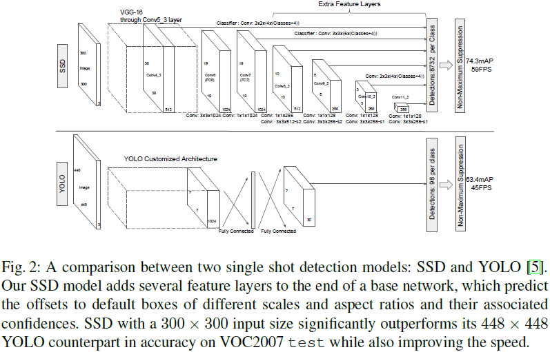

特征图尺寸：$m \times n$、通道数：$p$

预测器：$3 \times 3 \times p$小尺寸卷积核（small kernel），预测目标的一个类别评分（a score for a category）或相对于锚点框坐标的一个形状偏移（a shape offset relative to the default box coordinates）

#### 锚点框和长宽比（default boxes and aspect ratios）

特征图上的每个给定位置有$k$个锚点框，每个锚点框需计算$c$个类别的评分和相对于原始锚点框形状（the original default box shape）的$4$个偏移，因此每个特征图上共有$(c + 4)k$个滤波器。对于尺寸为$m \times n$的特征图，共有$(c + 4)kmn$个输出。

■■
假设共有$c$个类别及$4$个相对于锚点框坐标的形状偏移，对一个特征图上每个锚点框形状（$\{a_{r}\}$），需要$c + 4$个卷积预测器，输出$m \times n \times (c + 4)$个预测值；则该特征图上，$k = |\{a_{r}\}|$个锚点框形状共需要$(c + 4)k$个预测器，输出$m \times n \times \left[(c + 4) \times k\right]$个预测值。
即，预测器的卷积核尺寸为：$3 \times 3 \times p$，通道数为：$(c + 4) \times k$。
■

### 2.2 训练

#### 配匹策略（matching strategy）

在训练过程中，需要确定与真实边界框（a ground truth detection）对应的锚点框，并训练网络。对于每个真实边界框，需从不同位置、不同长宽比、不同尺度的锚点框中选择。

*重叠度（jaccard overlap，intersection over union，IoU）*

配匹策略：与某个真实边界框IoU大于阈值（threshold）（0.5）的所有锚点框。

#### 损失函数（training objective）

匹配标识（an indicator for matching）：$x_{ij}^{p} = \{1, 0\}$，表示锚点框$i$是否与类别为$p$的真实边界框$j$配匹。根据配匹策略可知，可能出现$\sum_{i} x_{ij}^{p} \geq 1$的情况。

*总损失函数（overall objective lossfunction）*：位置损失与置信度损失的加权和，

$$\mathcal{L}(x, c, l, g) =
\frac{1}{N} \left(
\mathcal{L}_{\mathrm{conf}}(x, c) +
\alpha \mathcal{L}_{\mathrm{loc}}(x, l, g)
\right)$$

其中，$N$为匹配的锚点框总数。若$N = 0$，则将$\mathcal{L}$设置为$0$。

*位置损失（localization loss，loc）*：$\mathcal{L}_{\mathrm{loc}}(x, l, g)$采用平滑$L_1$损失（smooth $L_1$ loss），回归目标为锚点框的偏移，

$$\mathcal{L}_{\mathrm{loc}}(x, l, g) =
\sum_{i \in Pos}^{N} \sum_{m \in \{ c_x, c_y, w, h \}} x_{ij}^{p}
\mathrm{smooth}_{L_1} \left( l_{i}^{m} - \hat{g}_{j}^{m} \right)$$

$$\begin{aligned}
& \hat{g}_{j}^{c_x} = \frac{g_{j}^{c_x} - d_{i}^{c_x}}{d_{i}^{w}}, \quad
& \hat{g}_{j}^{c_y} = \frac{g_{j}^{c_y} - d_{i}^{c_y}}{d_{i}^{h}} \\
& \hat{g}_{j}^{w} = \log \left( \frac{g_{j}^{w}}{d_{i}^{w}} \right), \quad
& \hat{g}_{j}^{h} = \log \left( \frac{g_{j}^{h}}{d_{i}^{h}} \right)
\end{aligned}$$

$$\mathrm{smooth}_{L_1} \left( x \right) =
\begin{cases}
0.5 x, & \mathrm{if} |x| \lt 1 \\
|x| - 0.5, & \mathrm{otherwise} \\
\end{cases}$$

其中，锚点框$d$的中心点坐标为$(c_x, c_y)$、长度为$w$、宽度为$h$；预测边界框（predicted box）$l$；真实边界框（ground truth box）$g$。■$g$、$d$已知，$l$未知■

*置信度损失（confidence loss，conf）*：$\mathcal{L}_{\mathrm{conf}}(x, c)$为所有类别（$c$）的交叉熵损失（softmax loss over multiple classes confidences ($c$)，cross-entropy loss）

$$\mathcal{L}_{\mathrm{conf}}(x, c) = -
\sum_{i \in Pos}^{N} x_{ij}^{p} \log \left( \hat{c}_{i}^{p} \right) -
\sum_{i \in Neg} \log \left( \hat{c}_{i}^{0} \right) \quad
\mathrm{where} \quad
\hat{c}_{i}^{p} = \frac{\exp \left( c_{i}^{p} \right)}{\sum_{p} \exp \left( c_{i}^{p} \right)}$$

通过交叉验证（cross validation），权值项（the weight term）$\alpha$应设为$1$。

#### 锚点框的尺度和长宽比选取（choosing scales and aspect ratios for default boxes）

不同尺度目标的检测，传统方式采用图像金字塔（image pyramid）；采用特征金字塔（feature pyramid）能够实现相似的作用，且权值共享。

本文利用低层、高层特征图（lower and upper feature maps）检测目标（Fig. 1）。

网络中各隐含层输出特征图的感知域（receptive field）尺寸不同。SSD框架下，*锚点框无需与各层实际感知域对应*。通过在给定特征图上平铺（tiling）锚点框，网络能够学习到该层特征图与特定尺度目标的对应关系。

使用$m$层特征图做预测情况下，每层特征图的*锚点框尺度（scale of the default boxes for each feature map）* 为：

$$s_{k} = s_{\min} + \frac{s_{\max} - s_{\min}}{m - 1} (k - 1), \quad k \in [1, m]$$

例如，$s_{\min} = 0.2$、$s_{\max} = 0.9$表示最低层尺度为$0.2$、最高层尺度为$0.9$、其余各层尺度均匀插值（regularly spaced）。

在第$k$层特征图的每个位置上，所有*锚点框的长宽比（aspect ratios）* 为：

$$a_{r} \in \left\{1, 2, 3, \frac{1}{2}, \frac{1}{3} \right\}$$

则各*锚点框的长度和高度*分别为：

$$w_{k}^{a} = s_{k} \sqrt{a_{r}}, \quad h_{k}^{a} = \frac{s_{k}}{\sqrt{a_{r}}}$$

当锚点框长宽比为$1$时，额外增加一个锚点框，其尺度为：

$$s_{k}^{\prime} = \sqrt{s_{k} s_{k + 1}}$$

即在特征图的每个位置上都有$6$个锚点框。

*锚点框中心（center of each default box）*：

$$\left( \frac{i + 0.5}{|f_k|}, \frac{j + 0.5}{|f_k|} \right)$$

其中，$|f_k|$为第$k$层方形特征图（the $k$-th square feature map）的尺寸，$i, j \in [0, |f_k|]$。

#### 决策边界负样本挖掘（hard negative mining）

锚点框匹配后，绝大多数锚点框均为负样本，当锚点框数量很大时，该现象更为明显。这导致正负样本极度不平衡（a significant imbalance between the positive and negative training examples）。本文*根据最大置信损失对锚点框排序*，并选取排名靠前的锚点框（pick the top ones），使负、正样本（锚点框）数量之比约为$3 : 1$。

#### 数据增强（data augmentation）

为使模型对输入目标的不同尺寸和形状更加鲁棒，需要采用下列方法之一对训练图像随机采样：

* 使用原始输入图像；
* 对原始输入图像采样（sample a patch），使其与目标IoU最小值为0.1、0.3、0.5、0.7或0.9；
* 对原始输入图像随机采样。

采样图像的尺寸为原始图像尺寸$[0.1, 1]$，长宽比范围为$[1/2, 2]$。

若真实边界框的中心位于采样图像中，则保留与真实边界框重叠的部分（keep the overlapped part of the ground truth box if the center of it is in the sampled patch）。将采样后图像调整为固定尺寸（resized to fixed size）、以概率$0.5$随机水平翻转，并施加光度失真（applying some photo-metric distortions）。

## 3 实验

#### 基础网络（base network）

基础网络为VGG16，将fc6、fc7替换为卷积层（建议Atrous卷积），pool5由$2 \times 2 - s2$修改为$3 \times 3 - s1$，移除dropout和fc8层。采用SGD微调网络权值，其初始学习率（initial learning rate）为$1e-3$、动量（momentum）$0.9$、权值衰减（weight decay）$5e-4$、批尺寸（batch size）$32$。

### 3.1 PASCAL VOC2007

使用conv4_3、conv7（fc7）、conv8_2、conv9_2、conv10_2、conv11_2层输出特征图预测位置及置信度。

（1）conv4_3层的尺度为$0.1$；
（2）conv4_3、conv10_2、conv11_2层输出特征图每个位置锚点框个数为$4$（$\in \left\{1, 2, \frac{1}{2}\right\}$），其余各层为$6$；
（3）conv4_3层输出特征图采用$L_2$标准化（$L_2$ normalization），使特征图每个位置的特征范数（feature norm）缩放至$20$。

$$y_i = \gamma_i \hat{x}_i, \quad \hat{\mathrm{x}} = \frac{\mathrm{x}}{\|\mathrm{x}\|_2}$$

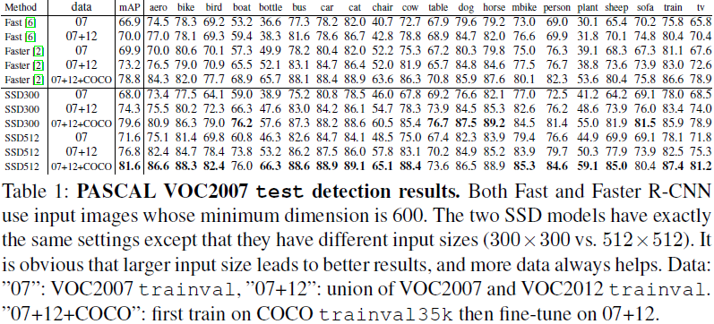

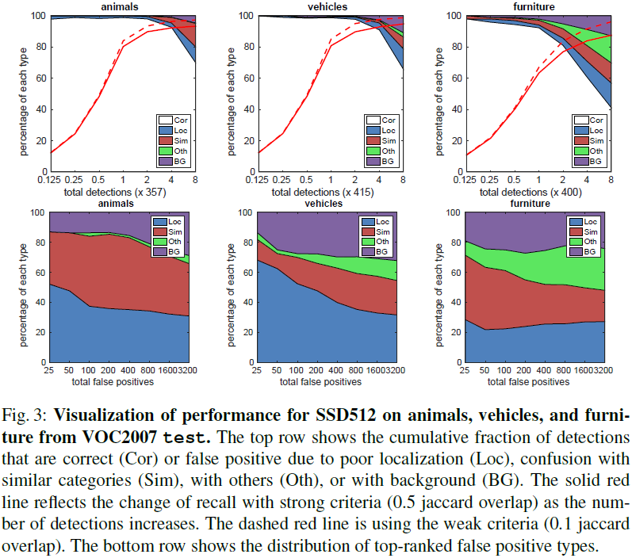

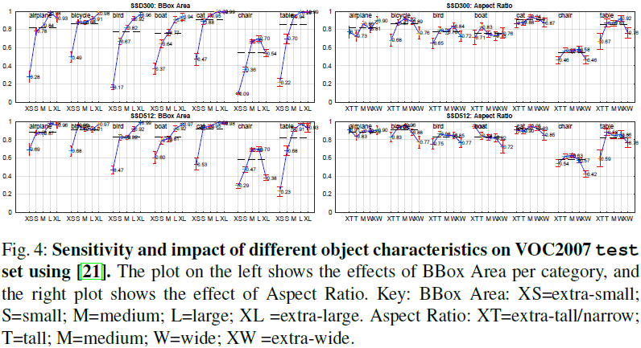

### 3.2 模型分析

#### 数据增强（data augmentation is crucial）

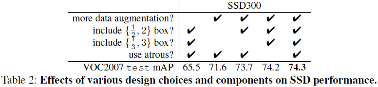

#### 锚点框形状（more default box shapes is better）

#### atrous（atrous is faster）

#### 多层特征图（multiple output layers at different resolutions is better）

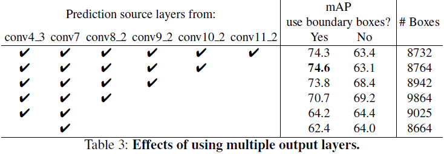

### 3.3 PASCAL VOC2012

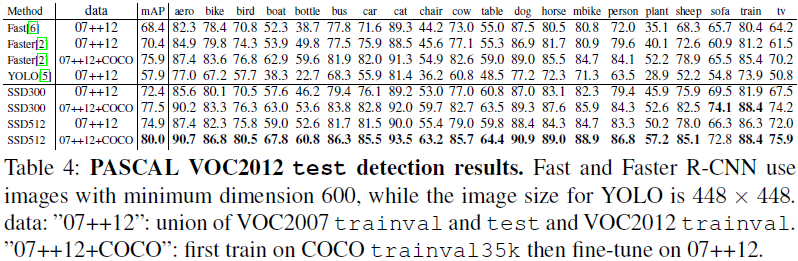

### 3.4 COCO

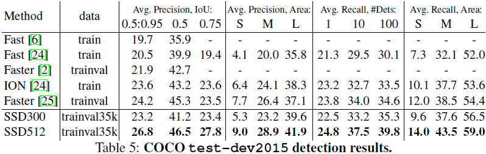

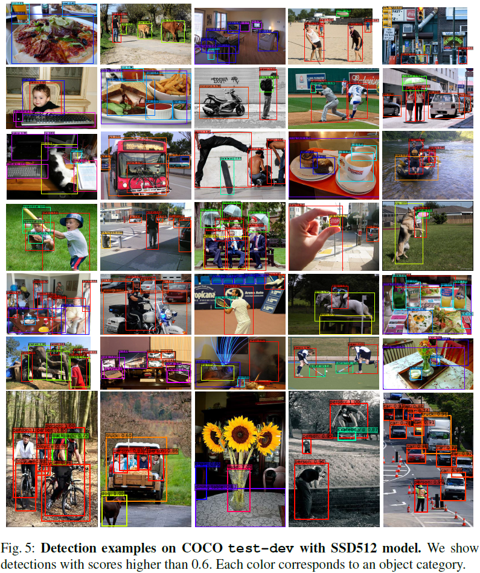

### 3.5 ILSVRC（preliminary ILSVRC results）

### 3.6 小尺寸目标数据增强（data augmentation for small object accuracy）

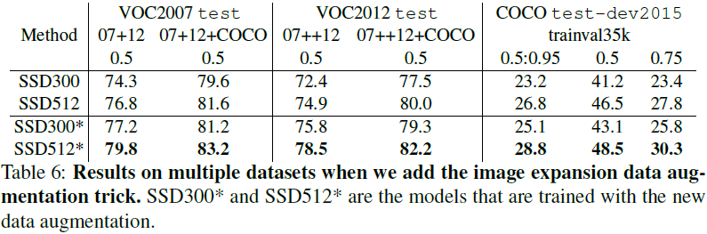

### 3.7 推理时间（inference time）

推理（inference）：非极大抑制（non-maximum suppression，NMS）、判别置信门限（confidence threshold）为$0.01$，

（1）NMS时，各类别的IoU至少为$0.45$；
（2）每幅图像保留前200个检测结果。

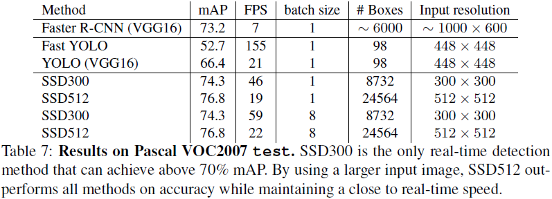

## 4 相关工作

Deformable Part Model (DPM)、Selective Search、R-CNN、Fast R-CNN、Faster R-CNN、OverFeat、YOLO

## 5 结论

## 6 致谢
