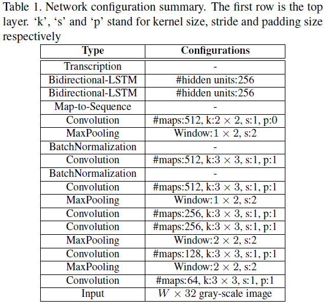
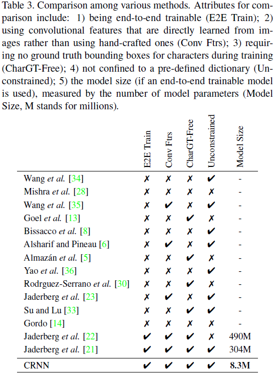

# An End-to-End Trainable Neural Network for Image-based Sequence Recognition and Its Application to Scene Text Recognition

---

B. G. Shi, et al., [An End-to-End Trainable Neural Network for Image-based Sequence Recognition and Its Application to Scene Text Recognition][crnn], TPAMI (2016).

[crnn]: https://arxiv.org/abs/1507.05717 "An End-to-End Trainable Neural Network for Image-based Sequence Recognition and Its Application to Scene Text Recognition"

---

## 摘要

## 1 引言

## 2 网络结构

### 2.1 特征序列提取（Feature Sequence Extraction）

### 2.2 序列标注（Sequence Labeling）

### 2.3 转录（Transcription）

#### 2.3.1 标签序列概率（Probability of label sequence）

#### 2.3.2 无词典转录（Lexicon-free transcription）

#### 2.3.2 基于词典转录（Lexicon-based transcription）

### 2.3 网络训练

## 3 实验

### 3.1 数据集

ICDAR 2003（IC03）、ICDAR 2013（IC13）、IIIT 5k-word（IIIT5k）、Street View Text（SVT）

### 3.2 实施细节

### 3.3 比较评估

### 3.4 曲谱识别（Musical Score Recognition）

## 4 结论
