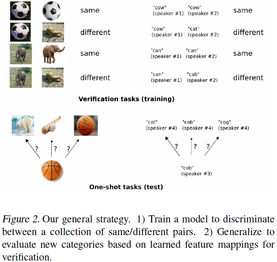
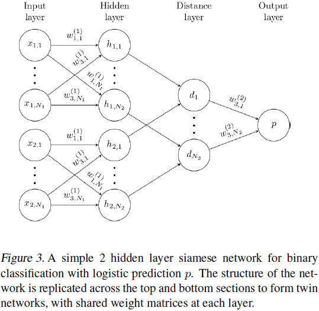
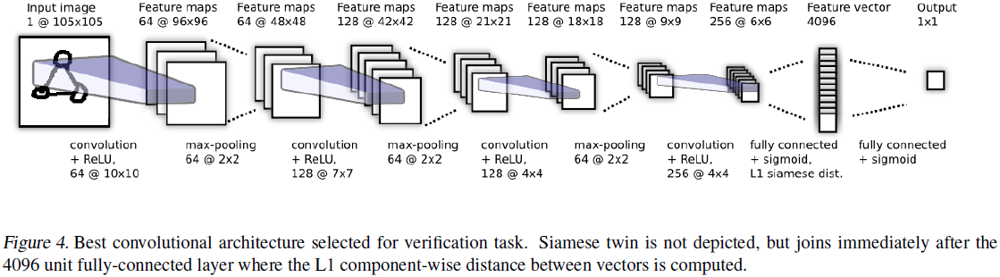
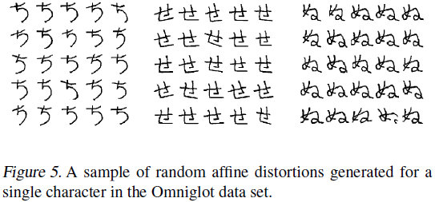
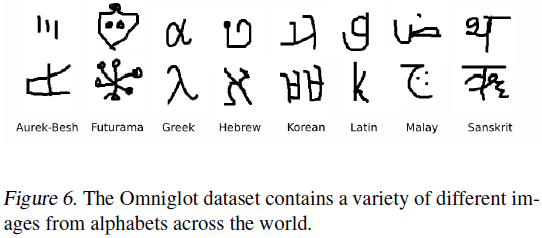
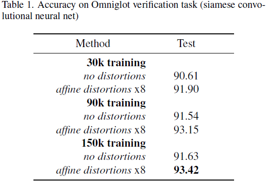
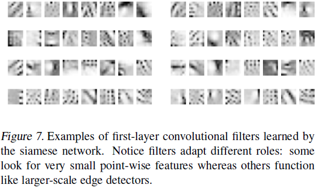
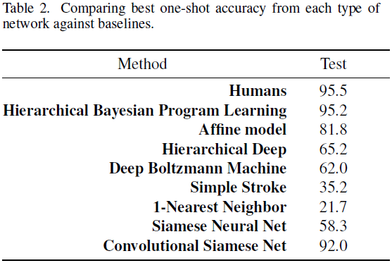
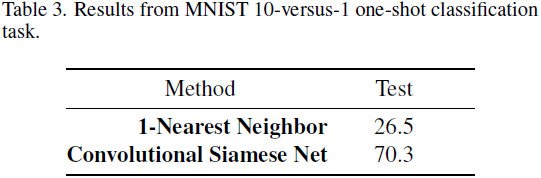
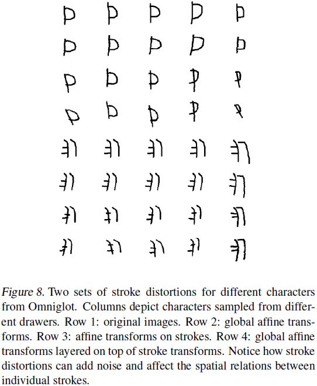

# Siamese Neural Networks for One-shot Image Recognition

---

Gregory Koch, R. Zemel, R. Salakhutdinov, [Siamese Neural Networks for One-shot Image Recognition][siamese_net], ICML (2015)

[siamese_net]: http://www.cs.cmu.edu/~rsalakhu/papers/oneshot1.pdf "Siamese Neural Networks for One-shot Image Recognition"

---

## 摘要

one-shot learning：训练集中各类别仅给出少量样本情况下，训练分类器、预测

孪生网络（siamese neural networks）：采用单一网络衡量不同输入间的相似程度

## 引言

one-shot learning：训练集中每个类别仅包含一个样本

zero-shot learning：模型未曾见过目标类别的任何样本

## 1 方法

通过基于度量监督的方法训练一个孪生神经网络，用于提取面部图像特征表示。用该孪生神经网络提取的特征进行one-shot learning，网络无需重新训练。

孪生神经网络提取的特征必需具有可辨能力（discriminate between the class-identity of image pairs），即满足图像识别的验证任务（verification task for image recognition）

## 2 相关工作

## 3 深度孪生网络

孪生神经网络由结构相同、权值共享的两个孪生分枝网络组成；两个分枝的输入不同、输出作为孪生神经网络损失函数的输入。

LeCun等人于2005年给出一种约束对偶项以减小相似对能量并增大非相似对能量的对比能量函数（a contrastive energy function which contained dual terms to decrease the energy of like pairs and increase the energy of unlike pairs）

本文将孪生特征向量$h_1$、$h_2$的加权$L_1$距离经Sigmoid激活（weighted $L_1$ distance between the twin feature vectors $h_1$ and $h_2$ combined with a sigmoid activation），损失函数为交叉熵（cross-entropy objective）。

### 3.1 模型

孪生卷积神经网络（siamese convolutional neural network）

$L$：网络层数

$N_l$：各层单元数

$\mathbf{h}_{1, l}$：孪生分枝1第$l$层的隐藏向量

$\mathbf{h}_{2, l}$：孪生分枝2第$l$层的隐藏向量

前$L-2$层的输出激活函数均为ReLU，其余两层的激活为Sigmoid；各层卷积核的数量为16的倍数；各层第$k$滤波器的输出为：

$$a^{(k)}_{1, m} = \mathrm{max-pool}(\max(0, \mathbf{W}^{(k)}_{l - 1, l} * \mathbf{h}_{1, l - 1} + \mathbf{b}_l), 2)$$
$$a^{(k)}_{2, m} = \mathrm{max-pool}(\max(0, \mathbf{W}^{(k)}_{l - 1, l} * \mathbf{h}_{2, l - 1} + \mathbf{b}_l), 2)$$

卷积层与全连接层相连；额外增加一个全连接层用于计算两个孪生分枝输出的导出距离测度（the induced distance metric between each siamese twin），其输出激活为Sigmoid，则预测向量（prediction vector）为：

$$\mathbf{p} = \sigma(\sum_{j} \alpha_{j} \left| \mathbf{h}_{1, L-1}^{(j)} - \mathbf{h}_{2, L-1}^{(j)} \right|)$$

输出层（第$L$层）导出第$L-1$层特征空间的测度，用于评判两个特征向量的相似性（This final layer induces a metric on the learned feature space of the $(L-1)$th hidden layer and scores the similarity between the two feature vectors.）。$\alpha_j$用于对各元素间距重要性加权。

### 3.2 学习

* 损失函数（loss function）

正则化交叉熵损失（regularized cross-entropy objective）

$$\mathcal{L}(x_{1}^{(i)}, x_{2}^{(i)}) =
\mathbf{y}(x_{1}^{(i)}, x_{2}^{(i)}) \log \mathbf{p}(x_{1}^{(i)}, x_{2}^{(i)}) +
(1 - \mathbf{y}(x_{1}^{(i)}, x_{2}^{(i)})) \log (1 - \mathbf{p}(x_{1}^{(i)}, x_{2}^{(i)})) +
\mathbf{\lambda}^{\mathrm{T}} \left| \mathbf{w} \right|^{2}$$

* 优化（optimization）

批大小：128

各层学习率（learning rate）：$\eta_j$、动量（momentum）：$\mu_j$、$L_2$正则化权值：$\lambda_j$

第$T$轮（epoch）的更新策略为：

$$\mathbf{w}^{(T)}_{kj} (x_{1}^{(i)}, x_{2}^{(i)}) =
\mathbf{w}^{(T)}_{kj} + \Delta \mathbf{w}^{(T)}_{kj} (x_{1}^{(i)}, x_{2}^{(i)}) + 2\lambda_j|\mathbf{w}_{kj}|$$

$$\Delta \mathbf{w}^{(T)}_{kj} (x_{1}^{(i)}, x_{2}^{(i)}) = - \eta_j \nabla \mathbf{w}^{(T)}_{kj} + \mu_j \Delta \mathbf{w}^{(T - 1)}_{kj}$$

其中，$\nabla \mathbf{w}^{(T)}_{kj}$为某层第$j$个神经元（neuron）与后续层第$k$个神经元间的偏导数（partial derivative）。

* 权值初始化（weight initialization）

* 学习策略（learning schedule）

学习率每轮均匀下降1%，$\eta_j^{(T)} = 0.99\eta_j^{(T-1)}$；各层初始动量均设为0.5，每轮线性增加直到$\mu_j$。

* 超参优化（hyperparameter optimization）

$\eta_j \in [10^{-4}, 10^{-1}]$、$\mu_j \in [0, 1]$、$\lambda_j \in [0, 0.1]$

* 仿射变形（affine distortions）

数据增强：仿射$T = (\theta, \rho_x, \rho_y, s_x, s_y, t_x, t_y)$，$\theta \in [-10.0, 10.0]$、$\rho_x, \rho_y \in [-0.3, 0.3]$、$ s_x, s_y \in [0.8, 1.2]$、$ t_x, t_y \in [-2, 2]$

## 4 实验

### 4.1 Omniglot数据集

### 4.2 验证

### 4.3 单次学习（One-shot Learning）

给定测度图像$\mathbf{x}$、$C$个类别样本的特征向量集合$\{\mathbf{x}_c\}^C_{c=1}$。查询时，以$\mathbf{x}$和$\mathbf{x}_c$作为网络输入，预测的类别对应最大的相似度：

$$C^{\ast} = \argmax_c \mathbf{p}^{(c)}$$

### 4.4 MNIST单次测试

## 5 结论

