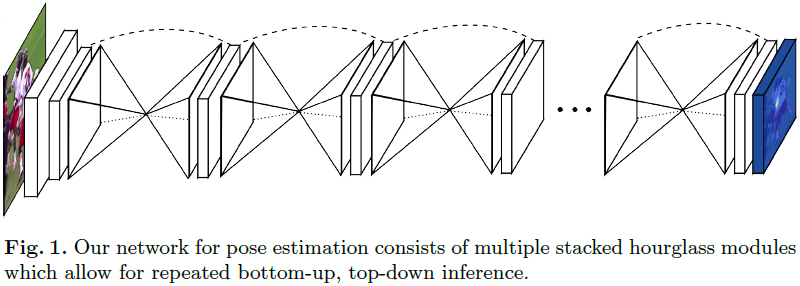
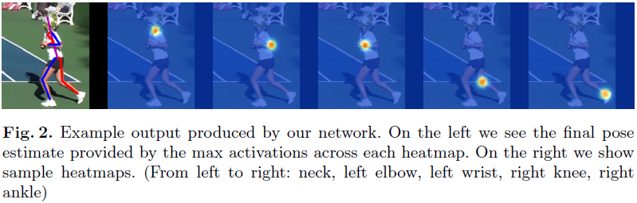
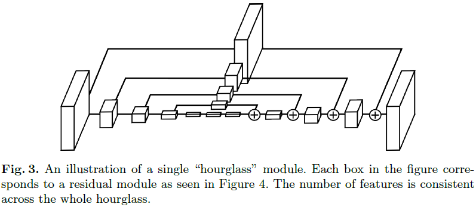
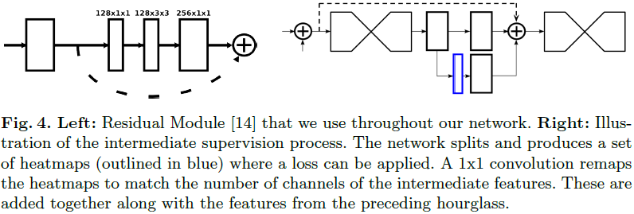

# Stacked Hourglass Networks for Human Pose Estimation

---

A. Newell, K.Y. Yang, J. Deng, [Stacked Hourglass Networks for Human Pose Estimation][hourglass], ECCV (2016)

[hourglass]: https://arxiv.org/abs/1603.06937 "Stacked Hourglass Networks for Human Pose Estimation"

---

## 摘要

## 1 引言

姿态估计（pose estimation）的挑战：遮挡（occlusion）、变形（deformation）、罕见姿态（rare and novel poses）、外观变化（changes in appearance）（服装、照明等因素）

## 2 相关工作

## 3 网络结构（Network Architecture）

### 3.1 沙漏网络（Hourglass Design）

### 3.2 沙漏网络隐含层（Layer Implementation）

