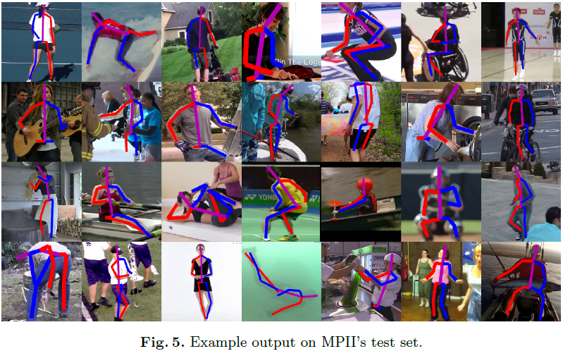
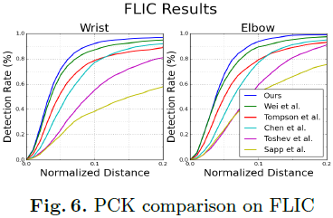
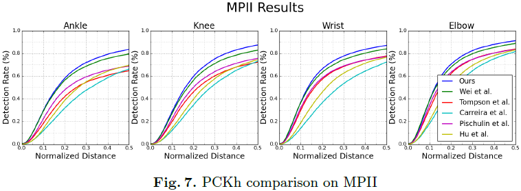
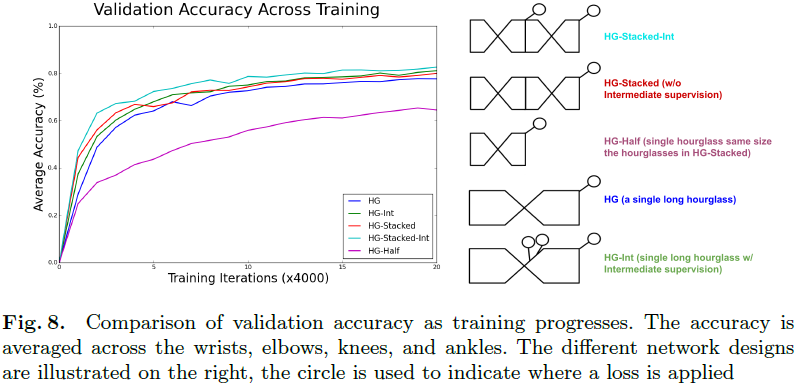
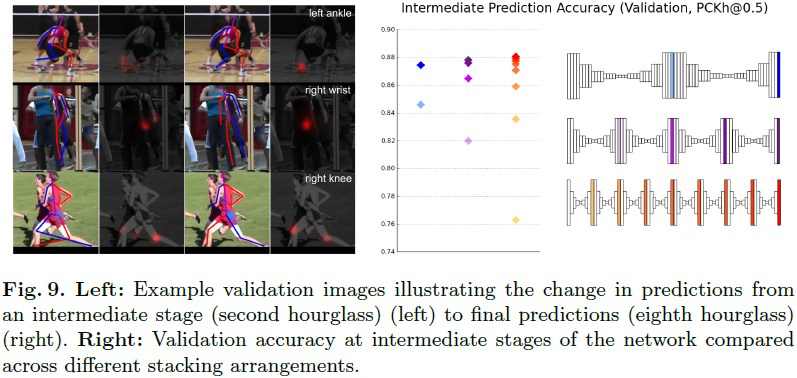
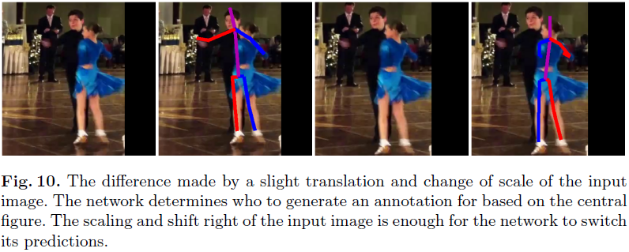
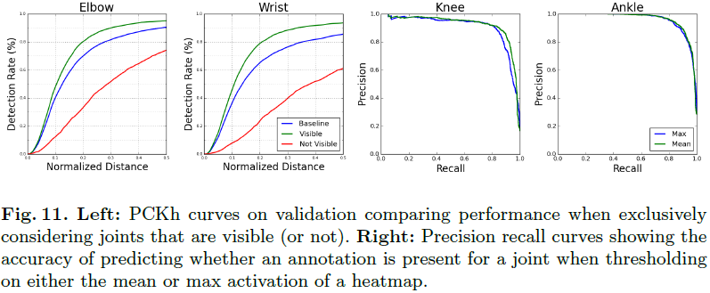

# Stacked Hourglass Networks for Human Pose Estimation

---

A. Newell, K.Y. Yang, J. Deng, [Stacked Hourglass Networks for Human Pose Estimation][hourglass], ECCV (2016)

[hourglass]: https://arxiv.org/abs/1603.06937 "Stacked Hourglass Networks for Human Pose Estimation"

---

## 摘要

特征在所有的尺度上被处理和整合，以最好地捕获与身体相关的各种空间关系

## 1 引言

一个好的姿态估计系统必须对遮挡和严重变形具有很强的鲁棒性，对罕见的和新颖的姿态具有成功的估计能力，并且不受服装和照明等因素的影响而改变外观。

姿态估计（pose estimation）的挑战：遮挡（occlusion）、变形（deformation）、罕见姿态（rare and novel poses）、外观变化（changes in appearance）（服装、照明等因素）

## 2 相关工作

## 3 网络结构（Network Architecture）

### 3.1 沙漏单元（Hourglass Design）

### 3.2 沙漏层实现（Layer Implementation）

用残差学习模块（residual learning modules）（Fig. 4 左）和Inception模块（Inception-based designs）替换大尺寸滤波器标准卷积层

卷积核尺寸不大于$3 \times 3$；瓶颈（bottleneck）结构用于限制沙漏层参数总数、减少内存使用（bottlenecking restricts the total number of parameters at each layer curtailing total memory usage）

沙漏网络的分辨率（输入、输出）限定为$64 \times 64$（highest resolution of the hourglass (and thus the final output resolution) is 64x64）。

*总网络结构（full network）*：

1. 卷积层（卷积核$7 \times 7$、步长为$2$）、残差模块、最大池化，将输入分辨率由256降低至64；
2. 串联2个残差沙漏单元（two subsequent residual modules precede the hourglass）（Fig. 3）；
3. 整个沙漏网络中，残差模块均输出256个特征（across the entire hourglass all residual modules output 256 features）。

### 3.3 沙漏单元堆叠与单元内监督（Stacked Hourglass with Intermediate Supervision）

### 3.4 训练（Training Details）

