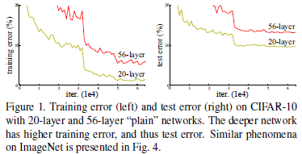
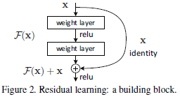
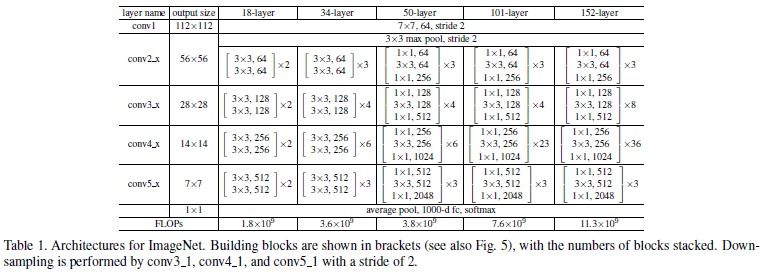
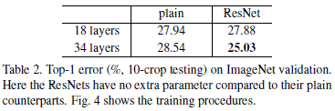
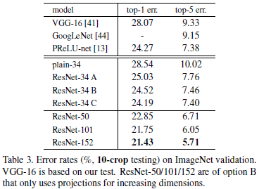
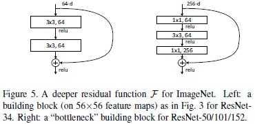

# Deep Residual Learning for Image Recognition

---

He K, Zhang X, Ren S, et al. [Deep Residual Learning for Image Recognition][resnet][C], CVPR, 2016.

[resnet]: https://arxiv.org/abs/1512.03385 "Deep Residual Learning for Image Recognition"

---

## 摘要

残差学习框架（residual learning framework）：以输入（inputs）为参考，将层（layers）定义为残差学习函数（learning residual functions）

残差网络（residual networks）易于优化，能够通过增加网络深度（depth）提高准确率（gain accuary）。

表示的深度（depth of representations）对许多视觉识别任务（visual recognition tasks）至关重要。

## 1 引言

深度网络（deep networks）能够提取底层、中层和高层特征（low/mid/high-level features），特征的“层次”可以通过堆叠网络层（stacked layers）的数量（深度）来丰富。

*梯度消失、爆炸（vanishing/exploding gradients）问题*能够通过初始值标准化（normalized initialization）和层间标准化解决。

*退化问题（degradation problem）*：随着网络深度的增加，网络预测准确率趋于饱和，然后迅速退化。但这种退化并非由过拟合引起，对恰到好处的深度模型（suitable deep model）添加更多的层会导致其训练误差增加。

为解决退化问题，本文提出一种深度残差学习框架（residual learning framework）。假设目标映射（desired underlying mapping）为$\mathcal{H}(\mathbf{x})$，则堆叠非线性网络层（stacked nonlinear layers）需拟合（fit）的映射为$\mathcal{F}(\mathbf{x}) := \mathcal{H}(\mathbf{x}) - \mathbf{x}$。

本文工作的基础是假设优化残差映射比优化原始目标映射容易。极端情况下，如果恒等映射为最优，则相比于拟合恒等映射，堆叠网络层将残差映射拟合为零更加容易。

捷径连接（shortcut connections）：跳过一层或多层的连接。本文中，捷径连接简化为恒等映射（identity mapping），其输出与堆叠网络层的输出相加（Fig.2）。

$\mathcal{F} = \mathbf{W}_2 \sigma(\mathbf{W}_1 \mathbf{x})$

$\sigma(\mathcal{F} + \mathbf{x})$

$\sigma := \text{ReLU}$

## 2 相关工作

#### 残差表示（Residual Representations）

求解偏微分方程（Partial Differential Equations，PDE）时，多重网格法（Multigrid method）将方程组分解为多尺度子问题，每个子问题对应粗尺度（coarser scale）和细尺度（finer scale）间的残差解（residual solution）。多重网格法可采用分层预处理（hierarchical basis preconditioning），即以两个尺度间的残差向量（residual vectors）为自变量。现已证明其解收敛速度远大于比标准求解器。

#### 捷径连接（Shortcut Connections）

公路网络（highway networks）

## 3 深度残差学习（Deep Residual Learning）

### 3.1 残差学习（Residual Learning）

向一个网络中添加额外的网络层，若添加的网络层拟合目标为恒等映射（identity mappings），则较深的模型训练误差应不大于较浅的模型。因此，退化问题表明使用多层非线性网络（multiple nonlinear layers）难以逼近恒等映射。

令堆叠网络层拟合残差函数$\mathcal{F}(\mathbf{x}) := \mathcal{H}(\mathbf{x}) - \mathbf{x}$，而非目标函数$\mathcal{H}(\mathbf{x}) = \mathcal{F}(\mathbf{x}) - \mathbf{x}$。

学习残差函数的响应较小，这表明恒等映射是一种合理的预处理（reasonable preconditioning）。

### 3.2 恒等映射捷径（Identity Mapping by Shortcuts）

构建块（building block）定义为：

$$\mathbf{y} = \mathcal{F}(\mathbf{x}, \{\mathbf{W}_i\}) + \mathbf{x} \tag{1}$$

$\mathcal{F}(\mathbf{x}, \{\mathbf{W}_i\})$表示待学习的残差映射（residual mapping），$+$表示向量按元素相加。

当$\mathcal{F}$与$\mathbf{x}$维度不同时，可通过线性投影（linear projection）$\mathbf{W}_s$修改$\mathbf{x}$的维度

$$\mathbf{y} = \mathcal{F}(\mathbf{x}, \{\mathbf{W}_i\}) + \mathbf{W}_s \mathbf{x} \tag{2}$$

实验表明：对于退化问题，恒等映射最为高效、经济

$\mathcal{F}$也可表示多层卷积神经网络，此时，$\mathcal{F} + \mathbf{x}$表示特征图按通道相加。

### 3.3 网络结构（Network Architectures）

#### 普通网络（Plain Network）

卷积网络设计原则：
（1）若输出特征图（feature map）尺寸相同，则各层滤波器（filter）数量相同；
（2）若输出特征图尺寸减半，则下层滤波器数量加倍，以保正各层计算时间复杂度（time complexity）相同。

大多数卷积层（convolutional layers）采用$3 \times 3$的卷积核。

#### 残差网络（Residual Network）

输入和输出维度相同时，采用恒等捷径（Eqn.(1)），由Fig.3中实线标出；

输出维度增加时，捷径由Fig.3中虚线标出：（1）采用恒等捷径，增加维度用零填充（zero padding）；（2）采用投影捷径（Eqn.(2)）匹配维度。

### 3.4 应用（Implementation）

批标准化（batch normalization）位于卷积层（convolution）输出与激活层（activation）输入之间。

学习率（learning rating）初始为0.1。每当误差下降停滞（error plateaus）时，学习率缩小到十分之一。

标准10-裁剪测试（standard 10-crop test）

## 4 实验

### 4.1 ImageNet分类任务（ImageNet Classification）

#### 普通网络（Plain Networks）

本文推测退化问题产生的原因：深度普通网络的收敛速度可能呈指数级放缓（exponentially low convergence rates），进而影响训练误差的下降速度。

#### 残差网络（Residual Network）

残差网络：（1）能够解决退化问题，即通过增加网络深度获得准确率增益（accuracy gains）；（2）训练初期阶段，网络收敛速度更快。

#### 恒等捷径与投影捷径（Identity vs. Projection Shortcuts）

（1）补零捷径（zero-padding shortcuts）增加维度（increasing dimensions），所有捷径均无参数；
（2）投影捷径（projecttion shortcuts）仅用于增加维度，其它捷径为恒等捷径；
（3）所有捷径均为投影捷径。

补零填充维度不能进行残差学习。处理退化问题时，投影捷径并非必需。

#### 更深的瓶颈结构（Deeper Bottleneck Architectures）

瓶颈设计（a bottleneck design）：对于拟合每个残差函数$\mathcal{F}$的堆叠网络层，用3层结构代替2层结构，3层卷积核尺寸分别为$1 \times 1$、$3 \times 3$和$1 \times 1$，其中$1 \times 1$卷积核用于先减少维度而后增加（恢复）维度，因此$3 \times 3$卷积层类似于瓶颈，其输入、输出维度较小。

对于瓶颈设计，恒等捷径更为高效。

#### 50层残差网络（50-layer ResNet）

将34层残差网络中的2层堆叠网络结构替换为3层瓶颈区块，即为50层残差网络。

#### 101层和152层残差网络（101-layer and 152-layer ResNets）

101层和152层残差网络均使用3层瓶颈区块构建。

#### 与最先进方法的比较（Comparisons with State-of-the-art Methods）

### 4.2 CIFAR-10及分析（CIFAR-10 and Analysis）

#### 层响应分析（Analysis of Layer Responses）

残差函数通常比非残差函数更接近于零；残差网络越深，其响应幅值范围越小；网络层数越多，残差网络各层对信号的改变越小。

#### 千层网络（Exploring Over 1000 layers）

### 4.3 PASCAL和MS COCO物体检测（Object Detection on PASCAL and MS COCO）
