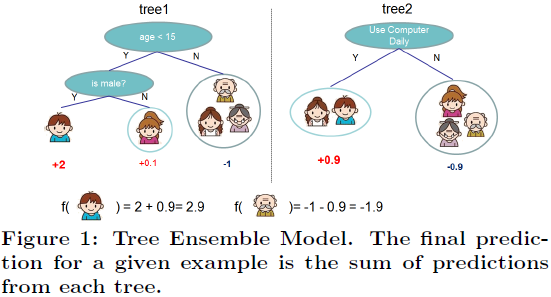
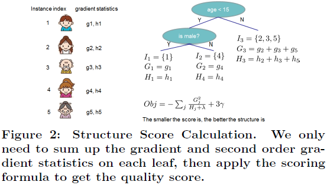
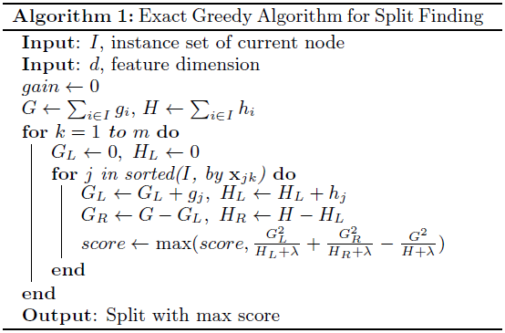
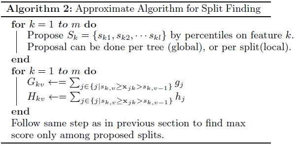

# XGBoost: A Scalable Tree Boosting System

---

T.Q. Chen, C. Guestrin, [XGBoost: A Scalable Tree Boosting System][xgboost], KDD (2016)

[xgboost]: https://arxiv.org/abs/1603.02754 "XGBoost: A Scalable Tree Boosting System"

---

## 摘要

XGBoost：端到端可扩展提升树（a scalable end-to-end tree boosting system）

稀疏感知算法处理稀疏数据（sparsity-aware algorithm for sparse data）

加权分位算法学习近似树（weighted quantile sketch for approximate tree learning）

## 1 引言

机器学习和数据驱动方法（machine learning and data-driven approaches）：

（1）使用统计模型提取复杂数据的内在关系（usage of effective (statistical) models that capture the complex data dependencies）

（2）从大型数据集中学习感兴趣的模型的可扩展学习系统（scalable learning systems that learn the model of interest from large datasets）

## 2 梯度提升树框架（tree boosting in a nutshell）

### 2.1 正则化损失（regularized learning objective）

给定数据集$\mathcal{D} = \{ (\mathbf{x}_{i}, y_{i}) \}$（$|\mathcal{D}| = n$，$\mathbf{x}_{i} \in {\R}^{m}$，$y_{i} \in \R$）

由$K$个加性方程构建的树集成模型（a tree ensemble model）（Fig. 1）的预测输出为：

$$\hat{y}_{i} = \phi(\mathbf{x}_{i}) = \sum_{k = 1}^{K} f_{k}(\mathbf{x}_{i}), \ f_{k} \in \mathcal{F} \tag{1}$$

其中，$\mathcal{F} = \{ f(\mathbf{x}_{i}) = w_{q(\mathbf{x})} \}$（$q : {\R}^{m} \rightarrow T$，$w \in {\R}^{T}$）表示回归树空间（space of regression trees，CART）。$q$表示将一条样本映射到相应叶结点索引的各树结构（the structure of each tree that maps an example to the corresponding leaf index）、$T$表示树的叶结点总数、$f_{k}$对应一棵独立的树结构$q$及叶结点权值（leaf weights）$\mathbf{w}$、与决策树不同，回归树的每个叶结点包含一个连续评分（a continuous score on each of the leaf），用$w_{i}$表示第$i$个叶结点的分值。

本文通过最小化正则化损失（regularized objective），学习函数集合：

$$\mathcal{L} (\phi)= \sum_{i} l(\hat{y}_{i}, y_{i}) + \sum_{k} \Omega(f_{k}), \ \text{where} \ \Omega(f) = \gamma T + \frac{1}{2} \lambda\| w \|^{2} \tag{2}$$

其中，$l$表示可微凸损失函数（a differentiable convex loss function），用于衡量预测值$\hat{y}_{i}$与直实值（target）$y_{i}$间的差异；$\Omega$表示模型复杂度的惩罚项（penalizes the complexity of the model, i.e., the regression tree functions）。

### 2.2 梯度提升树（gradient tree boosting）

树集成模型（Eq. 2）以函数作为参数，不能在欧氏空间中用传统优化算法求解（the tree ensemble model in Eq. (2) includes functions as parameters and cannot be optimized using traditional optimization methods in Euclidean space）。

$\hat{y}_{i}^{(t)}$表示第$t$次迭代模型对样本$i$（instance）的预测，即：

$$\hat{y}_{i}^{(t)} = \hat{y}_{i}^{(t - 1)} + f_{t}(\mathbf{x}_{i})$$

其中，$f_{t}$表示第$k$次迭代增加的函数，其目标为最小化损失$\mathcal{L}^{(t)}$（第$k$次迭代的损失函数，$\hat{y}_{i}^{(t - 1)}$为已知量、$\Omega$仅针对$f_{t}$）

$$\mathcal{L}^{(t)} = \sum_{i = 1}^{n}
l \left( y_{i}, \hat{y}_{i}^{(t - 1)} + f_{t}(\mathbf{x}_{i}) \right) +
\Omega(f_{t})$$

第$k$次迭代中，$f_{t}$的优化目标为使当前损失$\mathcal{L}^{(t)}$最小，属于贪心（greedy）算法。本文以$\mathcal{L}^{(t)}$的二阶近似（second-order approximation，泰勒级数）作为损失函数优化求解：

$$\mathcal{L}^{(t)} \cong \sum_{i = 1}^{n} \left[
l \left( y_{i}, \hat{y}^{(t - 1)} \right) +
g_{i} f_{t}(\mathbf{x}_{i}) +
\frac{1}{2} h_{i} f_{t}^{2}(\mathbf{x}_{i})
\right] + \Omega(f_{t})$$

其中，$g_{i} = \partial_{\hat{y}^{(t - 1)}} l \left( y_{i}, \hat{y}^{(t - 1)} \right)$、$h_{i} = \partial_{\hat{y}^{(t - 1)}}^{2} l \left( y_{i}, \hat{y}^{(t - 1)} \right)$分别为损失函数的一阶和二阶梯度统计（first and second order gradient statistics on the loss function）。

▇

泰勒公式：若函数$f(x)$在包含$x = x_0$的某个闭区间$[a, b]$上有$n$阶导数，且在开区间$(a, b)$上有$n + 1$阶导数，则对闭区间$[a, b]$上任意一点$x$，

$$f(x) = f(x_{0} + \Delta x) = \sum_{k=0}^{n} \frac{1}{k!} f^{(k)}(x_{0}) (\Delta x)^{k} + \mathcal{o}((\Delta x)^{n})$$

$\phi$表示函数空间$\mathcal{F}$中的点，第$k$次迭代时，$\phi = \sum_{k}^{t} f_{k} = \sum_{k}^{t - 1} f_{k} + f_{t}$。令$\phi_{0} = \sum_{k}^{t - 1} f_{k}$、$\Delta \phi = f_{t}$，将$l$在$\phi_{0}$处进行泰勒展开，

$$\begin{aligned}
l (y, \phi) & = l (y, \phi_{0} + \Delta \phi) \\
& \approx l ( y, \phi_{0}) +
\frac{\partial}{\partial \phi} l(y, \phi_{0}) \Delta \phi +
\frac{1}{2} \frac{\partial^{2}}{\partial \phi^{2}} l(y, \phi_{0}) (\Delta \phi)^{2}
\end{aligned}$$

在样本$\mathbf{x}_{i}$处，

$$\begin{aligned}
l (y_{i}, \phi(\mathbf{x}_{i})) & = l (y_{i}, \phi_{0}(\mathbf{x}_{i}) + \Delta \phi(\mathbf{x}_{i})) \\
& \approx l ( y_{i}, \phi_{0}(\mathbf{x}_{i})) +
\frac{\partial l}{\partial \phi} (y_{i}, \phi_{0}(\mathbf{x}_{i})) \Delta \phi(\mathbf{x}_{i}) +
\frac{1}{2} \frac{\partial^{2} l}{\partial \phi^{2}} (y_{i}, \phi_{0}(\mathbf{x}_{i})) (\Delta \phi(\mathbf{x}_{i}))^{2}
\end{aligned}$$

即

$$l \left( y_{i}, \hat{y}_{i}^{(t - 1)} + f_{t}(\mathbf{x}_{i}) \right) \approx
l \left( y_{i}, \hat{y}_{i}^{(t - 1)} \right) +
\frac{\partial l}{\partial \hat{y}^{(t - 1)}} \left( y_{i}, \hat{y}_{i}^{(t - 1)} \right) f_{t}(\mathbf{x}_{i}) +
\frac{1}{2} \frac{\partial^{2} l}{(\partial \hat{y}^{(t - 1)})^{2}} \left( y_{i}, \hat{y}_{i}^{(t - 1)} \right) f_{t}^{2}(\mathbf{x}_{i})$$

令$g_{i} = \partial_{\hat{y}^{(t - 1)}} l \left( y_{i}, \hat{y}_{i}^{(t - 1)} \right)$、$h_{i} = \partial_{\hat{y}^{(t - 1)}}^{2} l \left( y_{i}, \hat{y}_{i}^{(t - 1)} \right)$

$$l \left(y_{i}, \hat{y}_{i}^{(t - 1)} + f_{t}(\mathbf{x}_{i}) \right) \approx
l \left( y_{i}, \hat{y}_{i}^{(t - 1)} \right) +
g_{i} f_{t}(\mathbf{x}_{i}) +
\frac{1}{2} h_{i} f_{t}^{2}(\mathbf{x}_{i})$$

个人以为原文中$\hat{y}^{(t - 1)}$表述不够清晰，有歧义。

▇

忽略方程中的常数项（$l \left( y_{i}, \hat{y}^{(t - 1)} \right)$），则在第$t$次迭代的损失函数化简为

$$\tilde{\mathcal{L}}^{(t)} = \sum_{i = 1}^{n} \left[
g_{i} f_{t}(\mathbf{x}_{i}) +
\frac{1}{2} h_{i} f_{t}^{2}(\mathbf{x}_{i})
\right] + \Omega(f_{t}) \tag{3}$$

将叶结点$j$的样本集合（instance set of leaf $j$）定义为$I_{j} = \{ i | q(\mathbf{x}_{i}) = j \}$，并展开Eq. 3中的惩罚项$\Omega$，

$$\begin{aligned}
\tilde{\mathcal{L}}^{(t)}
= & \sum_{i = 1}^{n} \left[
g_{i} f_{t}(\mathbf{x}_{i}) +
\frac{1}{2} h_{i} f_{t}^{2}(\mathbf{x}_{i})
\right] + \gamma T + \frac{1}{2} \lambda \sum_{j = 1}^{T} w_{j}^{2} \\
= & \sum_{j = 1}^{T} \left[ \left( \sum_{i \in I_{j}} g_{i} \right) w_{j} +
\frac{1}{2} \left( \sum_{i \in I_{j}} h_{i} + \lambda \right) w_{j}^{2} \right] + \gamma T
\end{aligned}
\tag{4}$$

▇
$f_{t}$表示树结构，其作用是将输入$\mathbf{x}_{i}$映射到相应的叶结点$j$上，并返回叶结点$j$的权值$w_{j}$，即，$f_{t}(\mathbf{x}_{i}) = w_{j}, \forall i \in I_{j}$。
▇

树结构$q(\mathbf{x})$固定时，其叶结点$j$分值的最优解（optimal weight）$w_{j}^{\ast}$为（令$\frac{\partial \tilde{\mathcal{L}}^{(t)}}{\partial w_{j}} = 0$）：

$$w_{j}^{\ast} = - \frac{\sum_{i \in I_{j}} g_{i}}{\sum_{i \in I_{j}} h_{i} + \lambda} \tag{5}$$

相应的最优值（optimal value）为

$$\tilde{\mathcal{L}}^{(t)} (q)
= - \frac{1}{2} \sum_{j = 1}^{T} \frac{(\sum_{i \in I_{j}} g_{i})^{2}}{\sum_{i \in I_{j}} h_{i} + \lambda} + \gamma T
\tag{6}$$

Eq. (6)可作为评价树结构$q$质量的得分函数（Eq. (6) can be used as a scoring function to measure the quality of a tree structure $q$），该得分与决策树的不纯度得分相似（like the impurity score for evaluating decision trees）。Fig. 2为该得分的计算过程。

遍历所有可能树结构为NP-hard问题，本文采用贪心算法（greedy algorithm），由单叶结点树开始，迭代增加分枝（a greedy algorithm that starts from a single leaf and iteratively adds branches to the tree）。令$I_{L}$、$I_{R}$分别表示划分后左右结点的实例集（$I_{L}$ and $I_{R}$ are the instance sets of left and right nodes after the split），$I = I_{L} \cup I_{R}$，则划分后损失下降（loss reduction）为：

$$\mathcal{L}_{\text{split}}
= \frac{1}{2} \left[
\frac{(\sum_{i \in I_{L}} g_{i})^{2}}{\sum_{i \in I_{L}} h_{i} + \lambda} +
\frac{(\sum_{i \in I_{R}} g_{i})^{2}}{\sum_{i \in I_{R}} h_{i} + \lambda} -
\frac{(\sum_{i \in I} g_{i})^{2}}{\sum_{i \in I} h_{i} + \lambda} +
\right] - \gamma
\tag{7}$$

▇

给定一个树结构$q$，其损失为

$$\tilde{\mathcal{L}}^{(t)} (q)
= - \frac{1}{2} \sum_{j = 1, j \not= k}^{T} \frac{(\sum_{i \in I_{j}} g_{i})^{2}}{\sum_{i \in I_{j}} h_{i} + \lambda} -
\frac{1}{2} \frac{(\sum_{i \in I_{k}} g_{i})^{2}}{\sum_{i \in I_{k}} h_{i} + \lambda} +
\gamma T$$

假设在叶结点$j$处做划分，$I_{k} = I_{k, L} + I_{k, R}$，划分后树的叶结点数增加$1$（$T + 1$），其损失为

$$\tilde{\mathcal{L}}^{(t)} (q_{\text{split}})
= - \frac{1}{2} \sum_{j = 1, j \not= k}^{T} \frac{(\sum_{i \in I_{j}} g_{i})^{2}}{\sum_{i \in I_{j}} h_{i} + \lambda} -
\frac{1}{2} \frac{(\sum_{i \in I_{k, L}} g_{i})^{2}}{\sum_{i \in I_{k, L}} h_{i} + \lambda} -
\frac{1}{2} \frac{(\sum_{i \in I_{k, R}} g_{i})^{2}}{\sum_{i \in I_{k, R}} h_{i} + \lambda} +
\gamma (T + 1)$$

因此划分后损失下降

$$\begin{aligned}
\mathcal{L}_{\text{split}}
& = \tilde{\mathcal{L}}^{(t)} (q) - \tilde{\mathcal{L}}^{(t)} (q_{\text{split}}) \\
& = - \frac{1}{2} \frac{(\sum_{i \in I_{k}} g_{i})^{2}}{\sum_{i \in I_{k}} h_{i} + \lambda} +
\frac{1}{2} \frac{(\sum_{i \in I_{k, L}} g_{i})^{2}}{\sum_{i \in I_{k, L}} h_{i} + \lambda} +
\frac{1}{2} \frac{(\sum_{i \in I_{k, R}} g_{i})^{2}}{\sum_{i \in I_{k, R}} h_{i} + \lambda} -
\gamma \\
& = \frac{1}{2} \left[
\frac{(\sum_{i \in I_{k, L}} g_{i})^{2}}{\sum_{i \in I_{k, L}} h_{i} + \lambda} +
\frac{(\sum_{i \in I_{k, R}} g_{i})^{2}}{\sum_{i \in I_{k, R}} h_{i} + \lambda} -
\frac{(\sum_{i \in I_{k}} g_{i})^{2}}{\sum_{i \in I_{k}} h_{i} + \lambda}
\right] -
\gamma
\end{aligned}$$

▇

▇

注意$g$、$h$分别表示$l$在$\mathcal{F}$空间上对$\phi$的一阶、二阶偏导数（$g = \frac{\partial l}{\partial \phi}$、$h = \frac{\partial^{2} l}{\partial \phi^{2}}$），将$l$在$\phi_{0} = \sum_{k}^{t - 1} f_{k}$处进行泰勒展开（$\Delta \phi = f_{t}$）

$$\begin{aligned}
l (y, \phi) & = l (y, \phi_{0} + \Delta \phi) \\
& \approx l ( y, \phi_{0}) +
\frac{\partial l}{\partial \phi}(y, \phi_{0}) \Delta \phi +
\frac{1}{2} \frac{\partial^{2} l}{\partial \phi^{2}}(y, \phi_{0}) (\Delta \phi)^{2} \\
& = l ( y, \phi_{0}) +
g(y, \phi_{0}) \Delta \phi +
h(y, \phi_{0}) (\Delta \phi)^{2} \\
\end{aligned}$$

因此，$g$、$h$与第$t$次迭代新增树结构$f_{t}$（$q_{t}$）无关，故有

$G_{L} + G_{R} = G$、$H_{L} + H_{R} = H$、$G = \sum_{i \in I} g_{i}$、$H = \sum_{i \in I} h_{i}$

▇

### 2.3 系数收缩与二次采样（shrinkage and column subsampling）

树的每一步提高后，收缩尺度增加了一个因素$\eta$的权重

## 3 （split finding algorithms）

### 3.1 贪心算法（basic exact greedy algorithm）

### 3.2 近似算法（approximate algorithm）

### 3.3 加权分位数（weighted quantile sketch）

### 3.4 （sparsity-aware split finding）

## 4 （system design）

### 4.1 （column block for parallel learning）

### 4.2 （cache-aware access）

### 4.3 （blocks for out-of-core computation）

## 5 相关工作

## 6 端到端计算（end to end evaluations）

### 6.1 （system implementation）

### 6.2 （dataset and setup）

### 6.3 （classification）

### 6.4 （learning to rank）

### 6.5 （out-of-core experiment）

### 6.6 （distributed experiment）

## 7 结论
